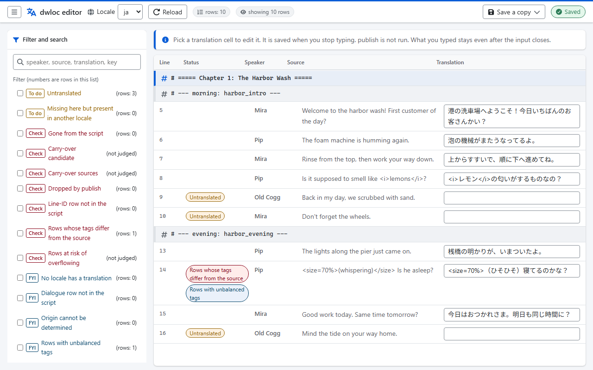
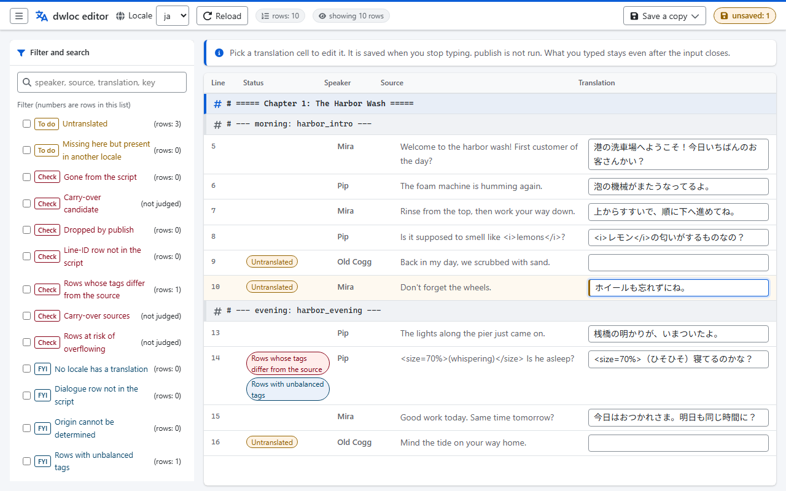
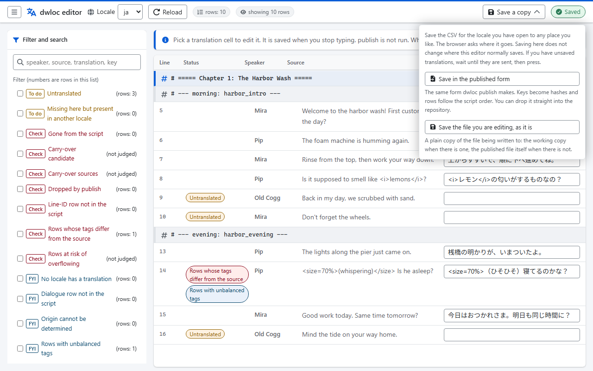
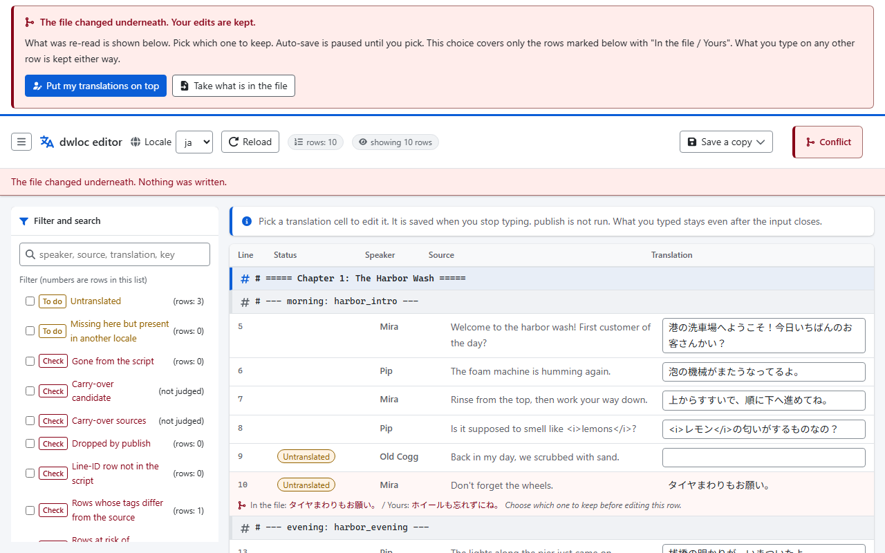

# dragnwash-localization-editor

**[日本語](README.md)** | English

An editor that helps with the translation work for [Drag'n Wash Localization](https://github.com/TomXV/dragnwash-localization).

It runs on Windows, macOS and Linux.  
It is a single executable, with nothing else to install.  
It is written in Go.

## What it does

It brings the following tasks a translator does together into one tool.

| Feature | What it does |
| ---- | ---- |
| Editing the translation CSV | Shows the source text and the translation side by side and lets you edit the translation (the source text only appears when the working copy could be read) |
| Comparing against the working file | Finds the working copy the game exported on its own and matches it up |
| Listing rows that are not registered | Lists untranslated rows, rows that disappeared from the script, and candidates for carrying a translation over |
| Saving | Rebuilds the CSV for publication. If even one translation would be lost, it does not write a single byte |
| Validating | Checks the format of the CSV for publication |

The source text and the "untranslated" judgement both rely on the working copy the game exports.  
You create that working copy in the game with `F1 → Translation → Export working copy`.  
The file only exists in the game folder, so `dwloc` goes looking for it rather than asking you where it is.  
For details, see "The two buttons inside the game" and "Using the game folder" below.

## Download

Download the archive for your environment from [Releases](https://github.com/223n/dragnwash-localization-editor/releases).  
You do not need to install Go.

### Which file to download

The file name has the form `dwloc_<version>_<OS>_<CPU>`.  
`<version>` is the release number with the leading `v` removed.  
For `v0.5.0` that gives `dwloc_0.5.0_windows_amd64.zip`.

| The environment you use | The file to download |
| ---- | ---- |
| Windows (ordinary PC) | `dwloc_<version>_windows_amd64.zip` |
| Windows (arm64 machine, such as Snapdragon) | `dwloc_<version>_windows_arm64.zip` |
| macOS (Apple Silicon, M1 or later) | `dwloc_<version>_darwin_arm64.tar.gz` |
| macOS (Intel) | `dwloc_<version>_darwin_amd64.tar.gz` |
| Linux (64-bit PC) | `dwloc_<version>_linux_amd64.tar.gz` |
| Linux (arm64 machine, such as a Raspberry Pi) | `dwloc_<version>_linux_arm64.tar.gz` |

`darwin` means macOS.  
`amd64` means the 64-bit CPUs from Intel and AMD, and `arm64` means CPUs such as Apple Silicon and Snapdragon.

If you are not sure which one you are on, you can check right now.

| Environment | How to check | How to read it |
| ---- | ---- | ---- |
| macOS | Run `uname -m` in Terminal | `arm64` means arm64, `x86_64` means amd64 |
| Linux | Run `uname -m` in a terminal | `aarch64` means arm64, `x86_64` means amd64 |
| Windows | Look at "System type" under "Settings" → "System" → "About" | If it says "ARM-based", it is arm64; otherwise it is amd64 |

If you download the wrong one, in most cases it simply will not start.  
However, Windows on arm64 and Apple Silicon will happily run the amd64 build under emulation.  
It is slower that way, so even if `dwloc version` works, please use the one the table says.  
Downloading the right one again fixes it.  
The two "Source code" entries that GitHub adds automatically are the source code.  
They contain no binaries.

When you open the archive, it contains a single folder with the same name as the archive.  
That folder has three things in it.

```text
dwloc_0.5.0_windows_amd64/
  dwloc.exe     ← the program itself
  LICENSE
  README.txt
```

| Item | What it is |
| ---- | ---- |
| `dwloc` (`dwloc.exe` on Windows) | The program itself |
| `LICENSE` | The license (Apache License 2.0) |
| `README.txt` | A short summary of how to run it |

There is a folder wrapped around everything so that extracting the archive does not scatter loose files across your machine.

This binary is not signed.  
Signing needs the Apple Developer Program (99 USD a year) and a Windows certificate, so for now we have held off.  
Because of that, macOS and Windows may show a warning the first time.  
The steps to get past it are below.

### Running it on Windows

1. Right-click the zip you downloaded and choose "Extract All"
1. Open PowerShell and move into the extracted folder
1. Go one more level down, into the folder inside it with the same name
   (it ends up nested, like `dwloc_0.5.0_windows_amd64\dwloc_0.5.0_windows_amd64`)
1. Run `.\dwloc.exe version`. If it prints the version, it is working

If "Windows protected your PC" appears, click "More info" and then choose "Run anyway".  
That is SmartScreen warning you about an unsigned program.

If you go all the way into the folder with the same name and still cannot find `dwloc.exe`, suspect that Microsoft Defender quarantined it.  
You can see what was quarantined under "Protection history" in Windows Security.  
The README of the original repository records a case where the distributed `Install.exe` was detected as `Trojan:Script/Wacatac.B!ml`.  
It explains there that this is a false positive, and that the trailing `!ml` means the verdict came from machine learning.  
Unsigned files can be flagged this way.  
If it was quarantined, first use "Verifying the checksum" below to confirm that **the `zip` you downloaded** is the same as what was distributed.  
The published checksums are for the archive; there is no hash listed for `dwloc.exe` on its own.  
If the archive matches what was distributed, then the `dwloc.exe` that came out of it is the same file too.  
Then allow it from "Protection history".  
Allow only that one file.

> [!NOTE]
> How this actually looks on Windows has not been verified with this binary.  
> The SmartScreen part comes from section 5.3 of [docs/research.md](docs/research.md),  
> and the Defender quarantine part comes from the README of the original repository.

### Running it on macOS

> [!WARNING]
> Drag'n Wash Localization does not currently work on macOS.  
> What follows is quoted from [Drag'n Wash Localization](https://github.com/TomXV/dragnwash-localization/blob/main/README.md).
>
> **It does not currently work on macOS.**  
> Drag'n Wash is built with Unity 6.3, and the loader (Doorstop) that BepInEx 5.4.23.5 uses on macOS  
> cannot yet hook into a Unity 6.3 game ([NeighTools/UnityDoorstop#108](https://github.com/NeighTools/UnityDoorstop/issues/108)).  
> Doorstop itself is loaded by the game, but BepInEx never starts,  
> neither `BepInEx/LogOutput.log` nor `BepInEx/config` is created, and the game starts in English.  
> This was confirmed on an Apple M3 Pro running macOS 26.6, with the same result on Apple silicon natively and under Rosetta.  
> It is a problem on the BepInEx side, so this mod cannot work around it.  
> Once a fixed BepInEx is released, macOS will be tried again.  
> For that day, an **experimental** installation script for macOS is kept in  
> the repository: [`installer/experimental/install-macos.sh`](https://github.com/TomXV/dragnwash-localization/blob/main/installer/experimental/install-macos.sh).  
> Like the Steam Deck script, it sets up the macOS build of BepInEx, the mod, the language and the Steam launch options,  
> and it can also run a **check** after starting the game to confirm whether the mod was loaded.  
> It has never once been run on a Mac, and it warns about the problem above before it installs anything.  
> It is not included in the release zip.

Because the mod is not loaded, the game on macOS does not export a working copy.  
So even when `dwloc` runs, the source text column stays empty and the "untranslated" judgement cannot be made.  
If you want to see the source text as well, bring over the `<locale>.working.csv` exported on Windows and  
put it in `<translation repository>/Translations/_discovered/`.

Open Terminal and run the following in the folder you downloaded into.

```bash
tar xzf dwloc_<version>_darwin_arm64.tar.gz
cd dwloc_<version>_darwin_arm64
xattr -d com.apple.quarantine ./dwloc
./dwloc version
```

The mark is attached to the `.tar.gz` you downloaded.  
When you extract it with `tar` in a terminal, the mark usually does not carry over to `./dwloc`, and the `xattr` line prints `No such xattr`.  
That is fine.  
Just move on to the next line.  
The line is there in case you extracted it in Finder, or the mark was carried over after all.  
If the mark is still there, Gatekeeper stops it from running.

Section 5.3 of [docs/research.md](docs/research.md) notes that from macOS 15 Sequoia onwards, the workaround of opening a file with right-click → "Open" was removed.  
The same section notes that for a command-line binary, the single `xattr` line is enough.

> [!NOTE]
> How this actually looks on macOS has not been verified with this binary either.

### Running it on Linux

```bash
tar xzf dwloc_<version>_linux_amd64.tar.gz
cd dwloc_<version>_linux_amd64
./dwloc version
```

The `dwloc` inside the archive already has the execute permission set.  
If you get `Permission denied`, the permission was lost in the way it was extracted.  
Run `chmod +x ./dwloc`.

Linux has, in practice, no signing mechanism (section 5.3 of [docs/research.md](docs/research.md)).  
The execute permission alone is enough.

### Verifying the checksum

`dwloc_<version>_checksums.txt` lists the SHA-256 of each of the six archives.  
Each line has the form "hash, two spaces, file name".  
Put it in the same folder as the archive you downloaded and check it there.

On macOS and Linux, check it like this.

```bash
sha256sum --check --ignore-missing dwloc_<version>_checksums.txt      # Linux
```

```bash
shasum -a 256 --check --ignore-missing dwloc_<version>_checksums.txt  # macOS
```

`--ignore-missing` limits the check to the archives you actually have.  
Without it, the other five you did not download are not found and the check fails.

On Windows, check it in PowerShell.

```powershell
Get-FileHash -Algorithm SHA256 .\dwloc_<version>_windows_amd64.zip
```

If the `Hash` it prints matches the line with the same file name in `checksums.txt`, it is the same file as the one distributed.  
You can ignore differences in upper and lower case.  
A match confirms "the same file as the one distributed"; it is not proof that the file is safe.

If a release is redone, the timestamps inside the archive change, so the checksums change too.  
Always use the archive and the checksums from the same release.

## How to use it

### The simplest way to start

First, get the translation repository onto your machine.  
Fork [TomXV/dragnwash-localization](https://github.com/TomXV/dragnwash-localization) and `clone` that fork.  
The flow from forking to opening a pull request is in [CONTRIBUTING.md](https://github.com/TomXV/dragnwash-localization/blob/main/CONTRIBUTING.md) in the translation repository.

Put `dwloc` in the **folder of the translation repository** and double-click it.  
That is the same place as the **`Translations` folder**.

```text
<translation repository>/
  Translations/    ← in the same place as this
  data/
  dwloc.exe        ← put this here
```

The screen for editing translations opens in your browser.  
You do not need a command prompt.  
To stop it, press `Ctrl+C` in the black window that opened, or close the window.

If there is no activity for 30 minutes, the server shuts itself down.  
That is why the tab does nothing when you come back after stepping away.  
The black window shows `No activity for 30m. Stopping.`.  
The `URL` is rebuilt every time it starts, so reloading the old tab only gives you `404 page not found`.  
Start it again and open the new `URL` shown in the black window.  
If you want to keep it open for longer, add `--idle-timeout 0` from the command line.  
The default is there so that no translator is left with a server nobody can reach still listening on their PC.

If you put it in the wrong place, it tells you where it should go and exits.

On a PC that has the game installed, a `dwloc` started by double-click also looks for the game folder.  
If it finds one, it saves to the working copy there.  
If you want it to stay inside the folder you put it in, add `--no-game` from the command line.  
For details, see "Using the game folder" below.

On Windows you can start it this way.  
Starting it from the file manager on macOS and Linux has not been verified, so  
if it does not work, use the commands below.

### Using it from the command line

Run the `dwloc` you downloaded, pointing it at the root of the translation repository.
If you want to build it yourself, see "Development" below.

```bash
./dwloc validate --root ../dragnwash-localization
```

```bash
./dwloc diff     --root ../dragnwash-localization
```

```bash
./dwloc publish  --root ../dragnwash-localization --dry-run
```

```bash
./dwloc publish  --root ../dragnwash-localization
```

| Subcommand | What it does |
| ---- | ---- |
| `validate` | Checks the format of `Translations/<locale>/strings.csv` |
| `diff` | Lists what to do next and the rows worth checking |
| `publish` | Rebuilds `strings.csv` for publication |
| `edit` | Starts a server only you can reach and lets you edit translations in the browser |
| `version` | Prints the version |

On a PC that has the game installed, the last two can stop the moment you run them.  
You do not even get the `--dry-run` report; it ends with "the translation in the game is older, so not a single byte was written" (exit code `1`).  
That is what actually happens on this development machine.  
Nothing is broken: `publish` is refusing to roll your work back.  
How to get out of it is in "It stops when the translation in the game is older" below.

The options you will use most are these.

| Option | Which subcommand | What it does |
| ---- | ---- | ---- |
| `--locale <locale>` | `publish` `diff` | Narrows to the given locales. You can list several, separated by commas |
| `--dry-run` | `publish` | Only shows what it would do and writes no file. The safety checks are the same |
| `--no-working` | `diff` | Does not read the working copy even when there is one. Shows what can be said from the published file alone |
| `--all` / `--limit` | `diff` | Also lists the informational categories / changes the cap per category (20 by default, `0` for all) |
| `--format csv` | `diff` | Prints an 11-column CSV. You can paste it straight into a spreadsheet. A category it did not judge simply has no rows, so it writes that category and the reason to standard error |
| `--strict` | `diff` | Returns exit code `1` even when there is only work to do. Meant for CI |
| `--port` / `--no-browser` | `edit` | Chooses the port to listen on / does not open the browser automatically |
| `--ui-lang ja` | `edit` | Chooses the language of the screen and the messages |
| `--idle-timeout` | `edit` | How long after the last activity it shuts down (`30m` by default, `0` never) |

`--no-working` and `--no-game` have different jobs.  
`--no-game` does not look for the game folder at all.  
`--no-working` looks for it, and even when it finds one, does not read the working copy.

### The two buttons inside the game

The source text column and the "untranslated" judgement come from the working copy the game exports.  
What creates that working copy is a button inside the game.

1. Turn on `Options → Mods → Drag'n Wash ModFramework → Developer tools` in the game.
   It is off by default. While it is off, the `F1` window does not appear and no `_discovered` folder is created
1. Choose the language you want to translate.
   Either `Options → "Language (Mod)"`, or the language list under `F1 → Translation`
1. Press `F1` in the game and press `Export working copy` on the `Translation` tab

| Button in the game | What it produces | Who presses it, and when |
| ---- | ---- | ---- |
| `Export working copy` | `<game>/Translations/_discovered/<locale>.working.csv` (the working copy, with the source text) | A translator, before starting to translate and after the game is updated |
| `Export game flow` | Three files such as `script_order.csv` in `<game>/Translations/_discovered/` | A maintainer, when the game is updated |

The working copy is created only for the language selected at that moment.  
That is because `Export working copy` exports the single locale the game currently has loaded.

On the Steam Deck you cannot open the window unless you map `F1` to a button in Steam Input.  
Even without mapping it, you can still switch the language from `Options → "Language (Mod)"`.  
For details, see the [README](https://github.com/TomXV/dragnwash-localization/blob/main/README.md) of the translation repository.

### Using the game folder

A translator has two folders.  
The translation repository they commit to, and the plugin folder the game reads and writes.

The source text (the English script) and the rows not yet translated exist only in the working copy on the game side.  
That is because `Translations/_discovered` in the repository is excluded by `.gitignore`.  
With `--game`, `dwloc` also looks for the working copy on the game side.

You can pass it to three of them: `publish`, `diff` and `edit`.

```bash
./dwloc edit    --root ../dragnwash-localization --game auto
./dwloc diff    --root ../dragnwash-localization --game auto
./dwloc publish --root ../dragnwash-localization --game auto
```

All three look for the game folder even when `--game` is left out.

```bash
./dwloc edit    --root ../dragnwash-localization
./dwloc diff    --root ../dragnwash-localization
./dwloc publish --root ../dragnwash-localization
./dwloc                                          # the same when you open it by double-clicking
```

The source text column and the "untranslated" judgement depend on whether the working copy can be read.  
That working copy normally exists only in the game folder, so if it is not looked for, it will never be found.  
When it is not found, or when there are several candidates and no way to choose, it starts without a working copy.  
It does not stop. You can still touch up the published file.

Writing `auto` makes it search the Steam library.  
When you know the location, you can point it at the folder directly.

```bash
./dwloc edit --root ../dragnwash-localization --game "C:/Program Files (x86)/Steam/steamapps/common/Drag'n Wash"
```

It accepts either the game folder or the plugin folder inside it.

| `--game` | How it searches (the same for `publish`, `diff` and `edit`) |
| ---- | ---- |
| Left out | Searches the Steam library |
| `auto` | Searches the Steam library |
| A folder | Looks only at the place you gave |
| `--no-game` | Neither searches nor reads |

All three search the same way.  
At one point only `edit` searched, and that was a mistake.  
`edit` saves by default to the working copy on the game side, so if `publish` does not read it by default, **not one line of the translation reaches the side you commit**.  
Worse, `publish` exits with code `0` saying "written", so nothing on screen shows that it never arrived.  
Having only one of them search was a path to failing silently.

In exchange for making all three consistent, what happens without `--game` depends on the PC you run it on and on whether the game is installed.  
That is a deliberate choice.  
The files it reads and writes always appear in the "file" column and in the output of `diff` and `publish`, so you can always tell which one it read.

#### Use --no-game when you need the same answer every time

All three of `publish`, `diff` and `edit` accept `--no-game`.  
With it, they do not look for the game folder.  
They do not read the working copy there either.  
They read and write only inside `--root`.

```bash
./dwloc publish --root ../dragnwash-localization --no-game
./dwloc diff    --root ../dragnwash-localization --no-game
./dwloc edit    --root ../dragnwash-localization --no-game
```

Use it in situations like these.

- When matching up `diff` output with another PC or machine
- When you want the contents you commit decided inside the repository alone
- When trying things out on a copy of the repository (even if you pass the copy to `--root`, the place it searches is still the real game folder)
- On a PC that cannot write to the game folder (the default permissions on `Program Files`, a locked-down machine, an external drive mounted read-only)

> [!WARNING]
> **It is not a way out when `publish` stops.**  
> With `--no-game`, the input to `publish` becomes the published file in the repository itself.  
> Not one line you typed into the working copy on the game side through `edit` is included, and it exits with code `0` saying "1 file written".  
> This was measured (`dwloc 0.5.0`, 18 September 2026).  
> After rewriting an existing translation in a copy of the repository and running `publish --no-game`, the published file did not receive a single character of that translation.  
> The same silent failure as above happens, this time by your own hand.  
> The right way out when it stops is in "It stops when the translation in the game is older" below.

Giving `--game` and `--no-game` together stops without doing anything (exit code `2`).  
There is no way for the tool to decide which of the two you mistyped.

`validate` accepts `--game` but does not use it.  
There is no `--no-game` for it either, because there is nothing to cancel.

#### It always tells you where it searched

It prints where it searched as two lines on standard error.
With `edit` it appears on the screen as well.  
It never quietly starts reading a different folder.

It says "where it searched" because it will not necessarily read there.  
If there is no working copy for that locale on the game side, it reads not a single byte.  
The file it actually read appears on the "working copy" line in `diff`, on the per-locale line in `publish`, and in the "file" column on the screen in `edit`.

When `--game` was left out and nothing was found, only `edit` says so.  
If nothing was found, not one place to read was added, so there is no reason for `publish` and `diff` to mention it.  
Printing three lines every time on a PC without the game, and in CI, is more of a nuisance.

When you typed `--game auto` or `--game <folder>` yourself, all three behave differently.  
They print to standard error why it did not match, and stop there (exit code `2`).  
`edit` stops too.  
Once you have typed it, having you retype it is safer than quietly carrying on with a different input.

It never writes to the published file of the game (`<game>/Translations/<locale>/strings.csv`).  
`edit` writes exactly one file, the working copy (inside `_discovered`), and `publish` only reads the game side.  
When that working copy is on the game side, the place written to is inside the game folder too.  
Even if you pass a copy to `--root`, what it edits is the working copy in the real game folder.

Both when you write `auto` and when you leave `--game` out, it follows the Steam library to search.  
If you installed Steam somewhere other than the default and that path contains Japanese or similar characters, it may fail to find it.  
That is because the value read from the registry is only used when it is ASCII (failing to find it is safer than getting the encoding wrong and pointing at a different folder).  
In that case, point `--game` straight at the folder.

Note that `auto` is a reserved word.  
If you want to point at a folder actually named `auto`, write it as `./auto` or give an absolute path.

#### What changes

| When the working copy cannot be read | When it can |
| ---- | ---- |
| The source text column stays empty | The source text column is filled in |
| "Untranslated" cannot be judged | "Untranslated" can be counted |
| `publish` takes only the repository as input | `publish` also takes the working copy on the game side as input |

Even when it can be read, rows with an empty source text column remain.  
In the real `ja.working.csv`, 101 of 1,753 rows had "source text not yet obtained".  
That is because `source_en` is filled in only for rows whose script and UI the game has loaded.  
If you load a save, go through that scene and run `Export working copy` again, more rows get filled in.  
It is not a fault in the tool.

The only thing read from the game folder is the working copy.  
The playback order (`data/script_order.csv`) keeps coming from the repository.  
That is because the carry-over candidates in `diff` are based on the previous playback order in the git history.

#### The order in which the working copy is searched for

The working copy can be in two places.  
The search order is as follows, and it is the same for `publish`, `diff` and `edit`.

| Order | Place | Who puts it there |
| ---- | ---- | ---- |
| 1 | `<game>/Translations/_discovered/<locale>.working.csv` | The mod inside the game |
| 2 | `<root>/Translations/_discovered/<locale>.working.csv` | You, by hand |
| 3 | `<root>/Translations/<locale>/strings.csv` | `publish` (opened as if there were no working copy) |

The third step applies only to `publish` and `edit`.  
`diff` does not treat the published file as a working copy, and says "there is no working copy".

It looks at the game side first so that the raw file the mod exported is always the input.  
Which one becomes the input does not change depending on whether a file was left behind in the repository.

In exchange, a file you put in `<root>/Translations/_discovered` yourself is not read as long as there is a working copy for the same locale on the game side.  
It does not stay silent about it.  
Which one it read appears in the places listed in "It always tells you where it searched" above.

That this order is the same for `publish` and `edit` is the foundation of this tool.  
The file `edit` writes to has to be the same file `publish` picks as its input.  
If the order differed for just one of them, the translations you entered in `edit` would not be picked up by `publish`, and not one line would reach the side you commit.

#### Translations reach the side you commit at publish time

`edit` writes exactly one file.  
The working copy if there is one, otherwise the published file itself, which is the same file `publish` picks as its input.

| What you are editing | Where it is saved | When it reaches the side you commit |
| ---- | ---- | ---- |
| The working copy on the game side | That working copy | When you run `publish` (you do not need `--game` unless you added `--no-game`) |
| The published file itself | That published file | It is already in, as soon as you save |

Untranslated rows do not exist in the published file.  
That is because `publish` does not write rows with an empty translation.  
In other words, "untranslated rows" and "rows missing from the published file" are the same set.  
Counting in the real `ja.working.csv`, 32 keys had an empty translation, and none of them had a row in `Translations/ja/strings.csv`.

That is why `edit` cannot write back to the published file by key.  
The thing a translator most wants to do (translate the untranslated rows) would not reach it at all.  
Putting new translations into the published file is the job of `publish`.

#### publish does not write if even one translation would be lost

`publish` rebuilds the published file from its input.  
If the input is truncated or corrupted, translations you already committed disappear on the spot.

So, before writing, it matches the result against the current published file.  
If a row that has a translation would disappear from the new output, it stops without writing a single byte.  
When it stops, it writes no locale at all.

When it stops, it lists the rows that would be lost by locale, line number, key and the beginning of the current translation only.  
It does not print the whole translation.  
For a row whose translation spans lines, it prints the line numbers as a range such as "lines 2 to 3" (`2〜3行目`).  
Line breaks in the translation are replaced with visible marks, such as `↵` for LF and `␍` for CR.  
The exit code is `1` (the same meaning as when `validate` finds a problem).  
`--dry-run` makes the same judgement and gives the same report.

**There are two things to do when it stops.**

1. Run `F1 → Translation → Export working copy` in the game again and export the working copy afresh.
   The cause is usually that the working copy used as input is truncated or corrupted
1. Check whether an old working copy has been left behind in `Translations/_discovered` in the repository.
   If there is no working copy for the same locale on the game side, that one becomes the input

The message the tool prints says "running `Export game flow` again in the game rebuilds the working copy".  
It is `Export working copy` that creates the working copy, so read it that way.

There is no way around this check.  
There is no option to disable it.

This check applies regardless of `--game`.  
That is because when an old working copy is left in `Translations/_discovered` in the repository, `publish` picks it as its input.  
This path used to be unprotected.  
Simply running `publish` without `--game` turned `Translations/ja/strings.csv` from 191,650 bytes into 39,342 bytes, with exit code `0`.  
Now the same input reports 1,361 rows and stops.

This was measured (`dwloc 0.5.0`, 18 September 2026).  
The real `ja.working.csv` (1,979 physical lines in the file, 1,753 data rows, 1,721 keys with a translation) was used as the input.  
The original `Translations/ja/strings.csv` was 191,650 bytes with 1,721 data rows.

| The working copy used as input | Translations lost | Written | Exit code |
| ---- | ---- | ---- | ---- |
| Truncated (the first 400 of 1,979 lines) | 1,367 | No | 1 |
| A quote left unclosed in the header | 1,721 | No | 1 |
| One translation of a row present in the published file emptied | 1 | No | 1 |
| As-is (one untranslated row translated) | 0 | Yes | 0 |

In the second row, back when it read one line at a time, `source_en` and `translation` fused into a single column name, so the `translation` column could no longer be looked up.  
Every row was then taken as "translation empty" and dropped.  
Before this check existed, that passed with exit code 0 and left the published file with nothing but a header line.  
Now that input is stopped earlier by the check in "publish does not write a file with a shape it would misread" below (it stops as a quote that is never closed; the exit code is the same `1`).

In the last row, `ja/strings.csv` went from 191,650 bytes to 191,653 bytes.  
The added translation row itself is 63 bytes.  
The net gain is only 3 bytes because the same `publish` also rewrites differences other than the translation, shrinking it by 60 bytes.  
52 of those bytes are the 17 rows of the `speaker` column described below.  
Running it through with the same input without adding a single translation shrinks it to 191,590 bytes.  
The change in file size does not match the length of the translation you added.  
The other 15 locales (the ones with no working copy) do not change by a single byte.

What it protects is the translations only.  
Even with a healthy working copy, the `speaker` column changes on 17 rows (`Ryan` and `Conrad` become `UI`) and 10 `UI` rows swap places.  
That is because the working copy does not carry the `speaker` of rows that are not in the playback order.  
No translation is lost, so it does not stop here.

#### publish does not write a file with a shape it would misread

`publish` reads the whole file at once, the same way as the upstream `tools/hash-strings.ps1`.  
A quoted value is read as one value even when it spans lines.  
Line breaks inside a value are written back exactly as they were read.  
The published file is byte for byte the same as the upstream tool writes.

This way of reading, however, cannot tell a forgotten closing quote from a valid multi-line value.  
From a working copy with a forgotten closing quote, the upstream tool writes the English source text or the keys of other rows into the published file as translations.  
The check above finds translations that disappear, but not English text that gets added.

So before writing, it checks the shape of the input, of the current published file and of the published file on the game side.  
If any of the following applies, it stops without writing any locale (exit code `1`).  
The checks run in this order: this shape check, the check of the translation in the game, and the check for lost translations.  
`--dry-run` makes the same judgement.

| Shape | Written as it is |
| ---- | ---- |
| The header has neither a `key` nor a `source_en` column, has no `translation` column, or its first column name starts with `#` | Every row is dropped |
| A quote is opened and never closed before the end of the file | Everything after it (including the English source text) becomes one translation |
| A quote seems to be closed on another line, swallowing the lines after it into a value | The English source text or the keys of other rows are published as translations |
| A value contains a lone `CR` (a `CR` not followed by `LF`) | The upstream tool drops that row when the file goes through it |
| An unquoted value is cut by a lone `CR` at the end of a line | Only the first half is published and the rest is dropped |
| The file has non-empty lines, yet not a single row can be read | Every row is dropped |

When it stops, it prints each case with the file, the line number, what would happen, and how to fix it.  
It does not print the translations.  
A working copy with only the two columns `source_en,translation` is valid input and passes.  
When it hits the published file on the game side, copying the repository's `Translations/<locale>/strings.csv` to the same place fixes it.

The play order data (`data/script_order.csv` and `data/level_flow.csv`) is checked before it is read, too.  
It stops in the same way when a quote is opened and never closed before the end of the file, and when a value that `publish` writes as it is contains a line break.  
The values written as they are are the columns used for heading lines, and the `order` column.  
The columns used for heading lines are `section`, `phase`, `node` and `condition` in `script_order.csv`, and `dragon`, `weather`, `set_flags` and `end_flags` in `level_flow.csv`.  
With a line break there, a heading line of the published file splits in two, and the second line is read as a data line the next time.  
The upstream tool breaks in the same way.

A swallowed line is spotted by whether a continuation line of a value that spans lines looks like a record on its own.  
If it starts with a key, or has as many separators as the header has columns, a forgotten closing quote is suspected.  
To fix it, check where the quotes close, and add the `"` that closes the value if it is missing.  
Write a `"` inside a value as two, `""`.

A valid multi-line value can hit this check too.  
That happens when the second line of the source text has many commas, or when the source text spans lines in a two-column working copy.  
After checking the reported lines and making sure the value is correct, run it again with the option printed in the fix when it stopped.  
The option names one record, in the form `<locale>:<key>`.  
The fix prints it in a form you can copy as it is.

```bash
dwloc publish --accept-multiline ja:0123456789abcdef
```

`<key>` is the value of the `key` column of that record.  
When there is no `key` column or it is empty, it is the key made from the source text (for example in a two-column `source_en,translation` working copy).  
Upper and lower case letters are not told apart.  
A line ID (starting with `line:`), though, is compared exactly as written.

It lets through only the shapes whose continuation lines look like records, and only in the given record.  
It does not let through other records of the same locale.  
The option applies to the record with that `key` in any of the input, the current published file, and the published file on the game side of that locale.  
The lines it lets through, and the option that let each of them through, are printed on standard error.  
To let through several records, give the option once for each.  
When you run it with `--path`, write the file you passed to `--path` instead of a locale (`<file>:<key>`).  
A locale alone (a file alone with `--path`) is not accepted.  
Given one, it stops and asks you to name a record (exit code `2`).  
An option that matches no line it can let through stops it with exit code `2` too.

A closing quote followed right away by text, a quote that is never closed, a lone `CR`, and the shapes of the play order data are never let through, even with this option.  
None of them appear in files written by the tools, and fixing them gets you through.  
For a lone `CR` in the source text (the `source_en` column), though, whether you may fix it depends on the key of the row (see the table below).  
A record with a line where text follows a closing quote right away is never let through, even when its continuation lines look like records.  
It cannot be a valid value, and letting it through would publish the English source text or keys as translations.

The following records cannot be let through with the option either.  
The fix printed when it stops does not offer the option for them.

- A record without a key (when the header is what swallows the lines, and a record whose `key` column and source text are both empty)
- A record whose `key` column holds a character other than ASCII letters, digits, `.`, `_`, `:` and `-` (a space, a quote, a line break, and so on)
- A record whose `key` is shared with another record in the same file

`publish` does not write the first two kinds as they are.  
This also keeps a key that would break apart in a shell out of the printed option.  
For the third kind, the option cannot tell which record you checked.  
`publish` writes only the first of them that has a translation.  
Remove the records you do not need, then run it again.  
Keys never repeat in the game's working copy or in the published files `publish` writes.

Once a value of this shape is published, the check of the current published file hits it every time.  
So every run that writes that record needs the same option.  
A forgotten closing quote that later gets into the working copy is in another record, so that option does not let it through.  
One that later gets into a value of the same record, though, is let through by the same option.  
Each time you run it, check the list of lines it lets through.  
Exporting from the screen has no such option.  
When it stops on a valid multi-line value, write it with `dwloc publish`.

When it stops on a lone `CR` in the source text (the `source_en` column), how to fix it depends on the key of the row.  
The fix printed for each row when it stops follows this table too.

| Key of the row | How to fix | Why |
| ---- | ---- | ---- |
| A line ID (starting with `line:`) | Change the `CR` in the source text to `LF`, or remove it | The key is not made from the source text, so the translation is published after the fix |
| The key in the `key` column matches the one made from the current source text | Leave the source text as it is, and empty the translation of that row | Fixing it makes the key no longer match, and the row is silently left out of the published file (the upstream tool does not publish this row either) |
| The `key` column is missing or empty | Leave the source text as it is, and empty the translation of that row | The key is made from the current source text, so fixing it changes the key, and the row is published under a key the game does not look up |
| The key in the `key` column matches once the line breaks in the source text are made `LF` | Make the line breaks in the source text `LF` (do not remove them) | The key was made from the source text with `LF`; for now it does not match, and the row is not published |
| The key in the `key` column matches neither way | Empty the translation of that row | Fixing it does not get the row published |

A row whose translation is emptied is not published, but the other rows can be written.

A translation that spans lines does not stop it by itself.  
The earlier `dwloc` read one line at a time, so it cut a translation that spans lines short at its first line.  
It therefore stopped on a published file with a value that spans lines, and on a working copy with a translated row whose value spans lines.  
Now both are written as valid values.  
The row in the game-side working copy whose source text spans lines and whose translation is empty is read as an untranslated row.

When a working copy is saved again in a spreadsheet application, the line breaks inside the source text can change from `LF` to `CRLF`.  
A row whose key no longer matches is not published (the same as the upstream tool).  
If a row's key would match once the `CRLF` in its source text became `LF`, it prints that row and key without stopping.  
Exporting the working copy again in the game fixes it.

A file whose line breaks are `CR` only does not stop it.  
`dwloc` also splits lines at a lone `CR`, so it reads the file correctly (it writes `LF` back).  
The upstream `tools/hash-strings.ps1` drops every translation in such a file.

Blank lines, whitespace-only lines and comment lines above the header are skipped before the header is chosen.  
This is how the upstream `tools/hash-strings.ps1` reads it too.  
Before, a whitespace-only line became the header and every translation of that locale was lost.

#### It stops when the translation in the game is older

When the working copy on the game side is the input, it checks one more thing before writing.
What decides it is not that you typed `--game`, but that the input came from the game side.  
It searches even when `--game` is left out, so this check applies to people who never typed it.  
What it checks is whether the `Translations/<locale>/strings.csv` inside the game disagrees with what is committed.  
If it disagrees, it stops without writing any locale (exit code `1`).

**When it stops, put the latest translations back into the game.**

1. Copy `Translations/<locale>/strings.csv` from the repository over the file with the same name on the game side.
   The destination is under the folder `dwloc` prints to standard error as "where it searched" (`<where it searched>/Translations/<locale>/strings.csv`)
1. If the game is running, the hot reload picks it up in about two seconds.
   If it is not running, start it once
1. Run `F1 → Translation → Export working copy` again in the game
1. Run `dwloc publish` once more

You only need to put back the locales named in the report.  
For a game under `Program Files`, this overwrite may ask for administrator rights.

You end up in this state every time `publish` goes through.  
Once you fix even one existing translation and `publish` succeeds, only the repository is up to date while the game side still has the version from before.  
That is why the second `publish` always stops; nothing is broken.  
This was measured (`dwloc 0.5.0`, 18 September 2026).  
With a copy of the repository and of the game, one existing translation was fixed and `publish` was run, and running `publish` again straight afterwards without changing anything stopped with exit code `1`.  
Copying the published file it had written over to the game side let the same `publish` through with exit code `0`.

The mod exports "the translations it currently has loaded" to the working copy.  
If the game side is old, the working copy carries old translations too.  
Using that as input rolls a new commit back to an older version.

The check one level up, "it does not write if even one translation would be lost", does not catch this.  
No row disappears, no translation becomes empty; only the value goes back.

It cannot be "stop when something was rewritten".  
Rewriting translations is exactly a translator's job, and stopping on it would make `publish` unusable.  
Telling an edit from a rollback needs a third point of reference. That is the published file inside the game, the ground the working copy stands on.

| The committed version and the game side | A difference in the working copy's translation means |
| ---- | ---- |
| In agreement | An edit the translator made inside the game. **Let through** |
| In disagreement | It stands on different ground. **Stopped** |

This was measured (`dwloc 0.5.0`, 18 September 2026).  
`publish --game` was run against the game installed in Steam on this development machine.  
The files on the game side had been exported on 2026-09-16, and the measurement was two days later.

| | Result |
| ---- | ---- |
| `Translations` on the game side | 13 locales (the repository has 16) |
| `ja/strings.csv` on the game side | 191,698 bytes, 2026-09-16 05:24 |
| Translations that disagreed | 3 |

Two of the three had lost a `</i>`, and one turned "16 languages" back into "13 languages".  
Before this check existed, that passed with exit code 0 and all three were quietly rolled back.

The report lists the key, the committed translation and the translation on the game side side by side.  
The excerpt is shifted so that the part that differs is visible.  
Printing a fixed number of characters from the start meant all three had the same beginning, so it was just the same string twice on two lines.

It looks only at translations.  
It does not look at differences in `section` or `order`. The playback order comes from the repository, so a difference there does not change what is written out.  
It does not count rows present on only one side either. Rows appearing and disappearing is normal across versions, and if a translation would be lost by that, the check one level up, "it does not write if even one translation would be lost", catches it.

When there is no published file on the game side, there is no way to judge agreement, so this check is skipped.

**There is a gap left.**  
If you put the latest translations back into the game and then run `publish` without redoing `Export working copy`, this check passes.  
The ground is in agreement, but the working copy alone is still the one exported before you put them back.  
Do not skip step 3 above (redoing `Export working copy`).

#### When nothing is found

The working copy is created by running `F1 → Translation → Export working copy` once in the game.  
What `--game auto` looks for is a folder that has a `Translations/_discovered`, and that can also be created by `Export game flow` on the same tab.  
If you have run neither, `--game auto` finds nothing and stops (exit code `2`).  
If the `F1` window does not appear at all, `Options → Mods → Drag'n Wash ModFramework → Developer tools` is off.  
For details, see "The two buttons inside the game" above.

When two or more candidates are found, none of them is used.  
If you wrote `--game auto`, it lists them and stops (exit code `2`).  
If you left `--game` out, it lists them and then starts without a working copy.  
This one does not stop.  
The split is: if you typed it, you get to choose again; if you did not, the screen still opens.  
Use `--game` to say which one to use.  
Choosing on its own would leave you unsure which game's files you are editing.

If the game is under `C:/Program Files (x86)/`, saving from `edit` may be refused.  
The screen then says the save failed, and it keeps retrying.  
Not a single byte of the file changes.

#### Nothing is found on macOS

On macOS there is no game folder.  
No plugin and no working copy are created either.  
That is because the in-game mod does not run on macOS.  
For details, see the warning under "Running it on macOS" above.

`dwloc` itself does run on macOS.  
What does not work is only the part that connects to the game.

| On macOS | What happens |
| ---- | ---- |
| `publish`, `validate`, `diff` | Usable |
| `edit` | Usable, but the source text column stays empty |
| `--game auto` | Finds nothing and stops with exit code `2` |

If you type `--game auto`, it prints to standard error why it came up empty and stops.  
`edit` searches even without `--game`, so it prints three lines saying it searched and found nothing, then starts with the source text column empty.  
If you bring over a working copy exported on another PC, you can point `--game` at that folder.

### Editing translations on screen

`edit` starts a server only you can reach.  
It binds only to `127.0.0.1`.

```bash
./dwloc edit --root ../dragnwash-localization --locale ja
```

Open the `URL` printed on standard output in a browser and every row of one locale is listed.  
Select the translation column to edit it.  
It saves automatically when you stop typing.



The screenshots use made-up lines written for this explanation.  
None of the game's script is shown.

When it saves to the working copy, the game reloads it in about two seconds.  
You can translate, check it on screen and repeat, with no restart.  
It works when the game is running, that language is selected, and `Developer tools` is on.  
Whether it was applied shows up as `[reload]` in `F1 → Activity log` in the game.
The language of the screen and the messages is decided by the `Accept-Language` your browser sends.  
If `ja` does not match, the screen and all the guidance come out in English.  
There is no switch inside the screen, so restart it with `--ui-lang ja`.

```bash
./dwloc edit --root ../dragnwash-localization --locale ja --ui-lang ja
```

The colour scheme follows the OS setting (light or dark).
Even in the dark scheme, the meaningful colours (needs work, needs checking, informational, save state) keep the same hues, and the name is always shown as well.
The meaningful colours are separated in both hue and lightness so that they can be told apart with colour vision differences (protan, deutan and tritan).
There is no switch inside the screen.

Selecting the translation column turns that spot into an input box.  
The input box wraps to the length of the translation, and its height grows with the content.  
You can fix a translation that does not fit the column while seeing all of it, without scrolling sideways.



A translation cannot contain a line break.  
`Enter` is used to move to the next row, and a pasted line break is replaced with a space.  
Saving from the screen rewrites the file one line at a time, so a translation containing a line break cannot be saved yet.

Rows whose quoted value spans lines (one record over several lines) cannot be edited on any of their lines.  
`publish` reads such a record as one, so rewriting only its first line would leave the rest behind and break it.  
Those rows show a lock icon and "This line belongs to a record that spans lines N to M, which cannot be edited yet".  
The source column of the first line shows the whole source text.  
The continuation lines are shown as they are in the file.  
A line inside a value that starts with `#` is not made a heading.  
The game-side ja working copy has one row whose source text spans three lines with a blank line in between, and that row cannot be translated yet.

A file where a quote is opened and never closed before the end of the file cannot be edited at all.  
Read as a whole, everything after it becomes one value.  
The "This file is read-only" note says on which line the quote was opened.  
From the line where the quote was opened on, the lines are listed as they are in the file.  
Close or remove the quote, then reload.  
The screen still opens.  
In the counts, the categories that depend on that file are "not judged".

The controls on the screen are as follows.

| Control | What happens |
| ---- | ---- |
| Filter | Shows only the rows matching any of the conditions you chose. You can choose several. The conditions are the thirteen built from the counts at startup, plus two for "screen state" (unsaved, cannot save) |
| Search | Shows only rows containing what you typed in the speaker, source text, translation or key |
| Left column | The button at the top (the three lines) folds the filter and explanation column away and brings it back. On a narrow screen it becomes a drawer |
| Clear conditions | Clears the filter and the search together |
| `Enter` | Commits the translation and opens the input box on the next (currently listed) row. On the last listed row it stays there without closing |
| `Escape` | Closes the input box. What you typed is kept |
| `Tab` | Moves to the next row |
| `/` | Moves to the search box. On a narrow screen it opens the left column (drawer) first |

"Save a copy" in the bar at the top saves the CSV of the locale you have open to wherever you like.  
Pressing it opens a menu where you choose the form.  
The browser asks you where to save it.  
This tool does not take a destination path, so there is no field on the screen to type one into.



When you press it, any translations not yet sent are sent first, and then it exports.  
If a translation shown on screen is still not in the file, it does not export.  
The reason appears under the button, so sort it out and press again.

| When it does not export | How to sort it out |
| ---- | ---- |
| Translations are still being sent, or could not be sent | Wait until they have been sent |
| There is a conflict | Pick which translation to keep |
| A row cannot be saved | Fix it using the reason shown on the row |
| A translation has no row to go to | Copy it down, then reload |

There are two forms you can export.

| What you choose | What comes out |
| ---- | ---- |
| The form of the published file | The same CSV that `dwloc publish` produces. The keys become hashes and the rows follow the order of the script. You can put it straight into the repository |
| The file being edited, as it is | Copies the file it is currently writing to, as it is. The working copy if there is one, otherwise the published file itself |

"The form of the published file" goes through the same guards `publish` applies before it writes, in the same order and to the same extent.  
If any one trips, it refuses without writing a single byte.  
Which rows are involved is printed by `dwloc publish`.

| Reason for refusing | When it happens | How to fix it |
| ---- | ---- | ---- |
| A file with a shape it would misread | The header lacks a key or translation column (it has neither `key` nor `source_en`, it has no `translation`, or its first column name starts with `#`), a quote is never closed, a quote is closed on another line and swallows the lines after it, a value contains a lone `CR`, an unquoted value is cut by a lone `CR`, the line breaks are misread so that not a single row can be read, or a value of the play order data that is written as it is, such as into a heading, contains a line break | Run `dwloc publish` and fix the rows it reports, as it describes. If it stops on a valid multi-line value, check it and write it with the `--accept-multiline <locale>:<key>` that `dwloc publish` prints in the fix, once per record |
| The translation in the game is older | The published file on the game side has different translations from what is committed. The working copy carries those old translations too, so exporting would roll a new commit back | Put the latest translations back into the game |
| A committed translation would not survive in the new output | A row that exists in the committed file is missing from the working copy | Open the screen containing the missing rows once inside the game, then rebuild the working copy with `F1 → Translation → Export working copy` |

Only rows whose text the game has loaded at least once appear in the working copy.  
Text on the mod and settings screens is not loaded until you open that screen, so exporting without opening it leaves those rows out of the working copy.  
If the committed file has a translation for them, the third case above applies.

"Rows dropped by publish" on the screen counts something different.  
That one counts rows in the working copy whose key is broken and which `publish` therefore drops.  
"Rows present in the committed file but missing from the working copy" are not counted, so the second and third cases above can apply even while it still reads 0 rows.

The "Save as" dialog only appears in browsers that support it.  
In browsers that do not, it goes to your usual download folder.

The thirteen filters are the same categories `dwloc diff` counts.  
`diff` splits the same thirteen into three tiers, "needs work", "needs checking" and "informational", and prints each with a reason.  
The names alone do not tell you where to start, so here is a table.

| Tier | Category | What kind of rows |
| ---- | ---- | ---- |
| Needs work | Untranslated | Rows that have source text in the working copy and an empty translation |
| Needs work | Present in other locales but missing here | Rows that other languages have a translation for, but this language has no row for |
| Needs checking | Rows that disappeared from the script | Rows that were in the playback order at the last publication but are not there now |
| Needs checking | Carry-over candidates | Guesses at where to move the translation for rows whose key changed because the English changed |
| Needs checking | Carry-over sources | Untranslated rows that a translation can be brought in for, from the published file. The opposite direction of the row above |
| Needs checking | Rows dropped by `publish` | Rows whose key is neither 16 hex digits nor a `line:`, and rows whose source-text hash does not match the key |
| Needs checking | Line-ID rows not in the script | Rows whose line ID does not appear in the playback order |
| Needs checking | Rows whose tags differ from the source | Rows where a tag in the source text is missing from the translation, and rows with a tag the source text does not have. Counts and values are compared too |
| Needs checking | Rows at risk of overflowing | Rows the in-game `Check translation layout` measured as not fitting on screen |
| Informational | Rows with no translation in any locale | Rows that have no translation in any language |
| Informational | Dialogue rows not in the script | Rows that are not in the playback order but are still recorded as somebody's line |
| Informational | Rows whose origin cannot be determined | Rows that are not in the playback order and cannot be told apart from UI text using the published file alone |
| Informational | Rows whose tags do not balance | Rows in the translation where an opening tag has no closing tag, and rows with a closing tag only. They are not compared against the source text |

On the real machine, ja had 32 untranslated, 17 dialogue rows not in the script, and 93 rows whose origin cannot be determined (`dwloc 0.5.0`, 18 September 2026).  
When the working copy cannot be read, "untranslated", "rows dropped by `publish`", "rows whose tags differ from the source" and "carry-over sources" become "not judged".  
That is why the same 32 appear as "rows with no translation in any locale".  
If you want to read the reasons too, run `dwloc diff --all`.

The filter and the search are in the left column.  
If you want to reach them from the middle of the list, press `/`.  
On a wide screen the column sticks under the top bar, and on a narrow screen (900px or less) it becomes a drawer.  
They are not put in the top bar.  
Putting them there would push the buttons for deciding a conflict out of the bar, where they could no longer be clicked.

How many rows are currently listed appears in the top bar as the "showing" count.  
When no row matches the conditions or the search, the list area says so.  
When there is text in the search box, it first tells you to clear the search box.

The list of key controls, the notes on the filter, and the band showing the state at startup are folded away.  
All three are closed by default.  
Press the heading, or move to the heading and press `Enter` or `Space`, to open it.  
Left open, long text would sit under the conditions.

The band with the state at startup (game folder, notes, counts, what was counted) is the one exception: the "file" column is left in the heading.  
Even while it is closed, you can read which file you are editing.  
That is the only place that says whether what you are editing is the published file in the repository or the working copy on the game side.

`/` does not work while you are typing in the translation or the search box.  
It does work while the focus is on a filter checkbox.

The search runs entirely in the browser.  
What you type is not sent to the server.  
It is not left in the `URL` either.

Switching locale clears the conditions and the search term.  
Conditions chosen for the previous locale are not carried over.  
They are only cleared when the load succeeded.  
When the load fails, the conditions, the search box and the list are all left as they were.

When you reload or switch locale, the translation column does not open until the load has finished.  
The two buttons of the conflict prompt cannot be pressed either.  
While it loads, the bar says "Loading...".  
Anything typed during the load, or kept with `Put my translations on top`, would be dropped unsaved the moment the load succeeded.  
When the load fails, the previous list stays and can be edited again.  
If you moved the focus onto a translation cell during the load (with `Tab`, for example), its input box opens right away.

A row in conflict (the file changed underneath you) cannot be edited until you choose which side to keep.  
Pressing the translation column on that row does not open the input box; the row says that you can edit it once you have chosen which side to keep.  
Typing into an undecided row could mean either `Put my translations on top` or `Take what is in the file`.  
Rows that are not in conflict can still be edited as usual while the prompt is up.



Besides a conflict, there are two other reasons saving stops.  
Both appear when the rows in the file changed while you were editing.  
That happens when you redo `Export working copy` in the game, or run `publish` in another window.

| What the screen says | What happened |
| ---- | ---- |
| Some translations have nowhere to go. Note them down and reload | That row disappeared from the file, or the same key now appears more than once |
| This row has shifted. A row with a different key is now at the same line number, so nothing was written | A row with a different key is now at the same line number |

Not a single byte of the file changes.  
But what you typed exists only on the screen, so note it down before you reload.

Rows with an unsaved translation, rows that could not be saved, and the row whose input box is currently open are not hidden even when they do not match the conditions.  
Hiding them would make the row you need to fix, and the row you are touching, vanish from the screen.

When you close the input box, the row is hidden there and then if it does not match the conditions.  
It is not hidden while you work down the rows with `Enter`.  
At the moment you close it, it is still unsaved, so it stays as a "row with an unsaved translation".

For the filter conditions built from the counts at startup, each carries how many rows of that condition are in the list currently shown.  
If "dialogue rows not in the script" says 17, then 17 rows in this list carry that badge.  
Choosing two conditions does not give you the sum of the two numbers.  
The only thing that tells you how many rows are currently shown is "showing" in the top bar.

The two "screen state" conditions (unsaved, cannot save) carry no number.  
These two are states the screen knows about, not the server.  
The quantity appears in the top bar as the "unsaved" count.

This number and the number of rows actually listed differ in three ways.

- When you save a translation, the badge on that row disappears and the number goes down, but the list is left alone (so that a row does not vanish in front of you while you are typing)
- Unsaved rows and the like are not hidden even when they do not match the conditions, so that many more are listed
- What you typed in the search box is not counted, so typing there lists that many fewer

Categories that could not be judged show no number, and say "(not judged)" instead.  
Showing 0 rows could be read as there being no work left.

The number in the counts column and the number of rows that can be listed do not always match.  
Some categories cannot be shown as rows, for example because the row is not in this locale's file.  
For a category that does not match, the counts column shows both, in the form "32 (0 rows in this list)".  
The chip for that category says "(cannot be listed here)" instead of a number.  
Hovering over a condition chip shows the same text as the counts column.

While you are composing text (building characters with an `IME`), it does not intercept your keys.  
The `Enter` that immediately follows committing a composition is not used to move to the next row either.  
That is so that committing alone does not jump you to the next row.

### The order to run things in

When the game has been updated, run `diff` before `publish`.

```text
Game updated
  → In the game, F1 → Translation → Export game flow (a maintainer rebuilds the playback order)
  → Copy script_order.csv and level_flow.csv from _discovered into data/ in the repository
  → In the game, F1 → Translation → Export working copy (exports the working copy with the source text)
  → dwloc diff
  → Fix translations with dwloc edit
  → dwloc publish
  → dwloc validate
  → Commit and open a pull request
```

There are two buttons inside the game, and they produce different things.  
For details, see "The two buttons inside the game" above.  
Pressing only `Export game flow` does not refresh the working copy.

`Export game flow` writes to `<game>/Translations/_discovered/`.  
`data/script_order.csv` in the repository stays old until a person copies it over from there.  
The mod itself logs "please copy `script_order.csv` and `level_flow.csv` into `data/` in the repository".  
If you go on to `diff` without copying, you read the old playback order rather than the one you meant to rebuild.  
The playback order is only rebuilt when the game is updated, and that is normally a maintainer's job.

All three look for the game folder even when `--game` is left out.  
The reason, and when to use `--no-game`, are written in "Using the game folder" above.  
The translations you fixed in `edit` reach the side you commit when you run `publish`.

`diff` points out where to carry a translation over for rows whose key changed because the English changed.  
It uses the previous `data/script_order.csv` still in git as the basis for that judgement.  
If you run it before committing the updated playback order, it can read it straight from `HEAD`.

What `diff` shows are candidates, not certainties.  
It does not rewrite translations, so check the content before you move anything.

`diff` reads the whole file at once, the same way as `publish`.  
The number of working copy rows and the count of each category are counted in records, not in lines of the file.  
A quoted value that spans lines still counts as one.  
The earlier `dwloc` read one line at a time, so the numbers for the game-side ja working copy changed as follows (September 24, 2026, against upstream `main`).

- Working copy rows went from 1770 to 1769
- "Rows dropped by publish" went from 2 to 0
- Untranslated went from 29 to 30, and carry-over sources from 8 to 9
- Rows that need checking went from 10 to 9

This is because one row has source text that spans three lines with a blank line in between.  
Read one line at a time, the first line and the continuation line of this row were counted as rows dropped because their keys did not match.  
Now it counts as one untranslated row with an empty translation.

When a quote is opened and never closed before the end of a published file, a working copy, `layout_risks.csv` or `data/script_order.csv`, it goes on without reading that file.  
The categories that depend on that file appear as "not judged (the quote on line N of the working copy is never closed)".  
Which file and which line are printed on standard error.  
For a published file, no category of that locale is judged, nor are "Missing here but present in another locale" and "No locale has a translation" of the other locales.  
For `data/script_order.csv`, no category is judged at all.  
Until it is fixed, the exit code is `1`.  
The closing line of the `text` format does not say that nothing needs review either; it says that some categories are not judged.

A quote never closed in `data/level_flow.csv` does not stop any judgement.  
This is because `diff` does not use the heading texts, and the exit code does not change either.  
`publish` and exporting from the screen do stop on that file, though.  
So it prints the line where the quote opens on standard error, in a single line.

`publish` assembles everything it targets before writing anything out.  
If even one of them fails to assemble, it writes nothing.  
If even one translation would be lost, it also stops without writing.  
If a file has a shape it would misread, it also stops without writing.  
If the translations inside the game disagree with what is committed, it likewise stops without writing (exit code `1`).  
That is because the mod exports "the translations it currently has loaded" to the working copy, so an old game side rolls a new commit back.  
For details, see "It stops when the translation in the game is older" above.  
Each file is written through a temporary file, so a file it could not write keeps its original content.  
However, if writing fails partway (no write permission, not enough disk space, and so on), it does not roll back.  
The locales it wrote before that keep their new content, and it stops with exit code `2`.  
Each locale it wrote is printed as one line on standard output.  
All of them passed the checks above, so no translation is lost.

You can narrow what it targets with `--locale`.  
With `--path` it stops scanning `Translations` and converts only the file you name.

As for exit codes, 0 is success and 2 is a runtime error.  
1 means "it ran, but something is left that a person should look at".  
1 comes back in these six cases.

- When `validate` finds a problem
- When `diff` finds something that needs checking (with `--strict`, something that needs work also gives 1)
- When `diff` cannot read a file because a quote is never closed, and so leaves categories unjudged
- When `publish` judges that writing would lose translations and stops
- When `publish` judges that a file has a shape it would misread and stops
- When `publish` judges that the translation in the game is older and stops

The last three are separate checks.  
The difference and the way out are in "publish does not write a file with a shape it would misread" and "It stops when the translation in the game is older" above.

#### Committing and opening a pull request

Once `publish` goes through, `Translations/<locale>/strings.csv` in the repository is rewritten.  
From there on it is not `dwloc`'s job but the procedure of the translation repository.

`dwloc validate` is a replacement for `tools/check-translations.py`, which runs on pull requests.  
Besides the shape of `strings.csv`, it checks the status word in `credits.txt` (the first line that is not a comment or blank) and the pictures in `textures/`.  
Pictures must be lowercase `.png` files of at most 8 MB and at most 4096 pixels on each side.  
`textures/credits.csv` needs one row per picture (`file,author,note`).  
Running it locally before you send anything lets you fix things before the automated check stops you.

The checks follow the version on the `dev` branch of the translation repository.  
Upstream has so far merged `dev` into `main` as a whole, so that version is expected to go into `main` with the next release.  
Pull requests go to `main`, so for now the automated check runs the version on `main`.  
The only difference between the versions on `main` and `dev` is the `credits.txt` check, and `dwloc validate` is stricter by that much.  
Apart from that, `dwloc validate` alone may report a problem for inputs where it does not copy an upstream bug (such as a quote in a comment line).

| What to do | Where it is written |
| ---- | ---- |
| Fork, commit and open a PR | ["The basic flow" in CONTRIBUTING.md](https://github.com/TomXV/dragnwash-localization/blob/main/CONTRIBUTING.md) |
| What to check before sending | ["Before you send a pull request" in CONTRIBUTING.md](https://github.com/TomXV/dragnwash-localization/blob/main/CONTRIBUTING.md) |
| How to write the title and body | ["How to write a pull request" in CONTRIBUTING.md](https://github.com/TomXV/dragnwash-localization/blob/main/CONTRIBUTING.md) |
| When the automated check stops you | ["When the automated check stops you" in CONTRIBUTING.md](https://github.com/TomXV/dragnwash-localization/blob/main/CONTRIBUTING.md) |

Keep a pull request to one language and one coherent scope.  
That too is a rule on the translation repository's side.

### Logs

`dwloc` also keeps what it printed on screen in `logs/dwloc_<date>.log`.

They go in `logs` under the folder you ran it from.  
If you are using it by double-click, that is next to `dwloc`.

```text
translation repository/
  dwloc.exe
  logs/
    dwloc_20260920.log
    dwloc_20260921.log
```

One file per day.  
However many times you run it on the same day, it appends to the same file.  
When you report something that did not work, please attach that day's file.

`dwloc edit` records each request on its own line in the file.  
With `--verbose`, the same thing is printed on screen as well.

```text
10:30:45 === dwloc 0.6.0 edit (windows/amd64) ===
10:30:45 Listening. Open this URL in your browser.
10:30:52 dwloc edit: GET /api/lines 200 12ms locale=ja lines=1721
10:31:03 dwloc edit: POST /api/rows 200 31ms locale=ja rows=1
```

It writes only the method, path, status code, duration, locale name and count.  
**It does not write the source text or the translation.**  
The token that appears in the URL the first time is replaced with `***` too.  
You can paste a log file as it is without the game's script leaving with it.

`dwloc` does not delete old files.  
When you no longer need them, you can delete the whole `logs` folder.

Where `logs` cannot be created, it prints one line saying so and carries on without logging.  
That is what happens when you put `dwloc` in a read-only folder.

## Why a dedicated tool is needed

`Translations/<locale>/strings.csv` in the original repository cannot be treated as ordinary CSV.  
There are three reasons.

1. Comment lines starting with `#` and blank lines are mixed in.
   Opening it in something like Excel and saving loses the headers
1. Saving is not writing back.
   The row order and the headers have to be regenerated in the order of the game's script
1. The existing tools are a Windows-only PowerShell script and a script that depends on Python.
   Translators on macOS and Linux cannot run them

The details are in the [research report](docs/research.md).

## Current state

The `dwloc` `CLI` works.  
It can replace the existing PowerShell and Python scripts.  
The screen for editing translations in a browser (`dwloc edit`) works too.

| What it can do | The original tool |
| ---- | ---- |
| `dwloc publish` | `tools/hash-strings.ps1` |
| `dwloc validate` | `tools/check-translations.py` |
| `dwloc diff` | Nothing corresponds to it |
| `dwloc edit` | Nothing corresponds to it |

The `edit` screen has been verified on a real Windows machine with input through an actual `IME` (`dwloc 0.4.1`, 17 September 2026).  
Opening the folded explanations from the keyboard has been verified on a real machine too (`dwloc 0.5.0`, 18 September 2026).  
What has not been verified yet is the `IME` for `ko`, `zh-Hans` and `zh-Hant`, Firefox and Safari, and  
the behaviour when started from the file manager on macOS and Linux.  
If you try it and something looks wrong, please tell us in an [issue](https://github.com/223n/dragnwash-localization-editor/issues).

That the port is correct is verified by feeding `Translations/<locale>/strings.csv` from the original repository into `dwloc publish` and  
checking that the output matches the input byte for byte.  
All 16 locales match (`dwloc 0.5.0`, 18 September 2026).  
`validate` is verified by checking that it gives the same report as the original Python script.

The screen was left to the browser so that the handling of `IME` and RTL did not have to be written by hand.  
Go's native-rendering `GUI` libraries had not solved those two points.  
It does not depend on `CGO`, so binaries for all six targets can be produced by cross-compiling alone.  
How the options were compared is in the research report.

| Document | Contents |
| ---- | ---- |
| [docs/research.md](docs/research.md) | The research report. It analyses the existing specification, compares `UI` approaches and recommends a structure |
| [docs/port-spec.md](docs/port-spec.md) | The porting specification extracted from the existing implementation. It contains 156 rules and the 42 discrepancies found by adversarial verification |

## Related repositories

| Repository and document | Relationship |
| ---- | ---- |
| [TomXV/dragnwash-localization](https://github.com/TomXV/dragnwash-localization) | The translation data and the in-game plugin itself. This is what this editor works on |
| [CONTRIBUTING.md](https://github.com/TomXV/dragnwash-localization/blob/main/CONTRIBUTING.md) | How translation works. From forking to a pull request, and how to fix what the automated check reports |
| [README.md](https://github.com/TomXV/dragnwash-localization/blob/main/README.md) | How to install the mod, and how to use the `F1` menu in the game |

## Development

### What you need

| Tool | What it is for |
| ---- | ---- |
| Node 22 or later | Used to check the Japanese documents and to run the E2E tests |
| Go 1.27.1 or later | Used for the implementation. It is pinned in `go.mod` |

### Building it yourself

```bash
go build ./cmd/dwloc
```

To embed the version, specify it the same way the release does.

```bash
go build -trimpath -ldflags "-s -w -X main.version=1.2.3" ./cmd/dwloc
```

Without it, `dwloc version` prints `dev`.

### Checking the Go code

```bash
gofmt -l ./cmd ./internal   # list files whose formatting is off
go vet ./cmd/... ./internal/...
go test ./cmd/... ./internal/... -count=1
```

To see whether it still builds for another target, build it and throw the result away.  
The name of the bit bucket differs by OS, so the line you type differs too.

```bash
GOOS=windows GOARCH=arm64 go build -o NUL       ./cmd/dwloc   # Windows
GOOS=windows GOARCH=arm64 go build -o /dev/null ./cmd/dwloc   # macOS and Linux
```

**Do not write `-o /dev/null` on Windows.**  
Go does not translate `/dev/null` into the Windows bit bucket.  
It treats it as an ordinary path, so it resolves to `\dev\null` on the current drive.  
If you are working on the `C:` drive and `C:\dev` exists, the binary you meant to throw away is left behind as `C:\dev\null` (10,166,272 bytes for `windows/arm64`).  
Git Bash does not translate it either.  
`/dev/null` is passed through to Go as-is, and `filepath.Abs` returns `C:\dev\null` (measured, Go 1.27.1).  
This is not specific to Go.  
A Windows program called from Git Bash writes to `C:\dev\null` in the same way with `curl -o /dev/null`.  
The name of the bit bucket Go knows about on Windows is `NUL`.  
Running it with `-o NUL` exits with code 0 and leaves no file behind.

CI's [ci.yml](.github/workflows/ci.yml) runs on `ubuntu-latest`, so there `/dev/null` does throw the result away correctly.  
This is the only place where the same line means something different locally and in CI.  
CI builds all six targets, so writing anything that uses `CGO` will pass locally and fail in CI.

There are tests that refer to the original repository.  
They run when you put its path in `DRAGNWASH_SOURCE_REPO`.  
Without it, they look in the default location and are skipped if nothing is found.

### Tests and coverage

There are two kinds of tests.  
The Go tests, and end-to-end (E2E) tests that drive the screen (`internal/web/ui`) in a browser.  
The E2E tests run in Playwright's Chromium.

```bash
npm ci
npx playwright install chromium   # first time only. On Linux, add --with-deps
npm run test:go                   # Go tests and coverage
npm run test:e2e                  # E2E tests of the screen and coverage of app.js
npm test                          # both
```

`npm run test:go` runs `go test ./cmd/... ./internal/...` with coverage and prints the figure for each package and the total.  
The profile is left in `coverage/go/cover.out`.

`npm run test:e2e` builds `dwloc` into a temporary directory, creates a sample translation repository in a separate temporary directory for each test, and starts `dwloc edit` on it.  
It neither reads nor writes the contents of your checkout.  
Coverage of `app.js` is counted on lines, leaving out comments and blank lines.  
The report is written to `coverage/e2e/index.html`.  
To use a `dwloc` you have already built, put its path in `DWLOC_BIN`.  
A relative path is taken from the root of the repository.

When you run a narrowed set of specs with `npx playwright test -c e2e <spec>`, first remove the raw data of earlier runs with `node e2e/coverage.mjs clean`.  
Aggregate the results afterwards with `npm run test:e2e:report`.  
If raw data from an earlier run is left behind, the aggregation stops without counting.

Both `npm run test:go` and `npm run test:e2e` fail when coverage falls below `coverageThresholds` in `package.json`.  
The thresholds are the figures measured under the same conditions as CI (Linux, no original repository), minus a small margin.  
Locally the tests that read the original repository also run, so the Go figure comes out a little higher than in CI.  
When you add tests and the figures go up, raise the thresholds too.

When the E2E tests fail in CI, Playwright's output (`test-results/`) is kept as an artifact for 7 days.  
It is named `e2e-test-results-<attempt number>`.  
Each failed test leaves a `trace.zip` and an `error-context.md`.  
Open the trace with `npx playwright show-trace <trace.zip>` to follow the actions and the screen at that moment.

### Trying the screen with the sample

[samples/harbor](samples/harbor) is a made-up translation repository for trying out the screen.  
You can open the `edit` screen without the original repository or the game.  
The screenshots in the README are taken with this sample too (`npm run screenshots` retakes them).  
How to use it is described in [samples/README.en.md](samples/README.en.md).

### Checking the Japanese documents

Markdown formatting is checked with `markdownlint` and Japanese writing with `textlint`.  
The rules live in the published shared configuration [@223n/lint-config-ja](https://www.npmjs.com/package/@223n/lint-config-ja).  
This repository only says what to check.

```bash
npm ci
npm run lint          # check formatting and Japanese together
npm run lint:md:fix   # fix the formatting warnings
npm run lint:ja:fix   # fix the Japanese warnings that can be fixed mechanically
```

The style is "desu/masu" form.  
Write one sentence per line.  
Do not put a space between full-width and half-width characters.

The English documents (`*.en.md`) are checked by `markdownlint` only.  
`textlint` here uses rules meant for Japanese, so they are listed in `.textlintignore`.

CI runs the same checks on every `push` to `main` and `develop`, and on every pull request.  
In CI it also checks the workflow syntax with `actionlint` and the safety of the workflows with `zizmor`.  
CI builds all six targets as well.  
That is to see whether the premise of shipping a single binary still holds.

## Things to watch out for

| Situation | What happens | What to do |
| ---- | ---- | ---- |
| Branch names | `release/` and `hotfix/` are picked up by the publishing workflow. `merge/` gets the "release" label, and such a pull request is left out of the release notes | Use `feature/` for working branches |
| The head of a pull request | Making `main` or `develop` the head fails the "Check the PR head branch" workflow. A pull request from a fork is not failed, because no branch of this repository would be deleted | Leave releases to the workflow. The details are in [CLAUDE.md](CLAUDE.md) (Japanese only) |
| How to merge | With squash or rebase, the pull request does not appear in the release notes and collides at the next version | Merge with a merge commit (Create a merge commit) |
| Line endings | `.gitattributes` pins every file to LF | Bringing in CRLF files makes every line a difference in the first commit |

## Branches and releases

We follow GitFlow.  
The role of each branch is in [CONTRIBUTING.en.md](CONTRIBUTING.en.md).

```text
develop ──▶ release/vX.Y.Z ──(pull request)──▶ main ──▶ tag vX.Y.Z and GitHub Release ──▶ back into develop
```

### Making a release

1. Open "Release" under Actions and choose "Run workflow"
1. Put the version to release in `version`.  
   Do not include the `v` (for example `1.2.0`, `1.2.0-rc.1`)
1. Turning on `auto_merge` merges without pausing for a review of the pull request and goes all the way to publication.  
   However, if `main` has required checks or approval rules, it stops at the merge.  
   CI on the pull request the workflow opened stays "waiting for approval" and never runs, so the required checks cannot be satisfied.  
   When it stops, a person merging the pull request takes it through to publication
1. The workflow branches `release/vX.Y.Z` from `develop`, brings in the content of `main`,  
   bumps the version in `package.json`, passes the document checks and then opens a pull request against `main`.  
   If `main` and `develop` conflict, it stops here
1. Review the pull request and merge it with a merge commit (Create a merge commit).  
   If you turned on `auto_merge` and it did not stop, you do not need this step.  
   CI on this pull request is created "waiting for approval" and does not run until `Approve workflows to run` is pressed.  
   That is because it is a pull request opened by GitHub Actions.  
   The document check (`npm run lint`) has already been done inside the workflow, so merging without pressing it does not skip the check
1. The "Publish release" workflow runs.  
   It creates the tag `vX.Y.Z`, creates a GitHub Release with the six archives attached, and merges `main` back into `develop`

The binaries are built before the tag is created.  
If even one build fails, it stops without creating the tag or the GitHub Release.  
That is so no Release goes out carrying only some of the six.

The archives are unpacked and run before the tag is created.  
Only the archive for the runner's own target can be run, which is `linux/amd64` on GitHub-hosted runners.  
Publishing runs on a Linux or macOS runner on amd64 or arm64.  
On any other runner, it stops without creating the tag or the GitHub Release.  
It checks three things.

- `dwloc version` prints the version being released
- On a copy of the sample (`samples/harbor`), `dwloc validate` ends with exit code 0
- On the same copy, `dwloc publish --no-game --dry-run` ends with no changes

It also checks that the checksum list matches the archives.  
It also checks that the archive holds all four files and that the executable permission is set.  
If any of these fails, it stops without creating the tag or the GitHub Release.  
Even when the build succeeds, a version left out of the binary or a mistake in how the archive was made only shows up when it is run.  
The sample is copied first because its working copy is committed to this repository.  
Running `validate` on it in place reports it as a working copy that must not be committed.  
A Go test (`cmd/dwloc/samples_test.go`) checks on each pull request that the sample still passes these checks.

Seven files are attached: the six archives and `dwloc_<version>_checksums.txt`.  
The Release is created as a draft, and the seven files are attached at that point.  
It counts what was attached, stops without publishing if it is not seven, and publishes the draft only once they are all there.  
This repository has immutable releases enabled, so the attachments are frozen the moment it is published and nothing can be added later.  
In v0.4.0, the order was to create the Release and then attach the archives, and the second step failed.  
All that was left was a Release with no archives at all.

If you re-run it to put things right, the attachments are replaced only while the Release is still a draft.  
Archives cannot be added to a Release that has already been published.  
In that case it stops rather than replacing them.  
Bump the version and start again.  
That is so a half-finished Release is not left behind silently.

The version is managed by `version` in `package.json`.  
Only a version greater than the version on `develop`, the version on `main` and the latest tag is accepted.  
It stops if the tag already exists, or if a `release/*` branch is still open.  
A prerelease version such as `-rc.1` is marked as a prerelease on the GitHub Release too.

If there is a rule requiring pull requests on `develop`, merging `main` back into `develop` becomes a pull request every time.  
The branch is named `merge/vX.Y.Z-into-develop`.  
After a release, merge that pull request with a merge commit as well.

The body of the GitHub Release is built automatically from the titles and labels of the merged pull requests.  
The classification is in `.github/release.yml`.  
`.github/release-notes-header.md` goes at the top of the body.  
That is because the Release page lists nothing but file names, and there is no way to tell that `darwin` means macOS.  
Which one to download is written there.

### Urgent fixes

To fix something already released in a hurry, branch `hotfix/name` from `main`.  
Fix it on that branch and bump the version in `package.json` too.

```bash
npm version patch --no-git-tag-version
```

Merging the pull request into `main` with a merge commit makes  
the "Publish release" workflow run just as it does for `release/*`.  
If you forget to bump the version, it stops because a tag for that version already exists.

### When the history is not connected

If `main` and `develop` have no common ancestor, "Release" stops at the step that bumps the version.  
That is what has happened when it says there is no common ancestor between `main` and `develop`.  
Right after creating a repository from a template with "Include all branches" is exactly this state.

Without a common ancestor, `git merge` refuses even when the contents are identical.  
"Release" brings `main` into `develop` before bumping the version, so it stops there.

Connect them once locally, then run it again.

```bash
git switch develop
git merge --allow-unrelated-histories --no-edit origin/main
git push
```

If you go on without connecting them, the tag and the GitHub Release can still be created, but it stops at the step that merges `main` back into `develop`.  
That is because the "Publish release" workflow has the same check.

## List of workflows

| File | When it runs | What it does |
| ---- | ---- | ---- |
| `ci.yml` | `push` to `main` and `develop`, pull requests, manually | Checks the Japanese documents, Go formatting and tests, the coverage thresholds, the E2E tests of the screen, and the syntax and safety of the workflows, and sees whether it builds for all six targets |
| `codeql.yml` | `push` to `main` and `develop`, pull requests, every Monday, manually | Scans the safety of the workflows with CodeQL |
| `labels.yml` | Changes to `.github/labels.yml`, pull requests (check only), manually | Brings the repository's labels in line with the definition. On a pull request it only shows what would change. A sync from `main` does not delete labels that are missing from the file |
| `labeler.yml` | When a pull request is opened, updated or reopened | Adds labels based on the files changed and the branch name |
| `branch-guard.yml` | When a pull request is opened, updated or reopened | Fails if the head branch is `main` or `develop`. It does not block the merge |
| `release.yml` | Manually | Branches a release branch from `develop`, bumps the version and opens a pull request against `main`. With `auto_merge`, it merges and goes through to publication |
| `release-publish.yml` | When a `release/*` or `hotfix/*` pull request is merged into `main`. When "Release" merged it with `auto_merge`, it is called directly from there | Builds the six binaries, unpacks and runs an archive, creates the tag, creates the GitHub Release with the archives attached, and merges `main` back into `develop` |

## Labels

There are 17 labels for issues and pull requests.  
The English labels GitHub provides out of the box have been renamed into Japanese.  
`npm` and `GitHub Actions` are left in English to match the names Dependabot uses.  
`.github/labels.yml` is the definition, and the "Sync labels" workflow brings the repository's labels in line with it.  
When you add or change a label, change this file rather than the GitHub screen.

## Contributing

How to go about a change is in [CONTRIBUTING.en.md](CONTRIBUTING.en.md).  
Branch `feature/*` from `develop` and open a pull request against `develop`.

## License

Apache License 2.0.  
See [LICENSE](LICENSE).

The icons on the screen are shapes copied from Font Awesome Free (CC BY 4.0).  
The attribution is in [THIRD_PARTY_NOTICES.en.md](THIRD_PARTY_NOTICES.en.md).
