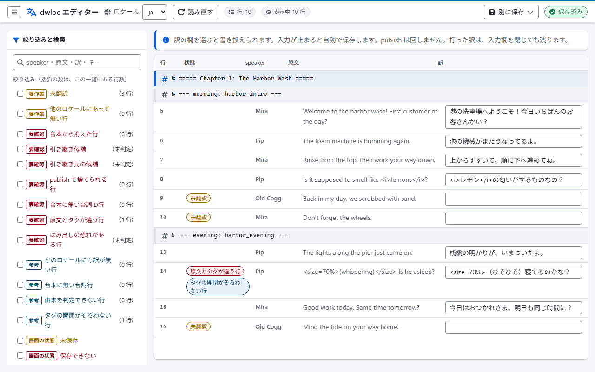
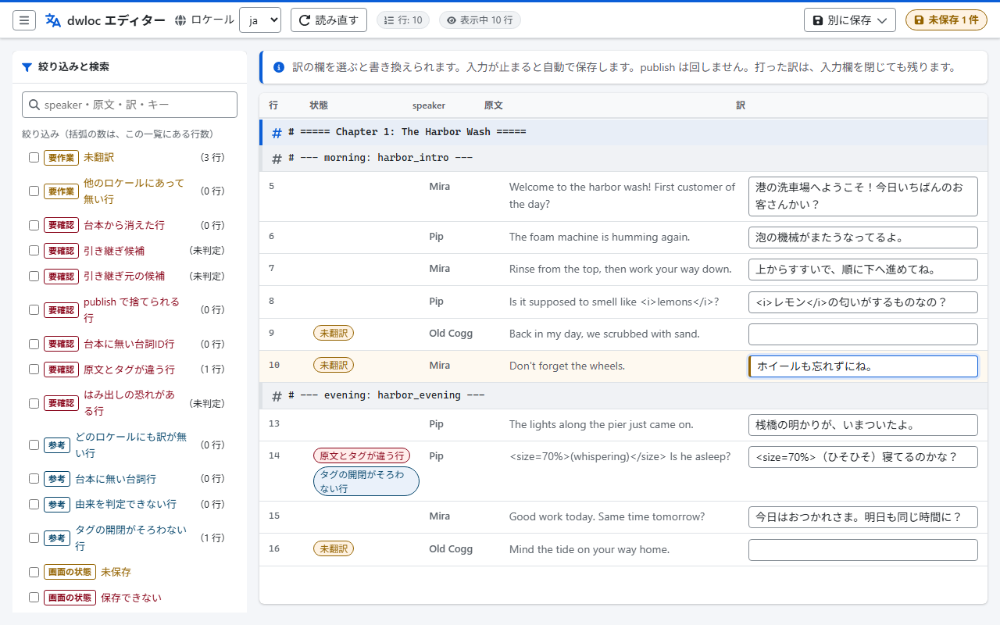
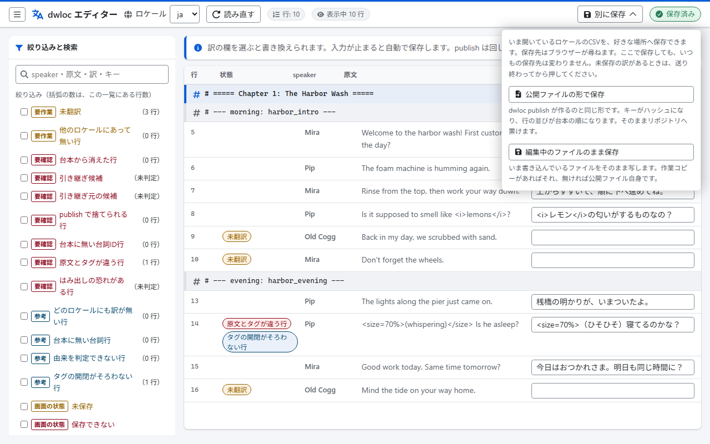
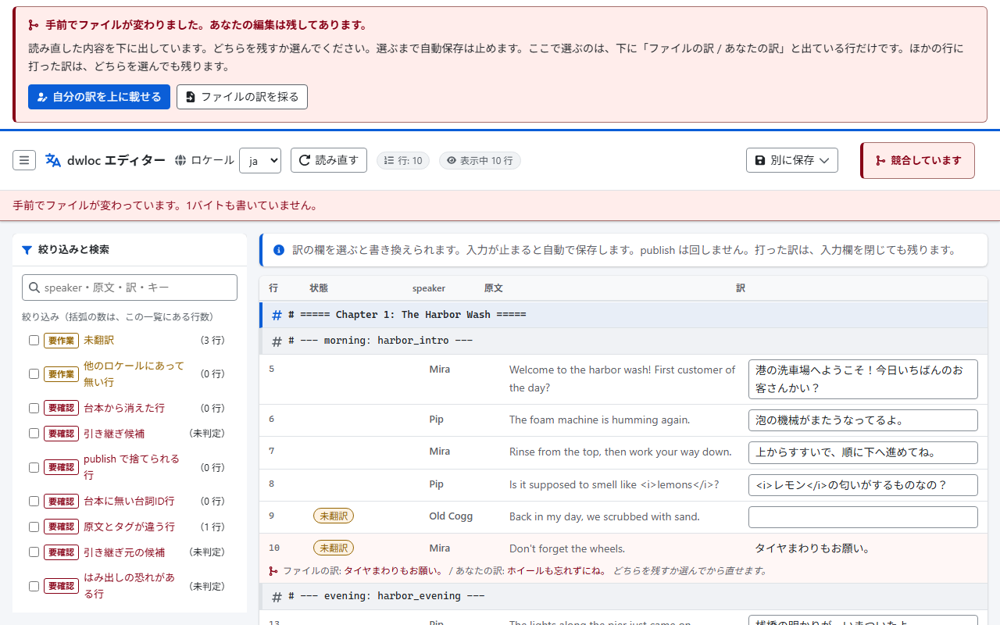

# dragnwash-localization-editor

**日本語** | [English](README.en.md)
[Drag'n Wash Localization](https://github.com/TomXV/dragnwash-localization)の翻訳作業を助けるエディターです。

Windows、macOS、Linuxで動きます。  
実行ファイル1つだけで、ほかに入れるものはありません。  
Go言語で書いてあります。

## 何をするもの

翻訳者が行う次の作業を、1つの道具にまとめます。

| 機能                   | 内容                                                                                       |
|------------------------|--------------------------------------------------------------------------------------------|
| 翻訳CSVの編集          | 原文と訳文を並べて表示し、訳文を編集します（原文が出るのは作業コピーを読めたときだけです） |
| 作業用ファイルとの比較 | ゲームが書き出した作業コピーを自分で探して、突き合わせます                                 |
| 未登録の行の抽出       | 未翻訳の行、台本から消えた行、訳の引き継ぎ候補を並べます                                   |
| 保存                   | 公開用のCSVを作り直します。訳が1つでも消えるなら1バイトも書きません                        |
| 検証                   | 公開用のCSVの形式を検査します                                                              |

原文と「未翻訳」の判定は、ゲームが書き出した作業コピーに頼っています。  
その作業コピーは、ゲーム内の`F1 → Translation → Export working copy`で作ります。  
ファイルはゲームのフォルダーにしかないので、置き場所を聞かずに`dwloc`のほうから探します。  
くわしくは下の「ゲーム内の2つのボタン」と「ゲームのフォルダーを使う」を見てください。

## 入手する

[Releases](https://github.com/223n/dragnwash-localization-editor/releases)から、お使いの環境向けの書庫をダウンロードします。  
Goのインストールは要りません。

### どのファイルを落とすか

ファイル名は`dwloc_<版>_<OS>_<CPU>`の形です。  
`<版>`はリリースの番号から先頭の`v`を外したものです。  
`v0.5.0`なら`dwloc_0.5.0_windows_amd64.zip`になります。

| 使っている環境                     | 落とすファイル                   |
|------------------------------------|----------------------------------|
| Windows（ふつうのPC）              | `dwloc_<版>_windows_amd64.zip`   |
| Windows（Snapdragonなどのarm64機） | `dwloc_<版>_windows_arm64.zip`   |
| macOS（M1以降のApple Silicon）     | `dwloc_<版>_darwin_arm64.tar.gz` |
| macOS（Intel）                     | `dwloc_<版>_darwin_amd64.tar.gz` |
| Linux（64ビットのPC）              | `dwloc_<版>_linux_amd64.tar.gz`  |
| Linux（Raspberry Piなどのarm64機） | `dwloc_<版>_linux_arm64.tar.gz`  |

`darwin`はmacOSのことです。  
`amd64`はIntelとAMDの64ビットのCPU、`arm64`はApple SiliconやSnapdragonなどのCPUを指します。

どちらか分からないときは、その場で確かめられます。

| 環境    | 確かめかた                                                           | 見かた                                                    |
|---------|----------------------------------------------------------------------|-----------------------------------------------------------|
| macOS   | ターミナルで`uname -m`を実行します                                   | `arm64`ならarm64、`x86_64`ならamd64です                   |
| Linux   | 端末で`uname -m`を実行します                                         | `aarch64`ならarm64、`x86_64`ならamd64です                 |
| Windows | 「設定」→「システム」→「バージョン情報」の「システムの種類」を見ます | 「ARMベース」と書いてあればarm64、そうでなければamd64です |

間違えたものを落とすと、多くの場合その場で起動しません。  
ただしarm64のWindowsとApple Siliconは、amd64版もエミュレーションで動かしてしまいます。  
動いても遅いので、`dwloc version`が通っても表のとおりのものを使ってください。  
落とし直せば直ります。  
自動で付く「Source code」の2つはソースコードです。  
バイナリは入っていません。

書庫を開くと、書庫と同じ名前のフォルダーが1つ入っています。  
その中身が4つです。

```text
dwloc_0.5.0_windows_amd64/
  dwloc.exe                ← 本体
  LICENSE
  THIRD_PARTY_NOTICES.md
  README.txt
```

| 中身                            | 何か                                                         |
|---------------------------------|--------------------------------------------------------------|
| `dwloc`（Windowsは`dwloc.exe`） | 本体です                                                     |
| `LICENSE`                       | ライセンス（Apache License 2.0）です                         |
| `THIRD_PARTY_NOTICES.md`        | 画面のアイコン（Font Awesome Free、CC BY 4.0）の帰属表示です |
| `README.txt`                    | 実行のしかたを短くまとめたものです（日本語と英語）           |

フォルダーを1枚かぶせてあるのは、書庫を展開したときに、ばらけたファイルが手元へ散らばらないようにするためです。

このバイナリには署名を付けていません。  
署名にはApple Developer Program（年99ドル）とWindowsの証明書が要るため、今のところ見送っています。  
そのため、macOSとWindowsでは初回に警告の出る場合があります。  
下に回避の手順を書きます。

### Windowsで実行する

1. ダウンロードしたzipを右クリックし、「すべて展開」を選びます
1. PowerShellを開き、展開したフォルダーへ移動します
1. その中にある同じ名前のフォルダーへ、もう1段入ります
   （`dwloc_0.5.0_windows_amd64\dwloc_0.5.0_windows_amd64`のように二重になります）
1. `.\dwloc.exe version`を実行します。版が表示されれば動いています

「WindowsによってPCが保護されました」と出た場合は、「詳細情報」を押してから「実行」を選びます。  
これはSmartScreenによる、署名の無いプログラムへの警告です。

同じ名前のフォルダーの中まで開いても`dwloc.exe`が見当たらない場合は、Microsoft Defenderによる隔離を疑ってください。  
何が隔離されたかは、Windowsセキュリティの「保護の履歴」で確認できます。  
元のリポジトリのREADMEには、配布物の`Install.exe`を`Trojan:Script/Wacatac.B!ml`として検出した事例が書かれています。  
そこでは、これは誤検知であり、末尾の`!ml`は機械学習による推定を表すと説明されています。  
署名の無いファイルは、このように検出されることがあります。  
隔離された場合は、まず下の「チェックサムを確かめる」で、**落とした`zip`が**配布物と同じかを確かめてください。  
公開しているチェックサムは書庫に対するもので、`dwloc.exe`単体のハッシュは載せていません。  
書庫が配布物と同じであれば、そこから出てきた`dwloc.exe`も同じものです。  
そのうえで「保護の履歴」から許可します。  
許可するのは、そのファイルだけにします。

> [!NOTE]
> Windowsでの実際の見え方は、このバイナリでは確かめていません。  
> SmartScreenの話は[docs/research.md](docs/research.md)の5.3節、  
> Defenderの隔離の話は元のリポジトリのREADMEによるものです。

### macOSで実行する

> [!WARNING]
> 現在、macOSでDrag'n Wash Localizationは、動作しません。  
> 以下、[Drag'n Wash Localization](https://github.com/TomXV/dragnwash-localization/blob/main/README.ja.md)の内容を引用しています。
>
> **macOS では現在動作しません。**  
> Drag'n Wash は Unity 6.3 で作られていて、BepInEx 5.4.23.5 が macOS で使う読み込み役（Doorstop）が、  
> まだ Unity 6.3 のゲームに割り込めません（[NeighTools/UnityDoorstop#108](https://github.com/NeighTools/UnityDoorstop/issues/108)）。  
> Doorstop 自体はゲームに読み込まれますが BepInEx が起動せず、  
> `BepInEx/LogOutput.log` も `BepInEx/config` も作られないまま、ゲームは英語で始まります。  
> Apple M3 Pro / macOS 26.6 で、Apple シリコンのままでも Rosetta でも同じ結果になることを確認しました。  
> BepInEx 側の問題なので、この Mod からは回避できません。  
> 修正の入った BepInEx が出たら、あらためて macOS で試します。  
> その日のために、**実験的な** macOS 用インストールスクリプトを  
> リポジトリに置いてあります: [`installer/experimental/install-macos.sh`](https://github.com/TomXV/dragnwash-localization/blob/main/installer/experimental/install-macos.sh)。  
> Steam Deck 用スクリプトと同じく、macOS 版 BepInEx・Mod・言語・Steam の起動オプションを設定し、  
> ゲームを起動したあとで Mod が読み込まれたかを確かめる **動作確認** もできます。  
> Mac ではまだ一度も実行しておらず、導入前に上の不具合について確認を出します。  
> リリースの zip には入っていません。

Modが読み込まれないので、macOSのゲームは作業コピーを書き出しません。  
そのため`dwloc`が動いても、原文の欄は空のまま、「未翻訳」の判定もできません。  
原文まで見たいときは、Windowsで書き出した`<ロケール>.working.csv`を持ってきて、  
`<翻訳リポジトリ>/Translations/_discovered/`へ置いてください。

ターミナルを開き、ダウンロードしたフォルダーで次を実行します。

```bash
tar xzf dwloc_<版>_darwin_arm64.tar.gz
cd dwloc_<版>_darwin_arm64
xattr -d com.apple.quarantine ./dwloc
./dwloc version
```

印が付くのは、落とした`.tar.gz`のほうです。  
ターミナルの`tar`で展開したときは`./dwloc`へ印は移らないことが多く、`xattr`の行は`No such xattr`と出ます。  
それでかまいません。  
そのまま次へ進みます。  
Finderで展開したときや、印が残っていたときのために、この1行を入れてあります。  
印が残っていると、Gatekeeperが実行を止めるためです。

[docs/research.md](docs/research.md)の5.3節には、macOS 15のSequoia以降で右クリックからの「開く」による回避が廃止されたと書かれています。  
同じ節に、コマンドラインのバイナリであれば`xattr`の1行で済むとあります。

> [!NOTE]
> macOSでの実際の見え方も、このバイナリでは確かめていません。

### Linuxで実行する

```bash
tar xzf dwloc_<版>_linux_amd64.tar.gz
cd dwloc_<版>_linux_amd64
./dwloc version
```

書庫の中の`dwloc`には実行権限を付けてあります。  
`Permission denied`と出る場合は、展開のしかたで権限が落ちています。  
`chmod +x ./dwloc`を実行してください。

Linuxには署名の仕組みが事実上ありません（[docs/research.md](docs/research.md)の5.3節）。  
実行権限だけで動きます。

### チェックサムを確かめる

`dwloc_<版>_checksums.txt`に、6つの書庫それぞれのSHA-256を載せています。  
1行は「ハッシュ、スペース2つ、ファイル名」の形です。  
落とした書庫と同じフォルダーに置いて確かめます。

macOSとLinuxでは、次のように確かめます。

```bash
sha256sum --check --ignore-missing dwloc_<版>_checksums.txt      # Linux
```

```bash
shasum -a 256 --check --ignore-missing dwloc_<版>_checksums.txt  # macOS
```

`--ignore-missing`は、手元にある書庫だけを対象にします。  
これを付けないと、落としていない5つが見つからずに失敗します。

WindowsではPowerShellで確かめます。

```powershell
Get-FileHash -Algorithm SHA256 .\dwloc_<版>_windows_amd64.zip
```

表示された`Hash`と、`checksums.txt`の同じファイル名の行が一致すれば、配布しているものと同じファイルです。  
大文字と小文字の違いは無視してかまいません。  
一致は「配布しているファイルと同じもの」の確認であって、安全であることの証明ではありません。

リリースをやり直すと、書庫に入る時刻が変わるため、チェックサムも変わります。  
書庫とチェックサムは、必ず同じReleaseのものを使ってください。

## 使い方

### いちばん簡単な始め方

先に翻訳リポジトリを手元へ用意します。  
[TomXV/dragnwash-localization](https://github.com/TomXV/dragnwash-localization)をフォークして、そのフォークを`clone`してください。  
フォークからPull Requestまでの流れは、翻訳リポジトリの[CONTRIBUTING.ja.md](https://github.com/TomXV/dragnwash-localization/blob/main/CONTRIBUTING.ja.md#基本の流れ)にあります。

`dwloc`を**翻訳リポジトリのフォルダー**へ置いて、ダブルクリックしてください。  
**`Translations`フォルダー**と同じ場所です。

```text
<翻訳リポジトリ>/
  Translations/    ← これと同じ場所に
  data/
  dwloc.exe        ← これを置く
```

訳を書き換える画面がブラウザーで開きます。  
コマンドプロンプトは要りません。  
止めるときは、開いた黒い窓で`Ctrl+C`を押すか、窓を閉じます。

操作がないまま30分たつと、待ち受けは自分から終わります。  
席を外して戻ったときに訳が保存されないのは、これです。  
ダブルクリックで開いた黒い窓は、そのとき閉じます。  
コマンドから起動していれば、`操作がないまま 30m0s たちました`と出ています。  
前のタブで訳を打つと、上の帯に「待ち受けに届きません」と出て、まだファイルに入っていない訳が一覧で並びます。  
一覧の訳は字として出ているので、選んで写せます。  
`URL`は起動のたびに作り直すので、前のタブを読み込み直しても`404 page not found`しか出ません。  
写してから、もう一度起動して、黒い窓に出た新しい`URL`を開いてください。  
新しい画面では、検索の欄にキーを打つとその行が出ます。  
長く開けておきたいときは、コマンドから`--idle-timeout 0`を付けます。  
翻訳者のPCに、誰も開けない待ち受けを残さないための既定です。

置き場所が違うと、どこへ置けばよいかを案内して終わります。  
起動の途中で止まったとき（公開ファイルの形が崩れている、ポートを取れない、など）も、黒い窓は理由を出したまま`Enter キーを押すと閉じます。`で待ちます。  
理由を読んでから`Enter`を押してください。  
`Ctrl+C`で止めたときと、時間切れで終わったときは待たずに閉じます。

ゲームが入っているPCでは、ダブルクリックした`dwloc`もゲームのフォルダーを探します。  
見つかれば、そこにある作業コピーへ保存します。  
置いたフォルダーの中だけで済ませたいときは、コマンドから`--no-game`を付けてください（`dwloc --no-game`）。  
くわしくは下の「ゲームのフォルダーを使う」を見てください。

Windowsではこの方法で開けます。  
macOSとLinuxのファイルマネージャーからの起動は確かめていないので、  
うまくいかないときは下のコマンドを使ってください。

macOSとLinuxでは、`dwloc`を翻訳リポジトリの中へ置かずに、`--root`で指して使ってください。  
翻訳リポジトリの`.gitignore`が外しているのはWindowsの`dwloc.exe`だけなので、`git add -A`でコミットに入ることがあります。  
翻訳リポジトリでない場所で起動したときも、これらのOSでは`dwloc`を移すのではなく`--root`を勧めます。

### コマンドから使う

ダウンロードした`dwloc`を、翻訳リポジトリのルートを指して実行します。  
自分でビルドする場合は、下の「開発」を見てください。

```bash
./dwloc validate --root ../dragnwash-localization
```

```bash
./dwloc diff     --root ../dragnwash-localization
```

```bash
./dwloc publish  --root ../dragnwash-localization --dry-run
```

```bash
./dwloc publish  --root ../dragnwash-localization
```

| サブコマンド | 何をするか                                             |
|--------------|--------------------------------------------------------|
| `validate`   | `Translations/<locale>/strings.csv`の形式を検査します  |
| `diff`       | 次にやることと、確かめたほうがよい行を並べます         |
| `publish`    | 公開用の`strings.csv`を作り直します                    |
| `edit`       | 手元だけの待ち受けを始め、ブラウザーで訳を書き換えます |
| `version`    | 版を表示します                                         |

サブコマンドごとの説明は、`dwloc <サブコマンド> --help`か`dwloc help <サブコマンド>`で出ます。  
版は`dwloc --version`でも出ます。  
引数を誤ったときは、理由の1行と`使い方は dwloc diff --help で表示します。`のような1行だけを出して止まります（終了コード`2`）。  
`--idle-timeout`のように単位の要る指定では、書き方も添えます。

ゲームが入っているPCでは、後ろの2つが打ったその場で止まることがあります。  
`--dry-run`の報告も出ず、「ゲームに入っている翻訳が古いので、1バイトも書きませんでした」で終わります（終了コード`1`）。  
この開発機では実際にそうなります。  
壊れているのではなく、`publish`が巻き戻りを止めている状態です。  
抜け方は下の「ゲームに入っている翻訳が古いと止まります」にあります。

よく使う指定は次のとおりです。

| 指定                      | どのサブコマンド | 何をするか                                                                                                                              |
|---------------------------|------------------|-----------------------------------------------------------------------------------------------------------------------------------------|
| `--locale <ロケール>`     | `publish` `diff` | 対象のロケールを絞ります。カンマ区切りで並べられます                                                                                    |
| `--dry-run`               | `publish`        | 何をするかだけを表示して、ファイルを書きません。守りの判定は同じです                                                                    |
| `--check`                 | `publish`        | `--dry-run`と同じ報告を出し、書き換えが要れば終了コードを`1`にします。ファイルは書きません。CI向けです                                  |
| `--no-working`            | `diff`           | 作業コピーがあっても読みません。公開ファイルだけで何が言えるかを見ます                                                                  |
| `--all` / `--limit`       | `diff`           | 参考のカテゴリも並べる／1カテゴリの上限を変える（既定20、0で全件）                                                                      |
| `--format csv`            | `diff`           | 11列のCSVで出します。表計算にそのまま貼れます。判定しなかったカテゴリは行が無いだけになるので、そのカテゴリと理由を標準エラーへ書きます |
| `--raw-csv`               | `diff`           | `--format csv`の値に`'`を付けず、そのまま書きます。機械と突き合わせるときに使います                                                     |
| `--output <ファイル>`     | `diff`           | 結果を標準出力の代わりにファイルへ書きます。文字が化けません。`csv`にはBOMを付けます                                                    |
| `--strict`                | `diff`           | 要作業だけでも終了コードを`1`にします。訳が1件もないロケールも要作業に数えます。CI向けです                                              |
| `--port` / `--no-browser` | `edit`           | 待ち受けるポートを決める／ブラウザーを自動で開かない                                                                                    |
| `--ui-lang ja`            | `edit`           | 画面とメッセージの言語を決めます                                                                                                        |
| `--idle-timeout`          | `edit`           | 操作が絶えてから終わるまで（既定`30m`、`0`で終わりません）                                                                              |

`--no-working`と`--no-game`は役割が違います。  
`--no-game`はゲームのフォルダーを探しません。  
`--no-working`は探して見つけても、作業コピーを読みません。

`--format csv`では、先頭が`=`・`+`・`-`・`@`・タブ・CRの値の頭に`'`を付けます。  
表計算へ貼ったとき、式として読まれないようにするためです。  
訳は公開ファイルから来るので、ほかの人の入れた訳が、開いた人の画面で式として動くことがあります。  
悪意が無くても、`-`で始まる台詞は`#NAME?`などに化けます。  
`'`を付けたくないとき（機械と突き合わせるとき）は`--raw-csv`を付けます。  
`publish`が書く公開ファイルと、画面の書き出しには付けません。上流の道具と同じバイト列が要るためです。

`diff`の結果をファイルに残すときは、`--output <ファイル>`を使ってください。  
Windowsに最初から入っているPowerShell 5.1で`>`を使ってファイルへ送ると、日本語が化けます。  
化けた字が改行を飲み込むので、CSVの行もつながります。  
`--output`はバイト列をそのまま書くので化けません。  
`--format csv`では、表計算ソフトがUTF-8と見分けられるようにBOMを付けます。`text`には付けません。  
PowerShell 7とコマンドプロンプトの`>`は化けませんが、CSVにBOMは付きません。  
パスはカレントディレクトリからの相対です。  
書き出し先のフォルダーは作りません。  
書き出し先のファイルを表計算ソフトなどで開いたままだと、Windowsでは置き換えられずに止まります（「権限がありません」と出ます）。閉じてから、もう一度実行してください。  
翻訳リポジトリの`Translations`と`data`、ゲームの`Translations`の中には書けません。`diff`・`publish`・`edit`が読むファイルを上書きしないためです。  
リンクやジャンクションを通してこれらのフォルダーの中を指したときも、書けません。  
場所に関わらず、`dwloc`が読むファイルの名前（`strings.csv`、`<ロケール>.working.csv`、`layout_risks.csv`、`script_order.csv`、`level_flow.csv`）でも書けません。  
`--no-game`のときや、ゲームが見つからないときも、ゲームの作業コピーを上書きしないためです。  
ほかの名前（ハードリンク）があるファイルにも書きません。書くと、ほかの名前の中身も書き換わるためです。

### 出力は日本語だけです

`dwloc`が端末に出す文は、日本語だけです。  
使い方、誤りの文、`validate`・`diff`・`publish`の報告がこれにあたります。  
`edit`の画面はブラウザーの言語に従い、黒い窓に出す文は`--ui-lang`に従います。  
英語版のREADMEには、止まったときに出る主な文の英訳を載せています。

### ゲーム内の2つのボタン

原文の欄と「未翻訳」の判定は、ゲームが書き出した作業コピーから来ます。  
その作業コピーを作るのは、ゲームの中にあるボタンです。

1. ゲームの`Options → Mods → Drag'n Wash ModFramework → Developer tools`をオンにします。
   既定はオフです。オフのあいだは`F1`の窓が出ず、`_discovered`フォルダーもできません
1. 訳したい言語を選びます。
   `Options →「言語（Mod）」`か、`F1 → Translation`の言語一覧です
1. ゲームの中で`F1`を押し、`Translation`タブの`Export working copy`を押します

| ゲーム内のボタン      | 何ができるか                                                                       | 誰がいつ押すか                                   |
|-----------------------|------------------------------------------------------------------------------------|--------------------------------------------------|
| `Export working copy` | `<ゲーム>/Translations/_discovered/<ロケール>.working.csv`（原文入りの作業コピー） | 翻訳者が、訳し始める前と、ゲームが更新されたあと |
| `Export game flow`    | `<ゲーム>/Translations/_discovered/`に`script_order.csv`など3つ                    | メンテナーが、ゲームが更新されたとき             |

作業コピーができるのは、そのとき選んでいる言語のぶんだけです。  
`Export working copy`は、ゲームがいま読み込んでいるロケール1つを書き出すためです。

Steam Deckでは、`F1`をSteam Inputのボタンへ割り当てないと窓を開けません。  
割り当てなくても、言語の切り替えだけは`Options →「言語（Mod）」`からできます。  
くわしくは翻訳リポジトリの[README.ja.md](https://github.com/TomXV/dragnwash-localization/blob/main/README.ja.md)を見てください。

### ゲームのフォルダーを使う

翻訳者は2つのフォルダーを持ちます。  
コミットする翻訳リポジトリと、ゲームが読み書きするプラグインのフォルダーです。

原文（英語の台本）と、まだ訳していない行は、ゲーム側の作業コピーにしかありません。  
リポジトリの`Translations/_discovered`は`.gitignore`で除外してあるためです。  
`--game`を付けると、`dwloc`はゲーム側の作業コピーも探します。

付けられるのは`publish`、`diff`、`edit`の3つです。

```bash
./dwloc edit    --root ../dragnwash-localization --game auto
./dwloc diff    --root ../dragnwash-localization --game auto
./dwloc publish --root ../dragnwash-localization --game auto
```

3つとも、`--game`を省いてもゲームのフォルダーを探します。

```bash
./dwloc edit    --root ../dragnwash-localization
./dwloc diff    --root ../dragnwash-localization
./dwloc publish --root ../dragnwash-localization
./dwloc                                          # ダブルクリックで開いたときも同じです
```

原文の欄と「未翻訳」の判定は、作業コピーを読めるかどうかで決まります。  
その作業コピーはふつうゲームのフォルダーにしかないので、探さなければ永久に当たりません。  
見つからないときや、候補が複数あって選べないときは、作業コピー無しで始めます。  
止まりません。公開ファイルの手直しはそのままできます。

`auto`と書くと、Steamのライブラリから探します。  
場所が分かっているときは、フォルダーを直に指定できます。

```bash
./dwloc edit --root ../dragnwash-localization --game "C:/Program Files (x86)/Steam/steamapps/common/Drag'n Wash"
```

ゲームのフォルダーでも、その中のプラグインのフォルダーでも受け付けます。

| `--game`    | どう探すか（`publish` / `diff` / `edit` とも同じ） |
|-------------|----------------------------------------------------|
| 付けない    | Steamのライブラリから探します                      |
| `auto`      | Steamのライブラリから探します                      |
| フォルダー  | 指定した場所だけを見ます                           |
| `--no-game` | 探しも読みもしません                               |

3つとも同じ探し方です。  
一度は`edit`だけが探す形にしていましたが、これは誤りでした。  
既定の`edit`はゲーム側の作業コピーへ保存するので、既定の`publish`がそれを読まないと、**訳が1行もコミットする側へ届きません**。  
しかも`publish`は終了コード`0`で「書き出しました」と言うので、届かなかったことが画面のどこにも出ません。  
片方だけ探すのは、静かに壊れる道でした。

3つそろえた代わりに、`--game`を付けないときの結果は実行するPCとゲームの有無で変わります。  
承知のうえの判断です。  
読み書きするファイルは「ファイル」の欄と`diff`・`publish`の出力に必ず出るので、どれを読んだかは必ず読めます。

#### 同じ答えが要るときは--no-game

`publish`・`diff`・`edit`の3つとも`--no-game`を受け取ります。  
付けると、ゲームのフォルダーを探しません。  
そこにある作業コピーも読みません。  
読み書きするのは`--root`の中だけになります。

```bash
./dwloc publish --root ../dragnwash-localization --no-game
./dwloc diff    --root ../dragnwash-localization --no-game
./dwloc edit    --root ../dragnwash-localization --no-game
```

`--root`と同じく、サブコマンドの前に置いてもかまいません。  
サブコマンドを省いたときの`edit`にも効きます（`dwloc --no-game`）。

使うのは次のような場面です。

- 別のPCや機械と`diff`の出力を突き合わせるとき
- コミットする中身をリポジトリの中だけで決めたいとき
- リポジトリを写して試すとき（写しを`--root`に渡しても、探しに行く先は実機のゲームのフォルダーです）
- ゲームのフォルダーへ書けないPC（`Program Files`の既定の権限、権限を絞った端末、読み取り専用で繋いだ外付け）

> [!WARNING]
> **`publish`が止まったときの逃げ道には使えません。**  
> `--no-game`を付けると、`publish`の入力がリポジトリの公開ファイル自身に変わります。  
> `edit`でゲーム側の作業コピーへ打った訳は1行も入らないまま、終了コード`0`で「1 件を書き出しました」と出ます。  
> 実測です（`dwloc 0.5.0`、2026年9月18日）。  
> リポジトリの写しで既訳を書き換えてから`publish --no-game`を通したところ、公開ファイルはその訳を1文字も受け取りませんでした。  
> 上の「静かに壊れる道」と同じ壊れ方が、こんどは自分の手で起きます。  
> 止まったときの正しい抜け方は、下の「ゲームに入っている翻訳が古いと止まります」にあります。

`--game`と`--no-game`を一緒に指定すると、何もせずに止まります（終了コード`2`）。  
どちらを打ち間違えたのかは、こちらからは決められないためです。

`validate`と`version`は、`--game`と`--no-game`を受け取りますが使いません。  
ほかのサブコマンドに付けて回している指定で、`validate`だけが落ちないようにするためです。

#### 探し先は必ず出します

探し先は、標準エラーへ2行出します。  
`edit`では画面にも出ます。  
黙って別のフォルダーを読み始めることはありません。

「探し先」と書いてあるのは、そこを読むとはかぎらないためです。  
そのロケールの作業コピーがゲーム側に無ければ、1バイトも読みません。  
実際に読んだファイルは、`diff`では「作業コピー」の行に、`publish`ではロケールごとの1行に、`edit`では画面の「ファイル」の欄に出ます。

`--game`を省いて探し、見つからなかったときの案内は`edit`だけが出します。  
見つからなければ読む先は1つも増えていないので、`publish`と`diff`で言う理由がありません。  
ゲームを入れていないPCとCIで毎回3行出るほうが邪魔です。

`--game auto`や`--game <フォルダー>`を自分で打ったときは、3つとも違います。  
外れた理由を標準エラーへ出して、そこで止まります（終了コード`2`）。  
`edit`も止まります。  
打った以上は、黙って別の入力で進めるより、打ち直してもらうほうが安全だからです。

ゲームの公開ファイル（`<ゲーム>/Translations/<ロケール>/strings.csv`）へは書きません。  
`edit`が書くのは作業コピー（`_discovered`の中）1つだけで、`publish`はゲーム側を読むだけです。  
その作業コピーがゲーム側にあるときは、書く先もゲームのフォルダーの中です。  
写しを`--root`に渡しても、直すのは実機のゲームのフォルダーにある作業コピーです。

`auto`と書いたときも、`--game`を省いたときも、Steamのライブラリを辿って探します。  
Steamを既定以外の場所へ入れていて、そのパスに日本語などが入っていると、見つけられないことがあります。  
レジストリから読んだ値は、ASCIIのときしか使わないためです（文字コードを取り違えて別のフォルダーを指すより、見つからないほうが安全です）。  
そのときは`--game`でフォルダーを直に指定してください。

なお、`auto`は予約した語です。  
`auto`という名前のフォルダーを指したいときは、`./auto`のように書くか、絶対パスで指定してください。

#### 何が変わるか

| 作業コピーを読めないとき                    | 読めたとき                                    |
|---------------------------------------------|-----------------------------------------------|
| 原文の欄は空のままです                      | 原文の欄が埋まります                          |
| 「未翻訳」は判定できません                  | 「未翻訳」を数えられます                      |
| `publish`はリポジトリの中だけを入力にします | `publish`はゲーム側の作業コピーも入力にします |

読めても、原文の欄が空の行は残ります。  
実機の`ja.working.csv`では、1753行のうち101行が「原文が未取得」でした。  
`source_en`が埋まるのは、ゲームがその台本とUIを読み込んでいる行だけだからです。  
セーブをロードしてその場面を通ってから`Export working copy`をやり直すと、埋まる行が増えます。  
道具の不具合ではありません。

ゲームのフォルダーから読むのは作業コピーだけです。  
再生順（`data/script_order.csv`）はリポジトリのものを使い続けます。  
`diff`の引き継ぎ候補は、gitの履歴にある1つ前の再生順を根拠にしているためです。

#### 作業コピーを探す順

作業コピーは2か所にありえます。  
探す順は次のとおりで、`publish`・`diff`・`edit`で同じです。

| 順 | 場所                                                       | 誰が置くか                                |
|----|------------------------------------------------------------|-------------------------------------------|
| 1  | `<ゲーム>/Translations/_discovered/<ロケール>.working.csv` | ゲーム内のMod                             |
| 2  | `<ルート>/Translations/_discovered/<ロケール>.working.csv` | 自分で置いたとき                          |
| 3  | `<ルート>/Translations/<ロケール>/strings.csv`             | `publish`（作業コピー無しとして開きます） |

ただし3段目は`publish`と`edit`だけです。  
`diff`は公開ファイルを作業コピーとは見なさず、「作業コピーはありません」と言います。

ゲーム側を先に見るのは、Modが書き出した生のファイルを常に入力にするためです。  
どちらが入力になるかが、リポジトリに置き忘れたファイルの有無で変わりません。

代わりに、自分で`<ルート>/Translations/_discovered`へ置いたファイルは、ゲーム側に同じロケールの作業コピーがあるかぎり読まれません。  
黙ったままにはなりません。  
どちらを読んだかは、上の「探し先は必ず出します」で挙げた場所に出ます。

この順が`publish`と`edit`で同じであることは、この道具の土台です。  
`edit`が書く先は、`publish`が入力に選ぶファイルと同じでなければなりません。  
片方だけ順が違うと、`edit`で入れた訳が`publish`に拾われず、コミットする側へ1行も届きません。

#### 訳がコミットする側へ入るのはpublishのときです

`edit`が書くのは1つのファイルだけです。  
作業コピーがあればそれ、無ければ公開ファイル自身で、`publish`が入力に選ぶファイルと同じです。

| いま直しているもの   | 保存先           | コミットする側へ入るのは                                                   |
|----------------------|------------------|----------------------------------------------------------------------------|
| ゲーム側の作業コピー | その作業コピー   | `publish`を回したとき（`--no-game`を付けていなければ`--game`は要りません） |
| 公開ファイル自身     | その公開ファイル | 保存した時点で入っています                                                 |

未翻訳の行は、公開ファイルに存在しません。  
`publish`が訳の空の行を書かないためです。  
つまり「未翻訳の行」と「公開ファイルに無い行」は、同じ集合です。  
実機の`ja.working.csv`で数えると、訳が空のキーは32件で、そのどれも`Translations/ja/strings.csv`には行がありませんでした。

だから、`edit`が公開ファイルへキーで書き戻すことはできません。  
翻訳者がいちばんやりたいこと（未訳の行を訳す）が、1行も届かないためです。  
新しい訳を公開ファイルへ入れるのは`publish`の仕事です。

#### publishは訳が1つでも消えるなら書きません

`publish`は入力から公開ファイルを作り直します。  
入力が途中までだったり壊れていたりすると、コミット済みの訳がその場で消えます。

そこで、書き出す前にいまの公開ファイルと突き合わせます。  
訳の入った行が新しい出力から消えるなら、1バイトも書かずに止まります。  
止まるときは、どのロケールも書きません。

止まったときは、失われる行をロケール・行番号・キー・いまの訳の先頭だけで出します。  
訳は丸ごと出しません。  
訳が行をまたぐ行は、行番号を「2〜3行目」のように範囲で出します。  
訳の中の改行は`↵`、`CR`は`␍`のような見える印に置き換えて出します。  
終了コードは`1`です（`validate`が問題を見つけたときと同じ意味です）。  
`--dry-run`でも同じ判定をして、同じ報告を出します。

**止まったときにすることは2つです。**

1. ゲーム内で`F1 → Translation → Export working copy`をやり直し、作業コピーを書き出し直します。
   止まる原因は、たいてい入力にした作業コピーが途中までか、壊れているかです
1. リポジトリの`Translations/_discovered`に、古い作業コピーを置き忘れていないか見ます。
   ゲーム側に同じロケールが無ければ、そちらが入力になります

道具が出す案内は「ゲーム内で`Export game flow`をやり直すと、作業コピーを作り直せます」と書いています。  
作業コピーを作るのは`Export working copy`のほうなので、そこは読み替えてください。

この確認に逃げ道はありません。  
無効にする指定は用意していません。

この確認は`--game`とは関わりなく効きます。  
リポジトリの`Translations/_discovered`に古い作業コピーが残っているときも、`publish`はそれを入力に選ぶためです。  
この経路はいままで無防備でした。  
`--game`を付けずに`publish`を回すだけで、`Translations/ja/strings.csv`が191,650バイトから39,342バイトになり、終了コードは`0`でした。  
いまは同じ入力で1,361件を報せて止まります。

実測です（`dwloc 0.5.0`、2026年9月18日）。  
実機の`ja.working.csv`（ファイルの物理行1979行、データ行1753行、訳の入ったキー1721件）を入力に据えました。  
元の`Translations/ja/strings.csv`は191,650バイト・データ行1721行です。

| 入力にした作業コピー                  | 失われる訳 | 書き出し   | 終了コード |
|---------------------------------------|------------|------------|------------|
| 途中まで（1979行のうち先頭400行）     | 1,367件    | ありません | 1          |
| ヘッダーの引用符が閉じていない        | 1,721件    | ありません | 1          |
| 公開ファイルにある行の訳を1つ空にした | 1件        | ありません | 1          |
| そのまま（未訳の行を1つ訳した）       | 0件        | あります   | 0          |

2行目は、1行ずつ読んでいたころ、`source_en`と`translation`が1つの列名に融合し、`translation`列を引けなくなる壊れ方でした。  
全行が「訳が空」と見なされて落ちます。  
この確認を入れる前は、これが終了コード0で通り、公開ファイルがヘッダー1行だけになっていました。  
いまこの入力を先に止めるのは、次の「読み違える形なら書きません」の確認です（閉じない引用符として止まります。終了コードは同じ`1`です）。

最後の行では`ja/strings.csv`が191,650バイトから191,653バイトになりました。  
足した訳の行そのものは63バイトです。  
差し引き3バイトしか増えないのは、同じ`publish`が訳以外の差も書き直して60バイト縮めるためです。  
そのうち52バイトは、下に書く`speaker`列の17行です。  
訳を1つも足さずに同じ入力で通すと、191,590バイトへ縮みます。  
ファイルの増減は、入れた訳の長さとは一致しません。  
ほかの15ロケール（作業コピーの無いロケール）は1バイトも変わりません。

守るのは訳だけです。  
正常な作業コピーでも、`speaker`列が17行変わり（`Ryan`と`Conrad`が`UI`になります）、`UI`の行が10行入れ替わります。  
作業コピーは、再生順に無い行の`speaker`を持たないためです。  
訳は1つも失われないので、ここでは止まりません。

#### 読み違える形なら書きません

`publish`は、上流の`tools/hash-strings.ps1`と同じく、ファイル全体を解釈して読みます。  
引用符で囲んだ値は、行をまたいでも1つの値として読みます。  
値の中の改行は、読んだとおりに書きます。  
上流の道具とバイト単位で同じ公開ファイルになります。

ただし、この読み方は、引用符の閉じ忘れと正しい複数行の値を見分けません。  
上流の道具は、閉じ忘れのある作業コピーから、英語の原文やほかの行のキーを訳として公開ファイルへ書きます。  
1つ上の確認は、訳が消えることは見つけますが、英文が足されることは見つけません。

そこで、書き出す前に、入力・いまの公開ファイル・ゲーム側の公開ファイルの形を確かめます。  
次のどれかに当たると、どのロケールも書かずに止まります（終了コード`1`）。  
確かめる順は、この形の確認、ゲームに入っている翻訳の確認、訳が消えるかの確認です。  
`--dry-run`でも同じ判定をします。

| 形                                                                                         | そのまま書くと                                     |
|--------------------------------------------------------------------------------------------|----------------------------------------------------|
| ヘッダーに`key`列も`source_en`列も無い、`translation`列が無い、または最初の列名が`#`で始まる | すべての行が捨てられます                           |
| 開いた引用符がファイルの終わりまで閉じない                                                 | そこから後ろ（英語の原文を含む）が1つの訳になります |
| 引用符が別の行で閉じ、後ろの行を値に飲み込んでいると見られる                               | 英語の原文やほかの行のキーが訳として公開されます   |
| 値の中に単独の`CR`（後ろに`LF`の続かない`CR`）がある                                       | 上流の道具を通すと、その行が落ちます               |
| 引用符で囲まない値が、行の終わりの単独の`CR`で切れている                                   | 切れた前半だけが公開され、後半は落ちます           |
| 空でない行があるのに、1行も読めない                                                        | すべての行が捨てられます                           |

止まったときは、ファイル・行番号・何が起きるか・直し方を1件ずつ出します。  
訳は出しません。  
`source_en,translation`の2列だけの作業コピーは、正しい入力として通します。  
ゲーム側の公開ファイルで当たったときは、リポジトリの`Translations/<ロケール>/strings.csv`を同じ場所へ写し直すと直ります。

再生順のデータ（`data/script_order.csv`と`data/level_flow.csv`）も、読む前に確かめます。  
開いた引用符がファイルの終わりまで閉じないときと、`publish`がそのまま書く値に改行があるときは、同じように止まります。  
そのまま書く値は、見出しの行に使う列と`order`列です。  
見出しの行に使う列は、`script_order.csv`の`section`・`phase`・`node`・`condition`と、`level_flow.csv`の`dragon`・`weather`・`set_flags`・`end_flags`です。  
改行があると、公開ファイルの見出しの行が2行に割れ、次に読むときに2行目がデータの行になります。  
上流の道具も同じように壊れます。

飲み込みは、行をまたぐ値の続きの行が、それだけで1件のレコードに見えるかで見分けます。  
キーの形で始まるか、区切りの数がヘッダーの列の数と同じなら、閉じ忘れを疑います。  
直すときは、引用符の閉じる位置を確かめ、値を閉じる`"`が抜けていれば足します。  
値の中の`"`は、`""`と2つ重ねて書きます。

正しい複数行の値でも、この確認に当たることがあります。  
原文の2行目がカンマを多く含むときや、2列の作業コピーで原文が行をまたぐときです。  
報告の行を見て値が正しいと確かめたら、止まったときの直し方に出る指定を付けて走らせます。  
指定はレコードごとで、`<ロケール>:<key>`の形です。  
直し方には、そのまま写せる形で出ます。

```bash
dwloc publish --accept-multiline ja:0123456789abcdef
```

`<key>`は、そのレコードの`key`列の値です。  
`key`列が無いか空なら、原文から作るキーです（`source_en,translation`の2列の作業コピーなど）。  
英数字の大文字と小文字は区別しません。  
ただし、台詞ID（`line:`で始まる）は綴りのまま比べます。

通すのは、指定したレコードの、続きの行がレコードに見える形だけです。  
同じロケールのほかのレコードは通しません。  
指定は、そのロケールの入力・いまの公開ファイル・ゲーム側の公開ファイルのどれでも、その`key`のレコードに効きます。  
通した行と、通した指定は標準エラーに出ます。  
複数のレコードを通すときは、1つずつ複数回指定します。  
`--path`で走らせたときは、ロケールの代わりに`--path`へ渡したファイルを書きます（`<ファイル>:<key>`）。  
パスに空白や括弧など（`Program Files (x86)`や`Drag'n Wash`）があるときは、直し方に二重引用符で囲んで出します。  
PowerShell、コマンドプロンプト、bashのどれにも、そのまま貼れます。  
`$`のように、二重引用符の中でもシェルによっては読み替える文字があるときは、使うシェルに合わせて書き直すよう添えます。  
ロケールだけ（`--path`ではファイルだけ）の指定はできません。  
渡すと、レコード単位で指定するよう案内して止まります（終了コード`2`）。  
通せる行に当たらない指定も、同じく終了コード`2`で止まります。

閉じ引用符のすぐ後ろに文字が続く形、閉じない引用符、単独の`CR`、再生順のデータの形は、指定しても通しません。  
どれも道具が書くファイルには現れない形で、直せば通ります。  
ただし、原文（`source_en`列）の単独の`CR`は、直してよいかが行のキーで変わります（下の表）。  
閉じ引用符のすぐ後ろに文字の続く行を含むレコードは、続きの行がレコードに見えても通しません。  
正しい値ではありえず、通すと英語の原文やキーが訳として公開されるためです。

次のレコードも、指定では通せません。  
止まったときの直し方にも、指定は出ません。

- `key`が無いレコード（飲み込んだのがヘッダーのときと、`key`列と原文がどちらも空のレコード）
- `key`列の値に、英数字と`.` `_` `:` `-`のほかの文字（空白、引用符、改行など）があるレコード
- 同じファイルに、同じ`key`のレコードが2つ以上あるレコード

前の2つは、そのままでは`publish`が書かないレコードです。  
写すとシェルで割れる`key`を、指定の案内に出さないためでもあります。  
3つ目は、どのレコードを確かめたのかを指定から決められません。  
`publish`が書くのは、訳の入った最初のレコードだけです。  
要らないレコードを消してから走らせます。  
ゲームの作業コピーと`publish`の書く公開ファイルでは、`key`は重なりません。

この形の値を一度公開すると、いまの公開ファイルの確かめで毎回当たります。  
そのため、そのレコードを書くたびに同じ指定が要ります。  
あとから作業コピーに入った閉じ忘れは、別のレコードなので、その指定では通りません。  
ただし、同じレコードの値に新しく入った閉じ忘れは、同じ指定で通ります。  
走らせるたびに、通した行の一覧を確かめてください。  
画面の書き出しには、この指定がありません。  
正しい複数行の値で止まったときは、`dwloc publish`で書きます。

原文（`source_en`列）の単独の`CR`で止まったときは、行のキーによって直し方が変わります。  
止まったときの直し方も、行ごとにこの表のとおりに出ます。

| 行のキー                                              | 直し方                                          | 理由                                                                                                   |
|-------------------------------------------------------|-------------------------------------------------|--------------------------------------------------------------------------------------------------------|
| 台詞ID（`line:`で始まる）                             | 原文の`CR`を`LF`に直すか、取り除きます          | キーを原文から作らないので、直しても訳は公開されます                                                   |
| `key`列のキーが、いまの原文から作ったものと一致する   | 原文は直さず、その行の訳を空に戻します          | 直すとキーと合わなくなり、その行は黙って公開されなくなります（上流の道具も、この行を公開しません） |
| `key`列が無いか空                                     | 原文は直さず、その行の訳を空に戻します          | キーはいまの原文から作るので、直すとキーが変わり、ゲームが引かないキーで公開されます                 |
| 原文の改行を`LF`にそろえると`key`列のキーと一致する | 原文の改行を`LF`にそろえます（取り除きません） | キーは`LF`の原文から作ったもので、いまはキーと合わず公開されません                                    |
| どちらでも`key`列のキーと合わない                     | その行の訳を空に戻します                        | 直しても公開されません                                                                                 |

訳を空に戻した行は公開されませんが、ほかの行は書けます。

行をまたぐ訳そのものでは止まりません。  
以前の`dwloc`は1行ずつ読んでいたので、行をまたぐ訳を1行目で切り詰めていました。  
そのため、行をまたぐ値のある公開ファイルと、訳の入った行をまたぐ値のある作業コピーで止めていました。  
いまはどちらも正しい値として書きます。  
ゲーム側の作業コピーには、原文が行をまたぎ、訳の空いた行があります。  
この行は、未翻訳の行として読みます。

表計算ソフトなどで作業コピーを保存し直すと、原文の中の改行が`LF`から`CRLF`に変わることがあります。  
キーと合わなくなった行は公開されません（上流の道具と同じです）。  
原文の`CRLF`を`LF`にするとキーと一致する行は、止めずに、行とキーを出して知らせます。  
ゲーム内で作業コピーを書き出し直すと直ります。

改行が`CR`だけのファイルでは止まりません。  
`dwloc`は単独の`CR`でも行を分けるので、正しく読めます（書き出すと`LF`になります）。  
上流の`tools/hash-strings.ps1`は、このファイルの訳をすべて落とします。

ヘッダーより上にある空行・空白だけの行・コメント行は、読み飛ばしてからヘッダーを選びます。  
上流の`tools/hash-strings.ps1`と同じ読み方です。  
以前は空白だけの行がヘッダーになり、そのロケールの訳がすべて消えていました。

#### ゲームに入っている翻訳が古いと止まります

ゲーム側の作業コピーを入力にしたときは、書き出す前にもう1つ確かめます。  
決め手になるのは、`--game`を打ったことではなく、入力がゲーム側から来たことです。  
`--game`を省いても探すので、この確認は打っていない人にも効きます。  
ゲームに入っている`Translations/<ロケール>/strings.csv`が、コミット済みと食い違っていないかです。  
食い違っていたら、どのロケールも書かずに止まります（終了コード`1`）。

**止まったときは、ゲームへ最新の翻訳を入れ直します。**

1. リポジトリの`Translations/<ロケール>/strings.csv`を、ゲーム側の同じ名前のファイルへ上書きします。
   写す先は、`dwloc`が標準エラーへ「探し先」として出しているフォルダーの下です（`<探し先>/Translations/<ロケール>/strings.csv`）
1. ゲームが動いていれば、約2秒でホットリロードが読み直します。
   動いていなければ、1度起動します
1. ゲーム内で`F1 → Translation → Export working copy`をやり直します
1. `dwloc publish`をもう一度実行します

入れ直すのは、報告に出たロケールだけで足ります。  
`Program Files`の下にあるゲームでは、この上書きに管理者の権限を求められることがあります。

`publish`を1回通すたびに、この状態になります。  
既訳を1行でも直して`publish`が通ると、リポジトリだけが新しくなり、ゲーム側は直す前のままだからです。  
2周目の`publish`が必ず止まるのはこのためで、壊れたわけではありません。  
実測です（`dwloc 0.5.0`、2026年9月18日）。  
リポジトリとゲームの写しで、既訳を1行直して`publish`を通し、続けて何も変えずにもう一度`publish`を回すと、終了コード`1`で止まりました。  
書き出した公開ファイルをゲーム側へ写すと、同じ`publish`が終了コード`0`で通りました。

Modは「いま読み込んでいる訳」を作業コピーへ書き出します。  
ゲーム側が古ければ、作業コピーも古い訳を持ちます。  
それを入力にすると、新しいコミットが古い版へ巻き戻ります。

これは1つ上の「訳が1つでも消えるなら書きません」では捕まりません。  
行は消えず、訳も空にならず、値だけが戻るためです。

「書き換わったら止める」にはできません。  
訳を書き換えることこそ翻訳者の仕事で、止めれば`publish`が使えなくなります。  
編集と巻き戻りを見分けるには3点目が要ります。それがゲームに入っている公開ファイル、つまり作業コピーが建っている土台です。

| コミット済みとゲーム側 | 作業コピーの訳の違いは                       |
|------------------------|----------------------------------------------|
| そろっている           | 翻訳者がゲームの中で入れた編集。**通します** |
| 食い違っている         | 別の土台の上に建っている。**止めます**       |

実測です（`dwloc 0.5.0`、2026年9月18日）。  
この開発機のSteamに入っていたゲームで、`publish --game`を回しました。  
ゲーム側のファイルは2026-09-16に書き出されたもので、測ったのはその2日後です。

|                            | 結果                            |
|----------------------------|---------------------------------|
| ゲーム側の`Translations`   | 13ロケール（リポジトリは16）    |
| ゲーム側の`ja/strings.csv` | 191,698バイト・2026-09-16 05:24 |
| 食い違っていた訳           | 3件                             |

3件のうち2件は`</i>`が落ち、1件は「16言語」が「13言語」へ戻るものでした。  
この確認を入れる前は、終了コード0で通り、3件とも静かに巻き戻っていました。

報告にはキー・コミット済みの訳・ゲーム側の訳を並べます。  
切り出しは、違っているところが見えるようにずらします。  
先頭から一定の文字数を出すだけだと、3件とも先頭が同じで、同じ文字列が2行並ぶだけになりました。

見るのは訳だけです。  
`section`や`order`の食い違いは見ません。再生順はリポジトリのものを使うので、そこがずれても書き出す中身は変わりません。  
片側にしか無い行も数えません。版が違えば行の増減は当たり前に起きるためで、それで訳が消えるなら1つ上の「訳が1つでも消えるなら書きません」が捕まえます。

ゲーム側に公開ファイルが無いときは、そろっているかどうかを判断できないので、この確認は飛ばします。

**残る隙間があります。**  
ゲームへ最新の翻訳を入れ直したあと、`Export working copy`をやり直さずに`publish`を回すと、この確認は通ります。  
土台はそろっているのに、作業コピーだけが入れ直す前に書き出されたままだからです。  
上の手順の3番目（`Export working copy`のやり直し）を飛ばさないでください。

#### 見つからないとき

作業コピーは、ゲーム内で`F1 → Translation → Export working copy`を1度実行するとできます。  
`--game auto`が探しているのは`Translations/_discovered`を持つフォルダーで、こちらは同じタブの`Export game flow`でもできます。  
どちらも実行していないと、`--game auto`は空振りして止まります（終了コード`2`）。  
`F1`の窓そのものが出ないときは、`Options → Mods → Drag'n Wash ModFramework → Developer tools`がオフです。  
くわしくは上の「ゲーム内の2つのボタン」を見てください。

候補が2つ以上見つかったときは、どれも使いません。  
`--game auto`と書いたときは、一覧を出して止まります（終了コード`2`）。  
`--game`を省いたときは、一覧を出してから、作業コピー無しで始めます。  
こちらは止まりません。  
打った人には選び直してもらい、打っていない人の画面は開く、という分け方です。  
どれを使うかは`--game`で指定してください。  
勝手に選ぶと、どちらのゲームのファイルを直しているのか分からなくなるためです。

ゲームが`C:/Program Files (x86)/`の下にあると、`edit`の保存を拒まれることがあります。  
そのときは画面に「保存できませんでした」と出て、送り直しを続けます。  
ファイルは1バイトも変わりません。

#### macOSでは見つかりません

macOSには、ゲームのフォルダーがありません。  
プラグインと作業コピーも作られません。  
ゲーム内のModがmacOSで動かないためです。  
くわしくは上の「macOSで実行する」の警告を見てください。

`dwloc`自身はmacOSでも動きます。  
動かないのは、ゲームと繋がる部分だけです。

| macOSで                       | どうなるか                                |
|-------------------------------|-------------------------------------------|
| `publish`、`validate`、`diff` | 使えます                                  |
| `edit`                        | 使えます。ただし原文の欄は空のままです    |
| `--game auto`                 | 何も見つからず、終了コード`2`で止まります |

`--game auto`と打つと、空振りした理由を標準エラーへ出して止まります。  
`edit`は`--game`を省いても探すので、そのときは探して無かったことを3行出してから、原文の欄が空のまま始めます。  
ほかのPCで書き出した作業コピーを持ってきたときは、`--game`でそのフォルダーを指定できます。

### 画面で訳を書き換える

`edit`は、手元だけの待ち受けを始めます。  
`127.0.0.1`にしか束ねません。

```bash
./dwloc edit --root ../dragnwash-localization --locale ja
```

標準出力に出た`URL`をブラウザーで開くと、1ロケールの全行が並びます。  
訳の欄を選ぶと書き換えられます。  
入力が止まると自動で保存します。



画面の例は、この説明のために作った架空の台詞で撮っています。  
ゲームの台本は載せていません。

保存先が作業コピーのときは、ゲームが約2秒で読み直します。  
訳しては画面で確かめる、を再起動なしで繰り返せます。  
効くのは、ゲームが動いていて、その言語を選んでいて、`Developer tools`がオンのときです。  
反映されたかは、ゲーム内の`F1 → Activity log`に`[reload]`で出ます。

画面とメッセージの言語は、ブラウザーが送る`Accept-Language`で決まります。  
`ja`が当たらないと、画面と案内が全部英語になります。  
画面の中に切り替えは置いていないので、`--ui-lang ja`を付けて起動し直してください。

```bash
./dwloc edit --root ../dragnwash-localization --locale ja --ui-lang ja
```

`--ui-lang`に渡せるのは`ja`と`en`です（`EN`や`en-US`のような書き方も受けます）。  
ほかの値（`eng`、`fr`など）は、`--ui-lang は ja か en です`と出して止まります（終了コード`2`）。  
黙って日本語に落とすと、英語を選んだつもりの人に読めない案内が出るためです。

配色は、OSの設定（明るい・暗い）に従います。
暗い配色でも、意味の色（要作業・要確認・参考・保存の状態）は同じ色みで、名前も必ず出ます。
意味の色は、色覚の違い（P型・D型・T型）でも見分けられるように、色相と明るさの両方で離してあります。
画面の中に切り替えは置いていません。

訳の欄を選ぶと、その場が入力欄に変わります。  
入力欄は訳の長さに合わせて折り返し、高さも中身に合わせて伸びます。  
欄に収まらない訳を、横へ送らずに全部見ながら直せます。



訳に改行は入れられません。  
`Enter`は次の行へ進むために使っており、貼り付けた改行は空白に置き換わります。  
訳に改行を入れる操作は、まだありません。

画面は、`publish`と同じくファイル全体を解釈して読み、1件のレコードを1行として並べます。  
引用符で囲んだ値が行をまたぐレコード（何行かにまたがる1件のレコード）も1行です。  
保存は、そのレコードの訳の欄（最後の列）だけを書き換え、ほかの列とほかの行は1バイトも変えません。  
行の終わりの改行（`CRLF`や`LF`）も元のまま残します。  
原文が行をまたぐレコードも、訳が1行に収まるかぎり書き換えられます。  
ゲーム側のjaの作業コピーには、原文が空行を挟んで3行にまたがる行が1件あり、この行も訳せます。  
値の中に`#`で始まる行があっても、見出しにはしません。

行番号の欄には、そのレコードが始まるファイルの行番号を出します。  
行をまたぐレコードだけ、その下に小さく「〜」と終わりの行番号を添えます（`1865〜1867`なら、`1865`の下に`〜1867`）。  
エディターでファイルを開いたときの行番号と照らし合わせるためのものです。  
原文の欄は、値の中の改行と空行をそのまま出します。

保存する行は、ファイルの行番号ではなく、レコードの通し番号とキーで指します。  
行をまたぐレコードがあると、後ろのレコードの行番号がずれるためです。  
自分の保存では通し番号は変わりません。  
書く前に、書き換えたレコードとファイル全体を読み直して、書いた訳のほかが変わって読めないことを確かめます。  
`publish`の読み方だけでなく、ゲームの読み方でも確かめます。  
キーの欄と原文がどちらも空の行の訳を書き換えると、ゲームがほかの行を見つけられなくなるファイルがあったためです。  
いまはその行を書き換えさせない（下の表）ので、この確かめは見落とした形を捕まえるための守りです。  
外れたら1バイトも書かずに、その行を「保存できない行」にします。  
続けて打った何行かを一緒に送ったときは、1行ずつ確かめ直し、原因の行だけを「保存できない行」にします。  
ほかの行は、もう一度送って保存します。

次の行は書き換えられません。  
行には鍵のアイコンと理由が出ます。  
どれも、書いた訳を`publish`かゲームが画面に見えている値と別の値に読むか、`publish`が捨てる形です。

| 行                                                         | 出る理由                                                           |
|------------------------------------------------------------|--------------------------------------------------------------------|
| 訳に改行がある行                                           | 訳に改行がある（改行の入る訳は、まだ画面から書き換えられない）     |
| 引用符が別の行で閉じて、後ろの行を値に飲み込んでいる疑いのある行 | N行目がこのレコードの値に飲み込まれて見える（引用符の閉じ誤りの疑い） |
| ゲームの読み方（`CsvReader`）では値が違って読まれる行（値の途中の`"`など） | ゲームの読み方（CsvReader）では（列名）列の値が違って読まれる         |
| ゲームの読み方（`CsvReader`）ではレコードが見つからない行                  | ゲームの読み方（CsvReader）では、このレコードが見つからない           |
| `key`列が16桁のキーでも台詞IDでもなく、原文（`source_en`）も空の行（`hello,訳`、`,UI,,,UI,,訳`など） | key列が16桁のキーでも台詞IDでもなく、原文（source_en）も空（publishがこのレコードを捨てるので、書いた訳は公開されない） |

訳に改行がある行を書き換えさせないのは、いまの画面が改行を空白に置き換えるためです。  
開いて1字打つと、見えていない改行まで消えます。  
ゲームの読み方でレコードが見つからないのは、ゲームがその行をほかの行の値に取り込んだときです。  
前の行の値の途中の`"`からゲームが引用を始めたとき、行末に単独の`CR`が混ざっているとき（ゲームは引用の外の`CR`を捨て、次の行とつなげて読みます）などに出ます。  
ヘッダーの前に全角空白や`NO-BREAK SPACE`だけの行があるファイルでは、ゲームがその行をヘッダーと読むので、どの行にもこの理由が出ます。  
その行を消すと直ります。  
飲み込みの疑いは、`publish`が止まる形と同じ見分け方です。  
正しい複数行の値でも当たることがありますが、画面には通す指定を置いていません。  
`dwloc publish`で確かめて、`--accept-multiline`で通してください。

`,,,,,,`のように、どの列も空の行は並べません。  
キーと原文の両方が空なので`publish`が捨て、そこへ打った訳は公開されないためです。  
原文が空で、`key`列が16桁のキーでも台詞ID（`line:`で始まる）でもない行は並べますが、同じ理由で書き換えられません（表の最後の行）。  
`publish`がその行のキーを決められずに捨てるためです。  
`key`列が空の行のほか、`hello`のように16桁のキーの形でない値が入った行も当たります。  
16桁のキーは16進の16桁です。  
大文字でも、前後に空白があっても`publish`は16桁のキーとして読むので、この理由には当たりません。  
ただし、引用符で囲まない値の前後の空白やタブは、ゲームの読み方と食い違うことがあります（先頭の空白やタブ、2つ以上続く末尾の空白など）。  
そのときは、表の「ゲームの読み方（`CsvReader`）では値が違って読まれる行」として書き換えられません。  
台詞IDでも同じです。  
空白を取り除くか、値を引用符で囲むと直ります。  
公開ファイルの形（`source_en`列の無い形）では、原文は空と同じに見ます。  
原文があって`key`列と合わない行は、この理由には当たりません（`publish`は捨てますが、「`publish`で捨てられる行」として`dwloc diff`と絞り込みに出ます）。  
その訳を残したいときは、`key`列を正しいキーに直すか、キーのある行へ訳を移してから要らない行を消してください。

この理由の行に訳が入っているときの`dwloc publish`は、画面が開いているファイルで違います。  
作業コピーを開いているときは、その行を捨ててほかの行を書きます。  
集計の`malformed dropped`に数えるだけで、止まりも、行ごとの知らせもしません。  
作業コピーの無いロケールで公開ファイル自身を開いているときは、「訳が失われる」と判断して止まり、どのロケールも書きません（終了コード`1`）。  
上の帯の「別に保存」から「公開ファイルの形」で書き出すときも、同じ理由で断ります。  
画面からは、その行の訳を消せません。  
エディターでそのファイルを開き、`key`列を正しいキーに直すか、要らない行を消してください。

行の区切りが`CR`だけのファイルは、全体を書き換えられません。  
ゲームは`CR`を行の区切りと見なさず、このファイルを1行と読むためです。  
改行を`LF`か`CRLF`にして保存し直してから、読み直してください。

開いた引用符がファイルの終わりまで閉じないファイルは、全体を書き換えられません。  
ファイル全体を解釈して読むと、そこから後ろがすべて1つの値になるためです。  
「このファイルは読み取り専用です」の断り書きに、何行目で開いたかが出ます。  
引用符が開いた行から後ろは、ファイルの行のまま並べます。  
引用符を閉じるか取り除いてから、読み直してください。  
画面は開きます。  
件数の欄では、そのファイルに依るカテゴリが「判定していません」になります。

画面での操作は次のとおりです。

| 操作       | 何が起きるか                                                                                                                                     |
|------------|--------------------------------------------------------------------------------------------------------------------------------------------------|
| 絞り込み   | 選んだ条件のどれかに当たった行だけを出します。複数選べます。条件は、起動時の件数から作った13個と、「画面の状態」の2個（未保存・保存できない）です |
| 検索       | speaker、原文、訳、キーに打った字を含む行だけを出します                                                                                          |
| 左の列     | 上のボタン（三本線）で、絞り込みと説明の列を畳んだり出したりします。狭い画面では引き出しになります |
| 条件を外す | 絞り込みと検索をまとめて外します                                                                                                                 |
| `Enter`    | 訳を確定して、次の（いま出ている）行の入力欄を開きます。出ている最後の行では、閉じずにその行に留まります                                         |
| `Escape`   | 入力欄を閉じます。打った訳は残ります                                                                                                             |
| `Tab`      | 次の行へ移ります                                                                                                                                 |
| `/`        | 検索の欄へ移ります。狭い画面では、先に左の列（引き出し）を開きます                                                                                   |
| ロケールの欄 | 選んでから少し（0.4秒）待って読み込みます。矢印キーで続けて動かしても、読むのは止めたところのロケールだけです。一覧を開いてから選ぶときは`Alt+↓`を押します |

上の帯の「別に保存」から、いま開いているロケールのCSVを好きな場所へ保存できます。  
押すとメニューが開き、出す形を選べます。  
保存先はブラウザーが尋ねます。  
この道具は保存先のパスを受け取らないので、画面に打ち込む欄はありません。



押すと、まだ送っていない訳を先に送ってから書き出します。  
画面に出ている訳のうち、ファイルに入っていないものが残るときは書き出しません。  
ボタンの下に理由を出すので、片付けてからもう一度押してください。

| 書き出さないとき                           | 片付け方                         |
|--------------------------------------------|----------------------------------|
| 送っている最中か、送れなかった訳がある     | 送り終わるのを待ちます           |
| 競合している                               | どちらの訳を残すか選びます       |
| 保存できない行がある                       | 行に出ている理由を見て直します   |
| 行き先の無い訳がある                       | 控えてから読み直します           |

出せる形は2つです。

| 選ぶもの                   | 何が出るか                                                                                                                           |
|----------------------------|----------------------------------------------------------------------------------------------------------------------------------------|
| 公開ファイルの形           | `dwloc publish`が作るのと同じCSVです。キーがハッシュになり、行の並びが台本の順になります。そのままリポジトリへ置けます              |
| 編集中のファイルのまま     | いま書き込んでいるファイルをそのまま写します。作業コピーがあればそれ、無ければ公開ファイル自身です                                   |

「公開ファイルの形」は、`publish`が書く前に見る守りを、同じ順で同じだけ通ります。  
どれかに当たると、1バイトも書き出さずに断ります。  
どの行かは`dwloc publish`が出します。

| 断る理由                                 | どういうときか                                                                                                                       | 直し方                                                                     |
|------------------------------------------|------------------------------------------------------------------------------------------------------------------------------------------|--------------------------------------------------------------------------------|
| 読み違える形のファイル                   | ヘッダーにキーか訳の列が無い（`key`も`source_en`も無い、`translation`が無い、または最初の列名が`#`で始まる）、引用符が閉じない、引用符が別の行で閉じて後ろの行を飲み込んでいる、値の中に単独の`CR`がある、引用符で囲まない値が単独の`CR`で切れている、行の区切りを読み違えて1行も読めない、再生順のデータの見出しなどへそのまま書く値に改行がある、のどれかです | `dwloc publish`を走らせ、出てきた行と直し方を見て直します。正しい複数行の値で止まったときは、確かめたうえで、`dwloc publish`の直し方に出る`--accept-multiline <ロケール>:<key>`をレコードごとに付けて書きます |
| ゲームに入っている翻訳が古い             | ゲーム側の公開ファイルが、コミット済みと違う訳を持っています。作業コピーもその古い訳を持つので、書き出すと新しいコミットが巻き戻ります | ゲームへ最新の翻訳を入れ直します                                           |
| コミット済みの訳が新しい出力に残らない   | コミット済みにある行が、作業コピーにありません                                                                                       | 足りない行の画面をゲーム内で一度開いてから、`F1 → Translation → Export working copy`で作業コピーを作り直します |

作業コピーに並ぶのは、ゲームがその文字を1度でも読み込んだ行だけです。  
Modや設定の画面の文字は、その画面を開くまで読み込まれないため、開かずに書き出すと作業コピーに入りません。  
コミット済みにその訳があると、上の3つ目に当たります。

画面の「publishで捨てられる行」は、これとは別の数え方です。  
あちらが数えるのは、作業コピーにある行のうち、キーが壊れていて`publish`が捨てるものです。  
「コミット済みにあって作業コピーに無い行」は数に入らないため、0行のままでも上の2つ目と3つ目に当たることがあります。

「名前を付けて保存」のダイアログが出るのは、それに対応したブラウザーだけです。  
対応していないブラウザーでは、いつものダウンロード先へ入ります。

絞り込みの13個は、`dwloc diff`が数えるカテゴリと同じものです。  
`diff`は同じ13個を「要作業」「要確認」「参考」の3段に分け、それぞれ理由を添えて出します。  
名前だけでは手の付けどころが決まらないので、表を置いておきます。

| 段     | カテゴリ                   | 何の行か                                                                     |
|--------|----------------------------|------------------------------------------------------------------------------|
| 要作業 | 未翻訳                     | 作業コピーに原文があり、訳が空の行です                                       |
| 要作業 | 他のロケールにあって無い行 | ほかの言語には訳があるのに、この言語には行が無いものです                     |
| 要確認 | 台本から消えた行           | 前回の公開時は再生順にあったのに、いまは無い行です                           |
| 要確認 | 引き継ぎ候補               | 英文が変わってキーが変わった行の、訳の移し先の見当です                       |
| 要確認 | 引き継ぎ元の候補           | 未翻訳の行のうち、公開ファイルから訳を持ってこられそうな行です。上と向きが逆です |
| 要確認 | `publish`で捨てられる行    | キーが16桁のhexでも`line:`でもない行と、原文のハッシュがキーと合わない行です |
| 要確認 | 台本に無い台詞ID行         | 再生順に同じ台詞IDが無い行です                                               |
| 要確認 | 原文とタグが違う行         | 原文にあるタグが訳に無い行と、原文に無いタグが訳にある行です。数と値まで見ます |
| 要確認 | はみ出しの恐れがある行     | ゲーム内の`Check translation layout`が測って、画面に収まらないと出た行です |
| 参考   | どのロケールにも訳が無い行 | どの言語にも訳が無い行です                                                   |
| 参考   | 台本に無い台詞行           | 再生順にはありませんが、誰かの台詞として記録が残っている行です               |
| 参考   | 由来を判定できない行       | 再生順にありませんが、公開ファイルだけではUI文言と見分けられない行です       |
| 参考   | タグの開閉がそろわない行   | 訳の中で、開始タグに終了が無い行と、終了タグだけがある行です。原文とは比べません |

実機のjaでは、未翻訳32件、台本に無い台詞行17件、由来を判定できない行93件でした（`dwloc 0.5.0`、2026年9月18日）。  
作業コピーを読めないときは、未翻訳・「`publish`で捨てられる行」・「原文とタグが違う行」・「引き継ぎ元の候補」が「判定していません」になります。  
同じ32件が「どのロケールにも訳が無い行」として出るのはこのためです。  
理由まで読みたいときは`dwloc diff --all`を通してください。

ディレクトリだけがあり、公開ファイルと作業コピーの無いロケールは、13個のカテゴリのどれにも当たりません。  
比べる行が1つも無いためです。  
`diff`は「訳が1件もないロケール」として名前を出し、`--strict`では要作業に数えます（終了コード`1`）。  
`--locale`で報告から外したロケールは数えません。  
`publish`と`edit`の`--locale`にそのロケールを渡すと、何が無いかを伝えて止まります（終了コード`2`）。  
ゲーム内でその言語を選び、`F1 → Translation → Export working copy`を押すと作業コピーができます。

絞り込みと検索は、左の列にあります。  
行の途中から触りたいときは`/`を押してください。  
広い画面では列が上の帯の下に貼り付き、狭い画面（900px以下）では引き出しになります。  
上の帯には入れません。  
入れると、競合したときの決断用のボタンが帯の中で押し出されて押せなくなるためです。

狭い画面で引き出しを開いているあいだは、上の帯と一覧は触れません。  
`Tab`で移る先も引き出しの中だけです。  
引き出しの裏に隠れた行へ焦点が抜けると、見えない訳の欄に打った字が入り、そのまま保存されるためです。  
閉じるときは、閉じるボタンか、引き出しの外の暗いところを押すか、`Escape`を押します。  
閉じると、焦点は上の帯の三本線のボタンへ戻ります。

いま何行出ているかは、いちばん上の帯に「表示中」の行数として出ます。  
条件や検索に1行も当たらなかったときは、一覧の場所にそう出ます。  
検索の欄に字が入っているときは、先に検索の欄を空にするよう案内します。  
どちらも、読み上げソフトへ伝える欄にしてあります。  
狭い画面で引き出しを開いているあいだは帯と一覧を読み上げの対象から外すので、同じ文を引き出しの中の欄から伝えます。

キー操作の一覧、絞り込みの断り書き、起動したときの状態の一帯は畳んであります。  
3つとも既定では閉じています。  
見出しを押すか、見出しへ移って`Enter`か`Space`を押すと開きます。  
開いたままだと、条件の下に長い文が居座るためです。

ただし起動したときの状態の一帯（ゲームのフォルダー、断り書き、件数、数えたもの）だけは、「ファイル」の欄を見出しに残してあります。  
閉じたままでも、どのファイルを直しているかは読めます。  
いま直しているのがリポジトリの公開ファイルなのか、ゲーム側の作業コピーなのかが、そこにしか出ていないためです。

`/`は、訳や検索の欄に文字を打っている間は効きません。  
絞り込みのチェックボックスに焦点があるときは効きます。

検索はブラウザーの中だけで行います。  
打った語は待ち受けへ送られません。  
`URL`にも残りません。

ロケールを切り替えると、条件と検索語は外れます。  
前のロケールで決めた条件を持ち越しません。  
外れるのは読み込めたときだけです。  
読み込みに失敗したときは、条件・検索欄・一覧のどれも前のままにします。

読み直しとロケールの切り替えでは、読み込みが終わるまで訳の欄は開きません。  
競合の引き止めの2つのボタンも押せません。  
そのあいだは、帯に「読み込んでいます…」と出ます。  
読み込みのあいだに打った訳や、`自分の訳を上に載せる`で残そうとした訳は、読み込めた時点で保存されないまま消えるためです。  
読み込みに失敗したときは、前の一覧のまま、また書き換えられます。  
読み込みのあいだに`Tab`などで焦点を移しておいた訳の欄は、そのまま入力欄が開きます。

競合（手前でファイルが変わったとき）が起きている行は、どちらを残すか選ぶまで書き換えられません。  
その行の訳欄を押しても入力欄は開かず、行に「どちらを残すか選んでから直せます」と出ます。  
決まっていない行への入力は、`自分の訳を上に載せる`と`ファイルの訳を採る`のどちらの意味にも取れてしまうためです。  
競合していない行は、引き止めが出ているあいだも今までどおり書き換えられます。



保存が止まる理由は、競合のほかに2つあります。  
どちらも、編集中にファイルの行が入れ替わったときに出ます。  
ゲーム内で`Export working copy`をやり直したときや、別の窓で`publish`を回したときです。

| 画面に出る文                                                                 | 何が起きたか                                       |
|------------------------------------------------------------------------------|----------------------------------------------------|
| 行き先が見つからない訳があります。控えてから読み直してください               | その行がファイルから無くなったか、同じキーが増えたか、その行を書き換えられなくなった |
| この行はずれています。同じ位置にいま別のキーの行があるので、書きませんでした | 同じ位置（通し番号）に、いま別のキーの行がいる     |

ファイルは1バイトも変わりません。  
ただし打った訳は画面の中にしか無いので、読み直す前に控えてください。

開いているあいだに、ファイルが書き換えられない形（引用符が閉じない、など）に変わったときも、競合として扱います。  
画面は読み直した一覧に書き換えられない理由を出し、載せる先の無い訳を「行き先が見つからない訳」として出し続けます。  
キーの欄が空の行の訳は、同じ通し番号の行へ載せ直します。  
その番号に、いまはキーのある別の行が来ていたときは載せず、行番号を添えて「行き先が見つからない訳」に出します。

同じ環境で動かす`dwloc`どうしなら、`dwloc edit`を2つ動かして同じファイルを開いても、`publish`を同時に回しても、保存済みと出た訳は消えません。  
版を確かめてから書き終えるまでを、OSの錠で囲むためです。  
`publish`は、入力と書き出し先の両方に同じ錠を掛けます。  
画面が公開ファイルを開いているとき（`--no-game`など）に、ゲーム側の作業コピーから同じ公開ファイルを書く`publish`を回しても、どちらかが待ちます。  
錠は、利用者のキャッシュのフォルダーに置く錠のためのファイルに掛けます。  
Windowsでは`%LocalAppData%\dwloc\locks`、macOSでは`~/Library/Caches/dwloc/locks`です。  
Linuxでは`$XDG_CACHE_HOME/dwloc/locks`で、`XDG_CACHE_HOME`が無ければ`~/.cache/dwloc/locks`です。  
このフォルダーを作れないか書けない環境では、一時フォルダーの`dwloc-locks-<利用者の番号>`（Windowsでは`dwloc-locks`）に置きます。  
`HOME`の無い利用者のコンテナーや、`root`の権限のコンテナーがこのフォルダーを先に作った環境などです。  
ほかの利用者が書ける一時フォルダーには置きません。  
どちらにも置けないときは、保存と`publish`は書かずに止まり、どの環境変数を直せばよいかを出します。  
書くファイル1つにつき空のファイルが1つでき、消さずに残ります。  
翻訳リポジトリにもゲームのフォルダーにも、ファイルは増えません。  
錠を持っている`dwloc`が落ちても、OSが錠を放すので、残った錠のファイルが保存を止めることはありません。  
あとから書く側は、先に書いた側の中身と版が合わないので、競合になります。  
ゲームの`Export working copy`はこの錠を使わないので、そちらは版の確かめだけで見つけます。

錠が効くのは、同じ錠のフォルダーを使う`dwloc`どうしだけです。  
同じ利用者でも、コンテナーと手元、WSLとWindows、`HOME`の違う端末のように環境が違えば、錠のフォルダーも違います。  
環境をまたいで同じファイルを同時に書くと、守りは版の確かめと書く直前の読み直しだけになります。  
そのため、保存済みと出た訳を失うことがあります。  
同じファイルを別の名前（ハードリンク）から書くときも同じです。  
環境をまたぐときは、片方の`dwloc`を終えてから、もう片方を動かしてください。

待ち受けに届かないときと、待ち受けが保存を受け付けないときも、保存は止まります。

| 画面に出る文                                         | 何が起きたか                                                                                         | 送り直し                                       |
|------------------------------------------------------|------------------------------------------------------------------------------------------------------|------------------------------------------------|
| 待ち受けに届きません                                 | `dwloc`が終わった（操作がないまま時間がたった、黒い窓を閉じた）                                       | 続けます。届けばそのまま入ります               |
| 待ち受けがこの画面からの保存を受け付けません（404） | `dwloc`を起動し直して、この画面の`Cookie`が古くなった（400と415は、画面と待ち受けの版が合わないとき） | しません。訳を打ち直すと、その訳を1回送ります |

どちらのときも、上の帯に「まだファイルに入っていない訳」の一覧が出ます。  
行番号とキーと訳が並ぶので、写してから起動し直してください。  
起動し直すと`URL`が変わり、前のタブからは送れなくなります。  
新しい画面では、検索の欄にキーを打つとその行が出ます。

未保存の訳がある行と、保存できなかった行と、いま入力欄が開いている行は、条件に当たらなくても隠しません。  
隠すと、直すべき行と触っている行が画面から消えるためです。

入力欄を閉じると、その行が条件に当たらないときはそこで隠れます。  
上から順に`Enter`で打っていくときは隠れません。  
閉じる時点ではまだ未保存なので、「未保存の訳がある行」として残るためです。

絞り込みの条件のうち、起動時の件数から作ったものには、いま並べている一覧にその条件の行が何行あるかを添えてあります。  
「台本に無い台詞行」に17行と出ていれば、この一覧の17行にそのバッジが付いています。  
条件を2つ選んでも、2つの数の足し算にはなりません。  
いま何行出ているかを言うのは、いちばん上の帯の「表示中」だけです。

「画面の状態」の2つ（未保存・保存できない）には数を添えません。  
この2つは待ち受けではなく画面が知っている状態です。  
量は、いちばん上の帯に「未保存」の件数として出ているためです。

この数と、実際に並ぶ行数は、次の3つでずれます。

- 訳を保存すると、その行のバッジが消えて数は減りますが、一覧はそのままにします（打っている最中に行が目の前から消えないようにするためです）
- 未保存の行などは条件に当たらなくても隠さないので、そのぶん多く並びます
- 検索欄に打った語は数に入っていないので、打つとそのぶん少なく並びます

判定できていないカテゴリには数を出さず、「（未判定）」と出します。  
0行と出すと、作業が残っていないと読めてしまうためです。

件数の欄の数と、この一覧に並べられる行数は一致しないことがあります。  
その行がこのロケールのファイルに無いなど、行として出せないカテゴリがあるためです。  
一致しないカテゴリには、件数の欄に「32件（この一覧には0行）」の形で両方を出します。  
そのカテゴリのチップには、数の代わりに「（この一覧には出せません）」と出します。  
条件のチップにマウスを載せると、件数の欄と同じ文が出ます。

変換中（`IME`で文字を組み立てている間）は、キーを横取りしません。  
変換を確定した直後の`Enter`も、行送りには使いません。  
確定しただけで次の行へ飛ばないようにするためです。

読み上げソフトでは、入力欄の名前が「訳（N行目）」と読まれます。  
続けて、その行の原文と、行に出ている断り（保存できない理由など）が読まれます。  
原文は英語として読まれます。  
節（`# =====`）と節点（`# ---`）のコメント行は見出しとして扱います。  
見出しへ移る操作を使えば、節から節へ飛べます。  
どちらの印も無いコメント行（メモなど）は見出しにしません。  
ここまでは属性で確かめただけで、読み上げソフトでは確かめていません。

画面の外にある行と見出しも、いつも描いておきます。  
読み上げソフトは、画面の外の行の原文と訳を、画面へ送らずに読み進められます。  
見出しの一覧には、画面の外の節と節点が名前つきで並びます。  
どちらもChromiumの読み上げの木（アクセシビリティツリー）で確かめただけで、読み上げソフトでは確かめていません。  
そのぶん、長い一覧で条件を外したり検索語を消したりして全行に戻すと、描き直しに0.2秒ほどかかります。

### 走らせる順番

ゲームが更新されたときは、`diff`を`publish`より先に走らせてください。

```text
ゲーム更新
  → ゲーム内で F1 → Translation → Export game flow（メンテナーが再生順を作り直す）
  → _discovered の script_order.csv と level_flow.csv をリポジトリの data/ へ写す
  → ゲーム内で F1 → Translation → Export working copy（原文入りの作業コピーを書き出す）
  → dwloc diff
  → dwloc edit で訳を直す
  → dwloc publish
  → dwloc validate
  → コミットして Pull Request
```

ゲーム内のボタンは2つあり、作るものが違います。  
くわしくは上の「ゲーム内の2つのボタン」を見てください。  
`Export game flow`だけを押しても、作業コピーは新しくなりません。

`Export game flow`が書く先は`<ゲーム>/Translations/_discovered/`です。  
リポジトリの`data/script_order.csv`は、そこから人が写さないかぎり古いままです。  
Mod自身も「`script_order.csv`と`level_flow.csv`をリポジトリの`data/`へ写してください」と記録に出します。  
写さずに`diff`へ進むと、作り直したつもりの再生順ではなく、古い再生順で読むことになります。  
再生順を作り直すのはゲームが更新されたときだけで、ふだんはメンテナーの仕事です。

3つとも`--game`を省いてもゲームのフォルダーを探します。  
理由と`--no-game`の使いどころは、上の「ゲームのフォルダーを使う」に書きました。  
`edit`で直した訳がコミットする側へ入るのは、`publish`を回したときです。

`diff`は、英文が変わってキーが変わった行の「引き継ぎ先」を示します。  
判断の材料に、gitに残っている1つ前の`data/script_order.csv`を使います。  
再生順の更新をコミットする前に走らせると、`HEAD`からそのまま読めます。

`diff`が示すのは候補であって確証ではありません。  
訳は書き換えないので、中身を確かめてから移してください。

`diff`は`publish`と同じく、ファイル全体を解釈して読みます。  
作業コピーの行数と各カテゴリの件数は、ファイルの行ではなくレコードで数えます。  
引用符で囲んだ値が行をまたいでも、1件と数えます。  
以前の`dwloc`は1行ずつ読んでいたので、ゲーム側のjaの作業コピーで数が次のように変わりました（2026年9月24日、上流の`main`で）。

- 作業コピーの行数は、1770行から1769行になりました
- 「`publish`で捨てられる行」は、2件から0件になりました
- 未翻訳は29件から30件に、引き継ぎ元の候補は8件から9件になりました
- 要確認の行は、10行から9行になりました

原文が空行を挟んで3行にまたがる行が1件あるためです。  
1行ずつ読むと、この行の1行目と続きの行が、キーと合わない行として捨てられる行に数えられていました。  
いまは訳の空いた1件の未翻訳として数えます。

公開ファイル・作業コピー・`layout_risks.csv`・`data/script_order.csv`のどれかで、開いた引用符がファイルの終わりまで閉じないときは、そのファイルを読まずに続けます。  
そのファイルに依るカテゴリは「判定していません（作業コピーのN行目の引用符が閉じません）」の形で出ます。  
どのファイルの何行目かは標準エラーに出ます。  
公開ファイルならそのロケールのすべてのカテゴリと、ほかのロケールの「他のロケールにあって無い行」「どのロケールにも訳が無い行」を判定しません。  
`data/script_order.csv`なら、すべてのカテゴリを判定しません。  
直すまでの終了コードは`1`です。  
`text`形式の締めの行も「要確認はありません」とは言わず、判定していないカテゴリがあることを伝えます。

`data/level_flow.csv`の閉じない引用符では、判定を止めません。  
`diff`は見出しの文言を使わないためで、終了コードも変わりません。  
ただし、`publish`と画面の書き出しはこのファイルで止まります。  
そのため、どの行で開いたかを標準エラーに1行だけ出します。

`publish`は対象をすべて組み立ててから書き出します。  
組み立てで1件でも失敗すれば何も書きません。  
訳が1つでも失われるときも、何も書かずに止まります。  
読み違える形のファイルがあるときも、何も書かずに止まります。  
ゲームに入っている翻訳がコミット済みと食い違うときも、何も書かずに止まります（終了コード`1`）。  
Modは「いま読み込んでいる訳」を作業コピーへ書き出すので、ゲーム側が古いと新しいコミットが巻き戻るためです。  
くわしくは上の「ゲームに入っている翻訳が古いと止まります」を見てください。  
組み立てたあとに入力か書き出し先が変わったときも、何も書かずに止まります（終了コード`1`）。  
書く直前に、入力・書き出し先・ゲーム側の公開ファイルを読み直し、組み立てと確かめに使った中身と1バイトでも違えば止めます。  
画面（`dwloc edit`）の保存やゲームの書き出しが、組み立てのあいだに同じファイルを書いたときです。  
そのまま書くと、そのとき入った訳が出力に入らないか、書き出し先に入った訳が消えます。  
読み直してから書き終えるまでは、画面の保存と同じOSの錠を、入力と書き出し先に掛けます。  
もう一度実行すれば、変わったあとの中身で確かめ直します。  
書き出しは1ファイルずつ一時ファイル経由なので、書き出せなかったファイルは元の中身のまま残ります。  
ただし、書き出しの途中で失敗したとき（書き込みの権限が無い、ディスクが足りない、など）は巻き戻しません。  
それより前に書いたロケールは新しい内容のまま残り、終了コード`2`で止まります。  
書いたロケールは標準出力に1行ずつ出ます。  
どれも上の確認を通った出力なので、訳は失われません。

`--locale`で対象を絞れます。  
`--path`を使うと`Translations`の走査をやめて、指定したファイルだけを変換します。  
入力と書き出し先は同じファイルです。  
パスはカレントディレクトリからの相対で、`--root`からではありません（`tools/hash-strings.ps1`の`-Path`と同じです）。  
渡すのは公開ファイル（`Translations/<ロケール>/strings.csv`）です。  
ヘッダーに`source_en`列のあるファイル（作業コピー）を渡すと、原文の列と訳の無い行が消えた形に書き換わります。  
そのため、書かずに止まります（終了コード`2`）。  
作業コピーから公開ファイルを作るときは、`--path`を付けずに`dwloc publish`を実行します。

終了コードは、0が成功、2が実行時のエラーです。  
1は「実行はできたが、人に見てほしいものが残っている」という意味です。  
1が返るのは次の8つです。

- `validate`が問題を見つけたとき
- `diff`が要確認を見つけたとき（`--strict`では要作業でも1になります）
- `diff`が、開いた引用符が閉じないファイルを読めず、判定していないカテゴリがあるとき
- `publish`が「書くと訳が失われる」と判断して止まったとき
- `publish`が「読み違える形のファイルがある」と判断して止まったとき
- `publish`が「ゲームに入っている翻訳が古い」と判断して止まったとき
- `publish`が「組み立てたあとに入力か書き出し先が変わった」と判断して止まったとき
- `publish --check`が、書き換えが要るロケールを見つけたとき

`publish`が止まる4つは、別々の確認です。  
違いと抜け方は、上の「読み違える形なら書きません」と「ゲームに入っている翻訳が古いと止まります」にあります。  
入力か書き出し先が変わったときは、もう一度実行してください。

`publish --check`は、4つの確認を通ったうえで、書き換えが要るかを終了コードで返します。  
何も書きません。  
CIで`publish`のし忘れを見つけるときに使います。

#### コミットしてPull Requestを出す

`publish`が通ると、リポジトリの`Translations/<ロケール>/strings.csv`が書き換わります。  
ここから先は`dwloc`の仕事ではなく、翻訳リポジトリの手順です。

`dwloc validate`は、Pull Requestで走る`tools/check-translations.py`を置き換えたものです。  
`strings.csv`の形に加えて、`credits.txt`の状態語（コメントと空行を除いた最初の行）と、`textures/`の絵も見ます。  
絵は小文字の`.png`で、8MB以下、縦横とも4096ピクセル以下にします。  
`textures/credits.csv`には、絵1枚につき1行の出典（`file,author,note`）が要ります。  
送る前に手元で通しておくと、自動チェックで止められる前に直せます。

検査は、翻訳リポジトリの`dev`ブランチの版にそろえてあります。  
上流はこれまで`dev`をまとめて`main`へ入れてきたので、`dev`の版は次のリリースで`main`に入る見込みです。  
Pull Requestは`main`へ出すので、いまの自動チェックは`main`の版で走ります。  
`main`と`dev`の版の差は`credits.txt`の検査だけで、その分`dwloc validate`のほうが厳しくなります。  
ほかに、上流の不具合を写していない入力（コメント行の引用符など）でも、`dwloc validate`だけが問題を報告することがあります。

| やること                             | 書いてある場所                                                                                                                                               |
|--------------------------------------|--------------------------------------------------------------------------------------------------------------------------------------------------------------|
| フォークして、コミットして、PRを出す | [CONTRIBUTING.ja.md 基本の流れ](https://github.com/TomXV/dragnwash-localization/blob/main/CONTRIBUTING.ja.md#基本の流れ)                                     |
| 送る前に確かめること                 | [CONTRIBUTING.ja.md Pull Requestを送る前に](https://github.com/TomXV/dragnwash-localization/blob/main/CONTRIBUTING.ja.md#pull-request-を送る前に)            |
| タイトルと本文の書き方               | [CONTRIBUTING.ja.md Pull Requestの書き方](https://github.com/TomXV/dragnwash-localization/blob/main/CONTRIBUTING.ja.md#pull-request-の書き方)                |
| 自動チェックで止められたとき         | [CONTRIBUTING.ja.md 自動チェックで止められたとき](https://github.com/TomXV/dragnwash-localization/blob/main/CONTRIBUTING.ja.md#自動チェックで止められたとき) |

Pull Requestは1言語・まとまりのある範囲に絞ってください。  
これも翻訳リポジトリ側の決まりです。

### 記録（ログ）

`dwloc`は、画面に出したものを`logs/dwloc_<日付>.log`にも残します。

置き場は実行したフォルダーの`logs`です。  
ダブルクリックで使っているなら、`dwloc`と同じ場所にできます。

```text
翻訳リポジトリ/
  dwloc.exe
  logs/
    dwloc_20260920.log
    dwloc_20260921.log
```

1日1ファイルです。  
同じ日に何度実行しても、同じファイルへ足していきます。  
うまくいかないことを知らせるときは、その日のファイルを添えてください。

記録では、利用者のホームのパス（`C:\Users\<名前>`や`/home/<名前>`）を`~`に置き換えます。  
パスには利用者名が入るためです。  
画面には置き換えずに出します。

ファイルを読めない・書けないときの誤りでは、翻訳リポジトリの中のパスを`--root`からの相対で出します。  
OSの理由のうち、見つからない・権限が無い・フォルダーを指した、などは日本語で出します。  
たとえば、`--root`を打ち間違えると`dwloc: Translations を読めません: 見つかりません`で止まります。  
翻訳リポジトリの外のパス（ゲームのフォルダーなど）は、そのまま出します。  
`edit`で`--ui-lang en`を指定したときは、OSの理由を英語のまま出します。

`diff`の一覧とCSV、`publish`が見せる訳の先頭と食い違いの見本は、画面にだけ出します。  
記録には、件数・キー・行番号・理由・見出しと、省いた行の数だけを残します。  
記録に`原文や訳を含む 23 行は記録しません（画面には出しました）。`のような1行があれば、そこで省いています。

> [!WARNING]
> **画面に出た`diff`の出力は、Issueなどの公開の場へ貼らないでください。**  
> 原文（ゲームの台本）と訳が入っています。  
> 知らせるときは、画面の出力ではなく、その日の記録のファイルを添えてください。
>
> **`0.10.0`までの版の記録には、原文と訳が入っていることがあります。**  
> その版で`diff`や`publish`を実行した日の記録は、貼る前に中身を確かめてください。

`dwloc edit`は、要求を1行ずつファイルに残します。  
`--verbose`を付けると、同じ内容が画面にも出ます。

```text
10:30:45 === dwloc 0.6.0 edit（windows/amd64）===
10:30:45 待ち受けを始めました。ブラウザーで次の URL を開いてください。
10:30:45 URL: http://127.0.0.1:52341/?t=***
10:30:52 dwloc edit: GET "/api/lines" 200 12ms locale=ja lines=1721
10:31:03 dwloc edit: POST "/api/rows" 200 31ms locale=ja edits=1 saved=1
```

書くのはメソッド・パス・状態コード・所要時間・ロケール名・件数だけです。  
件数は、読んだ行の数（`lines`）、送られた訳の数（`edits`）、実際に保存した訳の数（`saved`）などです。  
パスは`"`で囲み、改行などは`\n`の形で書きます。200バイトを超える分は切ります。  
メソッドは、`GET`や`POST`などの決まった名前ならそのまま書き、それ以外は`"`で囲んで32バイトを超える分を切ります。  
通らなかった要求（`404`）も残すので、そのパスやメソッドで偽の行を足されたり、記録を太らされたりしないためです。  
**原文と訳は書きません。**  
最初の1回のURLに載るトークンも`***`に置き換えます。  
ログファイルをそのまま貼っても、ゲームの台本は出ていきません。

古いファイルは`dwloc`が消しません。  
要らなくなったら`logs`ごと消してかまいません。

`logs`を作れない場所では、その旨を1行出して、記録せずにそのまま続けます。  
読み取り専用のフォルダーへ`dwloc`を置いたときがこれにあたります。

## なぜ専用の道具が要るのか

元のリポジトリの`Translations/<locale>/strings.csv`は、一般的なCSVとして扱えません。  
理由は3つあります。

1. `#`で始まるコメント行と空行が混ざります。
   Excelなどで開いて保存すると、見出しが失われます
1. 保存は書き戻しではありません。
   行の並び順と見出しを、ゲームの台本の順に生成し直す必要があります
1. 既存のツールはWindows専用のPowerShellと、Pythonに依存するスクリプトです。
   macOSやLinuxの翻訳者は実行できません

くわしくは、[事前調査レポート](docs/research.md)にあります。

## 現在の状態

`CLI`の`dwloc`が動きます。  
既存のPowerShellとPythonのスクリプトを置き換えられます。  
ブラウザーで訳を書き換える画面（`dwloc edit`）も動きます。

| できること       | 元のツール                    |
|------------------|-------------------------------|
| `dwloc publish`  | `tools/hash-strings.ps1`      |
| `dwloc validate` | `tools/check-translations.py` |
| `dwloc diff`     | 対応するものはありません      |
| `dwloc edit`     | 対応するものはありません      |

`edit`の画面は、Windowsの実機で、実際の`IME`を通した入力を確かめています（`dwloc 0.4.1`、2026年9月17日）。  
畳んだ説明をキーボードで開けることも、実機で確かめています（`dwloc 0.5.0`、2026年9月18日）。  
まだ確かめていないのは、`ko`・`zh-Hans`・`zh-Hant`の`IME`、FirefoxとSafari、  
macOSとLinuxのファイルマネージャーから起動したときの振る舞いです。  
打ってみておかしなところがあれば、[Issue](https://github.com/223n/dragnwash-localization-editor/issues)で教えてください。

移植が正しいことは、元リポジトリの`Translations/<locale>/strings.csv`を入力にして`dwloc publish`を通し、  
入力とバイト単位で一致するかで確かめます。  
16ロケールすべてで一致します（`dwloc 0.5.0`、2026年9月18日）。  
`validate`は元のPythonスクリプトと同じ報告を出すかで確かめます。

画面をブラウザーに任せたのは、`IME`とRTLの扱いを自分で書かずに済ませるためです。  
Goのネイティブ描画系`GUI`ライブラリは、この2点が未解決でした。  
`CGO`に依存しないので、クロスコンパイルだけで6種類の対象向けのバイナリを作れます。  
選び方をどう比べたかは、事前調査レポートにあります。

| 文書                                   | 内容                                                                                                  |
|----------------------------------------|-------------------------------------------------------------------------------------------------------|
| [docs/research.md](docs/research.md)   | 事前調査レポートです。既存仕様の分析、`UI`方式の比較、推奨する構成があります                          |
| [docs/port-spec.md](docs/port-spec.md) | 既存実装から抽出した移植仕様です。156件の規則と、敵対的な検証で見つかった42件の食い違いが入っています |

## 関連するリポジトリ

| リポジトリと文書                                                                                   | 関係                                                                   |
|----------------------------------------------------------------------------------------------------|------------------------------------------------------------------------|
| [TomXV/dragnwash-localization](https://github.com/TomXV/dragnwash-localization)                    | 翻訳データとゲーム内プラグインの本体です。このエディターが扱う対象です |
| [CONTRIBUTING.ja.md](https://github.com/TomXV/dragnwash-localization/blob/main/CONTRIBUTING.ja.md) | 翻訳の進め方です。フォークからPull Requestまでと、自動チェックの直し方 |
| [README.ja.md](https://github.com/TomXV/dragnwash-localization/blob/main/README.ja.md)             | Modの導入と、ゲーム内の`F1`メニューの使い方                            |

## 開発

### 要るもの

| 道具          | 用途                                     |
|---------------|------------------------------------------|
| Node 22以上   | 日本語の文書の検査とE2Eテストに使います  |
| Go 1.27.1以上 | 実装に使います。`go.mod`で指定しています |

### 自分でビルドする

```bash
go build ./cmd/dwloc
```

版を埋め込む場合は、リリースと同じ形で指定します。

```bash
go build -trimpath -ldflags "-s -w -X main.version=1.2.3" ./cmd/dwloc
```

指定しない場合、`dwloc version`は`dev`と表示します。

### Goのコードを検査する

```bash
gofmt -l ./cmd ./internal   # 書式が崩れているファイルを並べる
go vet ./cmd/... ./internal/...
go test ./cmd/... ./internal/... -count=1
```

Goのテストの一部は、`git`で作ったリポジトリを使います。  
`git`がPATHに無いときは、そのテストを飛ばします。  
`git`があるのに失敗したときは、飛ばさずに落とします。  
飛ばすと、`-v`を付けない`go test`は何も出さず、テストが走らなかったことに気付けないためです。  
テストが作るリポジトリには`core.longpaths`を設定してあるので、Windowsで一時ディレクトリ（`TMP`）が深くても通ります。  
目安は、`TMP`が180字までです。  
それより深いと`git`がリポジトリそのものを作れず、テストは落ちます。

別の対象でもビルドが通るかは、出来上がりを捨てながら見ます。  
捨て場の名前がOSで違うので、打つ行も違います。

```bash
GOOS=windows GOARCH=arm64 go build -o NUL       ./cmd/dwloc   # Windows
GOOS=windows GOARCH=arm64 go build -o /dev/null ./cmd/dwloc   # macOSとLinux
```

**Windowsで`-o /dev/null`と書かないでください。**  
Goは`/dev/null`をWindowsの捨て場に読み替えません。  
ただのパスとして扱うので、現在のドライブの`\dev\null`に解決します。  
`C:`ドライブで作業していて`C:\dev`があれば、捨てるはずのバイナリが`C:\dev\null`として残ります（`windows/arm64`で10,166,272バイト）。  
Git Bashも読み替えません。  
`/dev/null`はそのままGoへ渡り、`filepath.Abs`が`C:\dev\null`を返します（実測、Go 1.27.1）。  
Goに限った話でもありません。  
Git Bashから呼ぶWindows版のプログラムは、`curl -o /dev/null`でも同じように`C:\dev\null`へ書きます。  
Goが持っている捨て場の名前はWindowsでは`NUL`です。  
`-o NUL`で通すと、終了コード0で、ファイルは1つも残りません。

CIの[ci.yml](.github/workflows/ci.yml)は、このビルドを`ubuntu-latest`で回すので、あちらは`/dev/null`のままで正しく捨てられます。  
同じ1行が手元とCIで別の意味になるのは、ここだけです。  
CIは6種類の対象すべてで通すので、`CGO`を使う書き方を入れると、手元では通ってもCIで落ちます。

元リポジトリを参照するテストがあります。  
`DRAGNWASH_SOURCE_REPO`にそのパスを入れると走ります。  
指定しない場合は既定の場所を探し、見つからなければ飛ばします。  
指定したのに、その場所に翻訳リポジトリが無いときは、飛ばさずに落とします。  
パスを打ち間違えたまま、実データでの確かめを1つもせずに通ってしまわないようにするためです。

これらのテストは、上流の`main`に追従します。  
ロケールの数と行数は決め打ちにせず、読んだリポジトリから数えます。  
既定の場所も、作者のPCにある上流`main`のチェックアウトです。  
特定の版にしか無い形（上流`003ed1e`のBOM付きの`level_flow.csv`や、`norm`などの列の無い`script_order.csv`）は、合成の見本のテストで確かめます。

### テストとカバレッジ

テストは2種類あります。  
Goのテストと、画面（`internal/web/ui`）をブラウザーで動かすE2Eテストです。  
E2EはPlaywrightのChromiumで動かします。

```bash
npm ci
npx playwright install chromium   # 初回だけ。Linuxでは --with-deps も付けます
npm run test:go                   # Goのテストとカバレッジ
npm run test:e2e                  # 画面のE2Eと、app.jsのカバレッジ
npm test                          # 両方
```

`npm run test:go`は、`go test ./cmd/... ./internal/...`をカバレッジ付きで走らせ、パッケージごとの数字と合計を出します。  
プロファイルは`coverage/go/cover.out`に残ります。

`npm run test:e2e`は、`dwloc`を一時ディレクトリへビルドし、テストごとに翻訳リポジトリの見本を別の一時ディレクトリへ作って`dwloc edit`を起動します。  
手元のリポジトリの中身には触りません。  
`app.js`のカバレッジは、コメントと空行を除いた行で数えます。  
報告は`coverage/e2e/index.html`に出ます。  
ビルド済みの`dwloc`を使うときは、`DWLOC_BIN`にそのパスを入れます。  
相対パスは、リポジトリのルートから数えます。

スペックを絞って`npx playwright test -c e2e <スペック>`で走らせるときは、先に`node e2e/coverage.mjs clean`で前の実行の生データを消します。  
走らせたあとの集計は、`npm run test:e2e:report`で行います。  
前の実行の生データが残っていると、集計は数えずに止まります。

`npm run test:go`と`npm run test:e2e`は、どちらもカバレッジが`package.json`の`coverageThresholds`を下回ると失敗します。  
閾値は、CIと同じ条件（Linux、元リポジトリ無し）で測った値から少し余裕を引いたものです。  
手元では元リポジトリを読むテストも走るので、Goの数字はCIより少し高く出ます。  
テストを足して数字が上がったら、閾値も上げてください。

CIはGoのテストを、Linuxに加えてWindowsのランナーでも走らせます（`go-windows`のジョブ）。  
Windowsでだけ通る道（ドライブ文字、大文字と小文字を区別しないファイルシステム、Steamの既定の場所）を確かめるためです。  
カバレッジの閾値を見るのはLinuxのジョブだけです。  
Windowsのランナーの一時ディレクトリは`C:\Users\RUNNER~1\...`という短い名前（8.3形式）で、作業場所（`D:\a\...`）とドライブも違います。  
一時ディレクトリのパスを比べる試験は、この形でも通るように書いてください。

CIでE2Eが落ちたときは、Playwrightの出力（`test-results/`）を成果物として7日間残します。  
名前は`e2e-test-results-<試行の番号>`です。  
落ちた試験ごとに`trace.zip`と`error-context.md`が入ります。  
`npx playwright show-trace <trace.zip>`で開くと、そのときの操作と画面を追えます。

### 見本で画面を試す

[samples/harbor](samples/harbor)は、画面を試すための架空の翻訳リポジトリです。  
元リポジトリやゲームが無くても、`edit`の画面を開けます。  
READMEの画面の例も、この見本で撮っています（`npm run screenshots`で撮り直せます）。  
使い方は[samples/README.md](samples/README.md)にあります。

### 日本語の文書を検査する

Markdownの書式を`markdownlint`で、日本語の書き方を`textlint`で検査します。  
規則は公開されている共有設定[@223n/lint-config-ja](https://www.npmjs.com/package/@223n/lint-config-ja)にあります。  
このリポジトリには、何を検査するかだけを書いてあります。

```bash
npm ci
npm run lint          # 書式と日本語をまとめて検査する
npm run lint:md:fix   # 書式の指摘を直す
npm run lint:ja:fix   # 日本語の指摘のうち、機械的に直せるものを直す
```

文体は「ですます調」です。  
一文一行で書きます。  
全角文字と半角文字の間にスペースを入れません。

英語版の文書（`*.en.md`）は`markdownlint`だけで検査します。  
`textlint`の規則は日本語向けなので、`.textlintignore`に並べてあります。

`main`と`develop`への`push`、およびすべてのPull RequestでCIが同じ検査をします。  
CIではあわせて、ワークフローの構文を`actionlint`で、安全性を`zizmor`で検査します。  
ワークフローで使うアクションは、完全なコミットのSHAで固定します。  
固定していないアクションは、CIの`zizmor`が指摘します。  
リポジトリの設定「Require actions to be pinned to a full-length commit SHA」も有効にします。  
この設定は`scripts/setup.sh`（Windowsでは`scripts/setup.ps1`）が行います。  
有効にしたリポジトリでは、固定していないアクションは動きません。  
CIは6種類の対象向けのビルドも通します。  
単一バイナリで配れる前提が崩れていないかを見るためです。

Goの標準ライブラリの既知の脆弱性は、`govulncheck`で調べます。  
`push`とPull Requestのほか、毎週月曜にも走ります。  
脆弱性の一覧は、コードを変えなくても増えるためです。  
呼んでいる関数に当たると失敗するので、`go.mod`の`go`行を修正の入った版へ手で上げてください。  
依存が標準ライブラリだけなので、Dependabotはこの行を上げません。

## 使ううえでの注意

| 場面               | 何が起きるか                                                                                                                                                  | どうするか                                                                 |
|--------------------|---------------------------------------------------------------------------------------------------------------------------------------------------------------|----------------------------------------------------------------------------|
| ブランチ名         | `release/`と`hotfix/`は公開のワークフローが拾います。`merge/`は「リリース」ラベルが付き、そのPull Requestはリリースノートから外れます                         | 作業ブランチには`feature/`を使います                                       |
| Pull Requestのhead | `main`や`develop`をheadにすると、「PRのheadブランチを確かめる」が失敗します。フォークからのPull Requestは、このリポジトリのブランチが消えないので落としません | リリースはワークフローに任せます。詳しくは[CLAUDE.md](CLAUDE.md)にあります |
| マージの方法       | squashやrebaseだと、リリースノートにPull Requestが載らず、次の版で衝突します                                                                                  | マージコミット（Create a merge commit）でマージします                      |
| 承認待ちの実行     | ワークフローが開いたPull Requestでは、CIなどの実行は承認待ちで作られます。承認せずにマージすると、期限切れの失敗としてActionsに残ります                       | `Approve workflows to run`を押し、CIが通ってからマージします               |
| 改行コード         | `.gitattributes`が全ファイルをLFに固定します                                                                                                                  | CRLFのファイルを持ち込むと、最初のコミットで全行が差分になります           |

## ブランチとリリース

GitFlowに沿って運用します。  
ブランチの役割は[CONTRIBUTING.md](CONTRIBUTING.md)にあります。

```text
develop ──▶ release/vX.Y.Z ──(Pull Request)──▶ main ──▶ タグ vX.Y.Z と GitHub Release ──▶ develop へ戻す
```

### リリースする

1. Actionsの「リリース」を開き、「Run workflow」を選びます
1. `version`にリリースする版を入れます。  
   `v`は付けません（例: `1.2.0`、`1.2.0-rc.1`）
1. `auto_merge`を有効にすると、Pull Requestの確認を挟まずにマージし、公開まで一気に進みます。  
   人がCIを承認しない代わりに、ワークフローが`release/vX.Y.Z`ブランチでCI（`ci.yml`）を動かし、通るのを最大30分待ちます。  
   通ったら、Pull Requestの承認待ちの実行を取り消してからマージします。  
   ただし`main`に必須のチェックや承認のルールがあると、マージの前で止まることがあります。  
   Pull Requestの実行は承認されないままなので、必須チェックを満たせないためです。  
   マージが塞がれていると分かったときは、承認待ちの実行を取り消さずに止まります。  
   CIが落ちたときや、30分で終わらないときも、Pull Requestを開いたまま止まります。  
   止まったときは、人が`Approve workflows to run`を押し、CIが通ってからマージすれば公開まで進みます。  
   承認せずにマージすると、承認待ちの実行が期限切れの失敗として残ります。  
   CIの揺れで止まったときは、「リリース」の実行で`Re-run failed jobs`を押しても進められます。  
   CIを動かし直し、通れば承認待ちの実行を取り消して、マージと公開まで進みます。  
   `Re-run all jobs`は、`release/vX.Y.Z`ブランチが残っているため、ブランチを切る前の確かめで止まります
1. ワークフローは、まず`develop`の先端のコミットでCI（`ci.yml`）が通ったことを確かめます。  
   CIが走っている途中なら、終わるまで最大30分待ちます。  
   CIが落ちていたり、止められていたり（cancelled）、実行が無かったりすると、ここで止まります。  
   CIを通してから、もう一度実行してください。  
   `develop`を手で動かしたCI（Run workflow）は、`push`の実行が無いときだけ使います
1. 続いて、確かめたコミットから`release/vX.Y.Z`ブランチを切り、`main`の内容を取り込み、  
   `package.json`の版を上げ、文書の検査を通してから`main`へのPull Requestを開きます。  
   `main`と`develop`が衝突する場合は、ここで止まります
1. Pull Requestの内容を確かめ、`Approve workflows to run`を押します。  
   CIが通ってから、マージコミット（Create a merge commit）でマージします。  
   `auto_merge`を有効にして止まらなかったときは、この段は要りません。  
   GitHub Actionsが開いたPull Requestなので、CIなどの実行は「承認待ち」で作られ、押すまで動きません。  
   CIは、リリースする木そのもの（`develop`の先端に`main`を取り込み、版を上げたもの）で走ります。  
   ワークフローの中では走らない画面のE2EとWindowsのテストも、ここで通ります。  
   承認せずにマージすると、承認待ちの実行はPull Requestを閉じたときに期限切れになり、失敗としてActionsに残ります。  
   詳しくは「ワークフローが開いたPull RequestのCI」にあります
1. 「リリースを公開する」ワークフローが動きます。  
   タグ`vX.Y.Z`を打ち、6種類の書庫を添えたGitHub Releaseを作り、`main`を`develop`に戻します

バイナリを作る前に、配る`main`の木でGoのテスト（`go test ./cmd/... ./internal/...`）を通します。  
公開の前の最後の確かめです。  
リリースのPull RequestのCIは承認しないと動かず、`auto_merge`でマージしたときは`main`への`push`のCIも動かないためです。  
1つでも落ちた場合は、タグとGitHub Releaseを作らずに止まります。  
画面のE2Eはここでは走らせません。  
画面は`develop`のCIで確かめています。

バイナリはタグを打つ前に作ります。  
1つでもビルドに失敗した場合は、タグとGitHub Releaseを作らずに止まります。  
6種類のうち一部だけが載ったReleaseを出さないためです。

作った書庫は、タグを打つ前に展開して動かします。  
動かせるのはランナーと同じ対象の書庫だけで、GitHubがホストするランナーでは`linux/amd64`です。  
公開は、LinuxかmacOSの、amd64かarm64のランナーで行います。  
それ以外のランナーでは、タグとGitHub Releaseを作らずに止まります。  
確かめるのは次の3つです。

- `dwloc version`が、リリースする版を出すこと
- 見本（`samples/harbor`）の写しで、`dwloc validate`が終了コード0で終わること
- 同じ写しで、`dwloc publish --no-game --check`が終了コード0（書き換えが要らない）で終わること

あわせて、チェックサムの一覧が書庫と合うことも見ます。  
6つの書庫すべてについて、中身の一覧も見ます。  
書庫と同じ名前のフォルダーの下に4つのファイルだけがあること、Windows以外の本体に実行権限が付いていることです。  
動かせない5つの書庫（Windows向けの`zip`を含む）も、公開の前に中身を確かめるためです。  
1つでも満たさない場合は、タグとGitHub Releaseを作らずに止まります。  
ビルドが通っても、版の埋め込み漏れや書庫の作り方の誤りは、動かすまで分からないためです。  
見本を写してから確かめるのは、見本の作業コピーをこのリポジトリにコミットしてあるためです。  
その場で`validate`を掛けると、コミットしてはいけない作業コピーとして問題になります。  
見本がこの確認を通る形を保っているかは、Goのテスト（`cmd/dwloc/samples_test.go`）がPull Requestのうちに見ます。

添付するのは、6つの書庫と`dwloc_<版>_checksums.txt`の7ファイルです。  
Releaseは下書きとして作り、そのときに7ファイルを一緒に載せます。  
載った数を数えて7でなければ公開せずに止まり、揃ってはじめて下書きを公開します。  
このリポジトリは不変のリリース（immutable releases）を有効にしており、公開した瞬間に添付が固定され、あとから足せないためです。  
v0.4.0では、Releaseを作ってから書庫を載せる順だったため、2段目が失敗しました。  
書庫を1つも持たないReleaseだけが残りました。

入れ直しのために再実行した場合は、Releaseが下書きのまま残っているときだけ添付を入れ替えます。  
すでに公開されているReleaseには、あとから書庫を足せません。  
その場合は入れ直さずに止まります。  
版を上げてやり直してください。  
黙って中途半端なReleaseを残さないためです。

版は`package.json`の`version`で管理します。  
`develop`と`main`の版、最新のタグのどれよりも大きい版だけを受け付けます。  
すでにあるタグや、開いたままの`release/*`ブランチがあると止まります。  
`-rc.1`のようなプレリリースの版は、GitHub Releaseでもプレリリースになります。

そうした規則が無く`develop`へ直接戻せたときは、あわせて`develop`でCIを手で動かします（`workflow_dispatch`）。  
GitHub Actionsが押したコミットでは`push`のCIが動かず、次のリリースの「`develop`のCIが通ったことを確かめる」段が止まるためです。

`develop`にPull Requestを必須にする規則がある場合、`main`から`develop`への戻しは毎回Pull Requestになります。  
ブランチ名は`merge/vX.Y.Z-into-develop`です。  
このPull RequestもGitHub Actionsが開くので、CIなどの実行は「承認待ち」で作られます。  
リリースのあとに`Approve workflows to run`を押し、CIが通ってから、マージコミットでマージしてください。

GitHub Releaseの本文は、マージしたPull Requestのタイトルとラベルから自動で作られます。  
分類は`.github/release.yml`にあります。  
本文の頭には`.github/release-notes-header.md`が入ります。  
Releaseの画面にはファイル名しか並ばず、`darwin`がmacOSのことだと分からないためです。  
どれを落とせばよいかを、そこへ置いてあります。

### ワークフローが開いたPull RequestのCI

GitHub Actions（`GITHUB_TOKEN`）が開いたPull Requestでは、`pull_request`の実行が「承認待ち」で作られます。  
2026年6月からのGitHubの動きです（[GitHubの告知](https://github.blog/changelog/2026-06-11-bot-created-pull-requests-can-run-workflows-if-approved/)）。  
書き込み権限のある人がPull Requestの`Approve workflows to run`を押すまで、CI、CodeQL、「PRのheadブランチを確かめる」は動きません。  
リリースのPull Requestと、`develop`へ戻すPull Requestがこれにあたります。

| 経路           | すること                                                                                                     |
|----------------|--------------------------------------------------------------------------------------------------------------|
| 人がマージする | `Approve workflows to run`を押し、CIが通ってからマージします                                                 |
| `auto_merge`   | ワークフローが`release/vX.Y.Z`ブランチでCIを動かして通るのを待ち、承認待ちの実行を取り消してからマージします |

承認せずにマージすると、承認待ちの実行はPull Requestを閉じた時点で期限が切れます。  
Actionsには、ジョブが1つも無い失敗の実行として残ります。  
注記は「This workflow run required approval but was not approved before it expired.」です。  
v0.10.0とv0.11.0がこうなりました。  
`main`のコミットの判定には響きませんが、Actionsの一覧に赤い実行が残ります。  
`auto_merge`の経路が取り消すのは、期限切れの失敗ではなく、取り消しとして残すためです。

承認待ちの実行をAPIで承認や取り消しできるかは、GitHubの文書に書かれていません。  
承認のAPIは、公開のフォークから初めて貢献する人のPull Request向けと書かれています。  
`auto_merge`の経路は、取り消しを拒まれても止まらずに、警告を出して進みます。  
結果は、その実行の要約に、取り消しを受け付けた件数と拒まれた件数として出ます。  
手で確かめるときは、次のコマンドを使います。

```bash
# Pull Requestの先端のSHA
sha="$(gh pr view <番号> --json headRefOid --jq .headRefOid)"

# そのSHAの実行を並べる。承認待ちがstatusとconclusionのどちらに出るかも見る
gh api "repos/{owner}/{repo}/actions/runs?head_sha=${sha}" \
  --jq '.workflow_runs[] | [.id, .event, .status, .conclusion, .name] | @tsv'

# 1件を承認する。画面のボタンと同じく動き出すかを見る
gh api --method POST "repos/{owner}/{repo}/actions/runs/<実行のid>/approve"

# 1件を取り消す。conclusionがcancelledになるかを見る
gh api --method POST "repos/{owner}/{repo}/actions/runs/<実行のid>/cancel"

# 状態を見る
gh api "repos/{owner}/{repo}/actions/runs/<実行のid>" --jq '[.status, .conclusion] | @tsv'
```

`{owner}`と`{repo}`は、`gh`がカレントディレクトリのリポジトリに置き換えます。  
取り消しを試すのは、要らない実行にしてください（例: `develop`へ戻すPull Requestの「PRのheadブランチを確かめる」）。  
取り消した実行は、そのPull Requestでは動かないままになります。

### 緊急の修正

リリース済みの内容を急いで直すときは、`main`から`hotfix/名前`ブランチを切ります。  
そのブランチで修正し、`package.json`の版も上げます。

```bash
npm version patch --no-git-tag-version
```

`main`へのPull Requestをマージコミットでマージすると、  
「リリースを公開する」ワークフローが`release/*`と同じように動きます。  
版を上げ忘れると、同じ版のタグがすでにあるため止まります。

### 履歴が繋がっていないとき

`main`と`develop`に共通の祖先が無いと、「リリース」は版を上げる段で止まります。  
「`main`と`develop`に共通の祖先が無い」と出たときがこれです。  
テンプレートから「Include all branches」でリポジトリを作った直後が、この状態にあたります。

共通の祖先が無いと、中身が同じでも`git merge`は拒まれます。  
「リリース」は版を上げる前に`main`を`develop`へ取り込むので、そこで止まります。

手元で1度つなぎ直してから、もう一度実行してください。

```bash
git switch develop
git merge --allow-unrelated-histories --no-edit origin/main
git push
```

つながないまま進めると、タグとGitHub Releaseは作れても、`main`を`develop`へ戻す段で止まります。  
「リリースを公開する」ワークフローも同じ確認を持っているためです。

## ワークフローの一覧

| ファイル              | いつ動くか                                                                                                                                                                                                      | 何をするか                                                                                                                                                                                                                                                            |
|-----------------------|-----------------------------------------------------------------------------------------------------------------------------------------------------------------------------------------------------------------|-----------------------------------------------------------------------------------------------------------------------------------------------------------------------------------------------------------------------------------------------------------------------|
| `ci.yml`              | `main`と`develop`への`push`、Pull Request、毎週月曜（`govulncheck`だけ）、手動（入力`runner`で、その実行だけランナーを選べます）。「リリース」の`auto_merge`も、手動と同じ入口で`release/*`ブランチに動かします | 日本語の文書、Goの書式とテスト（LinuxとWindows）、カバレッジの閾値、画面のE2E、ワークフローの構文と安全性、Goの標準ライブラリの既知の脆弱性を検査し、6種類すべての対象向けにビルドが通るかを見ます                                                                    |
| `codeql.yml`          | `main`と`develop`への`push`、Pull Request、毎週月曜、手動（入力`runner`で、その実行だけランナーを選べます）                                                                                                     | ワークフロー、Goのコード、JavaScript（画面の`app.js`と、試験や道具の`.mjs`）をCodeQLで走査します。結果は必須のチェックにしていません                                                                                                                                  |
| `labels.yml`          | `.github/labels.yml`の変更、Pull Request（確認だけ）、手動                                                                                                                                                      | リポジトリのラベルを定義に揃えます。Pull Requestでは何が変わるかを見せるだけです。`main`からの同期では、ファイルに無いラベルを消しません                                                                                                                              |
| `labeler.yml`         | Pull Requestを開いたとき、更新したとき、開き直したとき                                                                                                                                                          | 変えたファイルとブランチ名からラベルを付けます                                                                                                                                                                                                                        |
| `branch-guard.yml`    | Pull Requestを開いたとき、更新したとき、開き直したとき                                                                                                                                                          | headブランチが`main`か`develop`なら失敗します。マージは止めません                                                                                                                                                                                                     |
| `release.yml`         | 手動                                                                                                                                                                                                            | `develop`の先端でCIが通ったことを確かめてから、リリースブランチを切り、版を上げ、`main`へのPull Requestを開きます。`auto_merge`を指定したときは、リリースブランチでCIを動かして通るのを待ち、Pull Requestの承認待ちの実行を取り消してから、マージして公開まで進めます |
| `release-publish.yml` | `release/*`か`hotfix/*`のPull Requestが`main`にマージされたとき。「リリース」が`auto_merge`でマージしたときは、そちらから直接呼ばれます                                                                         | Goのテストを通し、6種類のバイナリを作り、書庫を展開して動かしてから、タグを打ち、GitHub Releaseを作って書庫を添付し、`main`を`develop`に戻します                                                                                                                      |

## ラベル

IssueとPull Requestのラベルは17件です。  
GitHubが最初から用意する英語のラベルは、日本語に改名してあります。  
`npm`と`GitHub Actions`は、Dependabotが付ける名前に合わせて英語のままです。  
`.github/labels.yml`が定義で、「ラベルを同期する」ワークフローがリポジトリのラベルをこの内容に揃えます。  
ラベルを足したり変えたりするときは、GitHubの画面ではなくこのファイルを変えてください。

## 貢献

変更の進め方は[CONTRIBUTING.md](CONTRIBUTING.md)にあります。  
`develop`から`feature/*`ブランチを切り、`develop`へのPull Requestを開きます。

## ライセンス

Apache License 2.0です。  
[LICENSE](LICENSE)を見てください。

画面のアイコンは、Font Awesome Free（CC BY 4.0）から図形を写したものです。  
帰属表示は[THIRD_PARTY_NOTICES.md](THIRD_PARTY_NOTICES.md)にあります。
